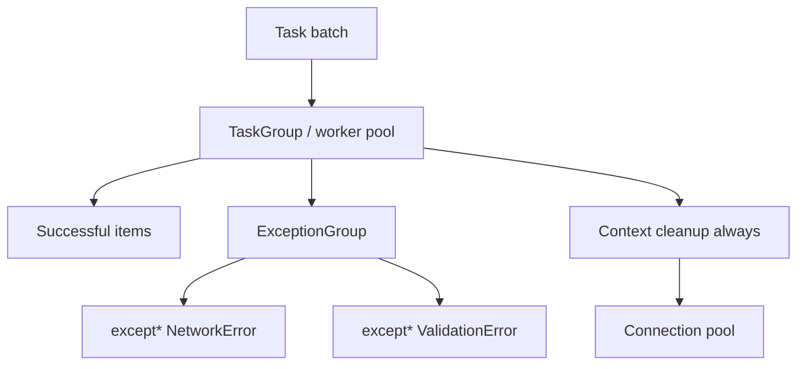

# Iteration Exceptions and Context Exercises

Control iteration, generator lifetimes, structured exception routing, and resource cleanup before building asyncio pipelines or bulk ETL jobs.

## Linked Topic

- [[03-Python/04-Iteration-Exceptions-and-Context/Iterator Protocol|Iterator Protocol]]
- [[03-Python/04-Iteration-Exceptions-and-Context/Generators and Generator Internals|Generators and Generator Internals]]
- [[03-Python/04-Iteration-Exceptions-and-Context/yield from and Generator Delegation|yield from and Generator Delegation]]
- [[03-Python/04-Iteration-Exceptions-and-Context/Exception Hierarchy ExceptionGroup and except star|Exception Hierarchy ExceptionGroup and except star]]
- [[03-Python/04-Iteration-Exceptions-and-Context/Context Managers and contextlib|Context Managers and Contextlib]]
- [[03-Python/04-Iteration-Exceptions-and-Context/Context Variables|Context Variables]]
- [[03-Python/04-Iteration-Exceptions-and-Context/Resource Cleanup and Cancellation Semantics|Resource Cleanup and Cancellation Semantics]]

## Warm-up

1. What happens if a generator is garbage-collected mid-iteration without closing?
2. How does `yield from` propagate `send`, `throw`, and `close`?
3. When should you use `except*` vs nested `try/except`?

## Core Drills

### Exercise 1 — Understand

**Prompt:**

Trace execution of a generator with `try/finally` and a `break` out of a `for` loop. Relate to [[03-Python/04-Iteration-Exceptions-and-Context/Generators and Generator Internals|Generators and Generator Internals]]. Draw Mermaid states: suspended, running, closed, and garbage-collected.

**Acceptance criteria:**

- [ ] `GeneratorExit` path documented
- [ ] `finally` in generator runs on close/break
- [ ] Difference between iterator protocol and generator protocol stated

### Exercise 2 — Implement

**Prompt:**

Extend [[03-Python/code/seb_python/iterators.py|iterators lab]] and [[03-Python/code/seb_python/context.py|context lab]]:

1. Implement a **paginated iterator** that fetches pages lazily via callable `fetch(page)`.
2. Wrap acquisition in a context manager that releases a connection on exit even when iteration aborts early.
3. Route multiple failure types through [[03-Python/code/seb_python/exceptions.py|exceptions lab]] `ExceptionGroup` helper when a page batch fails partially.

**Acceptance criteria:**

- [ ] Early `break` still runs cleanup (`with` + generator close)
- [ ] Partial page failures surfaced as structured exception group
- [ ] Includes tests or reproducible verification

### Exercise 3 — Optimize

**Prompt:**

A batch job materializes `list(huge_generator())` before processing. Refactor to streaming pipeline with bounded in-flight items and measurable peak memory drop.

**Constraints:**

- Latency / memory / throughput target: peak RSS ≤ 128 MB for 10M-item logical stream in lab benchmark
- What may not change: per-item processing order and idempotency keys

## Debugging Drill

**Broken behavior:** Database connections leak during nightly ETL when workers hit a bad row and `continue` without exhausting iterators.

**Expected investigation path:**

1. Confirm generators/context managers not closed on exceptional paths.
2. Reproduce with injected failure mid-stream; count open handles.
3. Fix with `try/finally`, `@contextmanager`, or `contextlib.closing`.
4. Add handle-leak test and connection pool metric alert.

## Production Scenario

A fan-out worker processes tasks concurrently; some fail with network errors, others with validation errors. Operators need partial success reporting and guaranteed resource release.

Design exception taxonomy, `except*` routing policy, metrics for partial failure, and cancellation behavior when the parent job is aborted.

## Stretch

- Implement `ExitStack`-style dynamic context registration per [[03-Python/projects/Resource Pool and ExitStack/README|Resource Pool and ExitStack]].
- Propagate `contextvars` through a thread pool wrapper and assert log correlation IDs survive.

## Solutions Notes

- Generators are iterators; `close()` injects `GeneratorExit` at yield boundaries.
- `except*` requires `ExceptionGroup` bases; do not flatten unrelated errors silently.
- Cleanup belongs in `finally` or context managers, not in "hope GC runs" paths.

## Related Notes

- [[03-Python/code/README|Python code labs]]
- [[03-Python/projects/Resource Pool and ExitStack/README|Resource Pool and ExitStack]]
- [[03-Python/_interview/Iteration Exceptions and Context Interview Questions|Iteration Exceptions and Context Interview Questions]]
- [[Career/README|Career]]
