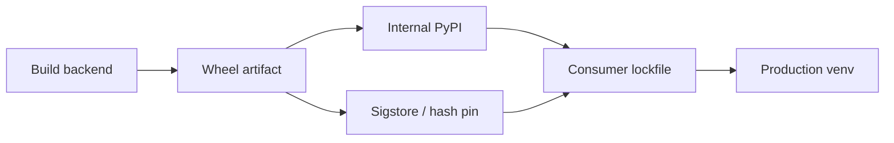

# Modules Packaging and Environments Exercises

Master import semantics, package layout, lockfiles, and distribution boundaries before shipping libraries to PyPI or internal indexes.

## Linked Topic

- [[03-Python/08-Modules-Packaging-and-Environments/Import System and Module Objects|Import System and Module Objects]]
- [[03-Python/08-Modules-Packaging-and-Environments/Packages Namespace Packages and init|Packages Namespace Packages and init]]
- [[03-Python/08-Modules-Packaging-and-Environments/Virtual Environments and Interpreter Isolation|Virtual Environments and Interpreter Isolation]]
- [[03-Python/08-Modules-Packaging-and-Environments/pyproject Build Backends and Wheels|pyproject Build Backends and Wheels]]
- [[03-Python/08-Modules-Packaging-and-Environments/Dependency Locking and Reproducibility|Dependency Locking and Reproducibility]]
- [[03-Python/08-Modules-Packaging-and-Environments/Entry Points Plugins and Console Scripts|Entry Points Plugins and Console Scripts]]
- [[03-Python/08-Modules-Packaging-and-Environments/Editable Installs and Development Layouts|Editable Installs and Development Layouts]]
- [[03-Python/08-Modules-Packaging-and-Environments/Distribution Signing and Supply-Chain Integrity|Distribution Signing and Supply-Chain Integrity]]

## Warm-up

1. What is the difference between a module and a package in Python 3?
2. How does `python -m pkg.cli` alter import paths vs running `pkg/cli.py` directly?
3. What problem do lockfiles solve that `pyproject.toml` alone does not?

## Core Drills

### Exercise 1 — Understand

**Prompt:**

Given a namespace package split across two directories on `sys.path`, explain import resolution order and shadowing risks. Use [[03-Python/code/seb_python/imports.py|imports lab]] cycle detection as analogy for graph thinking.

Draw Mermaid import graph with cycle, lazy import break point, and `importlib.reload` hazard.

**Acceptance criteria:**

- [ ] `sys.meta_path` finders role summarized
- [ ] Namespace vs regular package layout distinguished
- [ ] Import cycle mitigation strategies listed (refactor, local import, protocol)

### Exercise 2 — Implement

**Prompt:**

Extend [[03-Python/code/seb_python/imports.py|imports lab]] and [[03-Python/code/pyproject.toml|code pyproject]] patterns:

1. Build a minimal installable package with console script entry point invoking a `--version` flag.
2. Add plugin discovery via entry point group `seb_python.plugins`.
3. Detect and report import cycles in a dependency graph fixture.

**Acceptance criteria:**

- [ ] `pip install -e ".[dev]"` succeeds from [[03-Python/code/README|Python code labs]]
- [ ] Console script and plugin entry point documented in README snippet
- [ ] Includes tests or reproducible verification

### Exercise 3 — Optimize

**Prompt:**

CI installs dependencies from scratch in 6 minutes. Introduce wheel caching, hash-locked lockfile, and split dev vs prod dependency groups.

**Constraints:**

- Latency / memory / throughput target: cold CI install ≤ 2 minutes with cache warm
- What may not change: reproducible hashes and supply-chain verification policy

## Debugging Drill

**Broken behavior:** Production imports wrong version of internal `utils` because a top-level script named `utils.py` shadows the package on `sys.path[0]`.

**Expected investigation path:**

1. Print `sys.path` and `utils.__file__` in failing environment.
2. Identify script-as-module vs package layout conflict.
3. Fix layout (`src/` structure), rename script, or enforce `-m` entry.
4. Add startup check failing on ambiguous shadow imports in CI.

## Production Scenario

A monorepo publishes three interdependent wheels. A patch release breaks consumers due to undeclared optional dependency and yanked wheel republished without version bump.

Define versioning policy, optional dependency extras, lockfile update workflow, yank/rollback procedure, and SBOM or signing gate before promotion.

## Stretch

- Implement [[03-Python/projects/Import Hook Plugin Loader/README|Import Hook Plugin Loader]] stage 1: meta path finder for plugins.
- Compare editable install vs `PYTHONPATH` dev workflow for debugger attachment.

## Solutions Notes

- Prefer `src/` layout to prevent import shadowing from cwd.
- Entry points decouple distribution name from import name.
- Lockfiles pin transitive deps; document upgrade cadence and security scanning.

## Related Notes

- [[03-Python/code/README|Python code labs]]
- [[03-Python/projects/Import Hook Plugin Loader/README|Import Hook Plugin Loader]]
- [[03-Python/_interview/Modules Packaging and Environments Interview Questions|Modules Packaging and Environments Interview Questions]]
- [[16-DevOps/README|DevOps]]
- [[Career/README|Career]]
