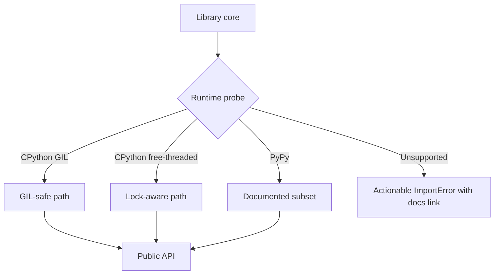

# Orientation Exercises

Separate the Python language, CPython implementation, and deployment environment before predicting behavior or choosing portability strategies.

## Linked Topic

- [[03-Python/00-Orientation/Why Python Exists|Why Python Exists]]
- [[03-Python/00-Orientation/CPython Alternatives and Portability|CPython Alternatives and Portability]]
- [[03-Python/00-Orientation/Python Program Lifecycle|Python Program Lifecycle]]
- [[03-Python/00-Orientation/The REPL Debugger and Introspection Surface|The REPL Debugger and Introspection Surface]]

## Warm-up

1. Classify `list.append`, `asyncio.create_task`, `sys.path`, and `importlib.metadata` as language, standard library, or interpreter-specific.
2. Explain why two CPython builds on the same version may differ in free-threading, extension ABI, and performance but must agree on language semantics.
3. Describe source → AST → bytecode → evaluation in one sentence each.

## Core Drills

### Exercise 1 — Understand

**Prompt:**

Given a script run as `python app.py`, as `python -m pkg.cli`, and embedded in another process via `PyRun_SimpleString`, predict which lifecycle stages differ and which remain the same. Draw a Mermaid diagram separating **language**, **CPython**, and **deployment environment**.

**Acceptance criteria:**

- [ ] Every claim names its owner: language reference, stdlib, CPython internals, or host/OS
- [ ] `-m` vs script entry effects on `sys.path[0]` and package context are stated
- [ ] Embedded vs standalone interpreter differences are labeled

### Exercise 2 — Implement

**Prompt:**

Add a runtime introspection helper to [[03-Python/code/README|Python code labs]] (new module or extend `seb_python/__init__.py`). Report:

- `sys.version_info`, implementation name, and whether the build appears free-threaded (when detectable)
- Effective `sys.path` roots and the cwd
- Whether running as `-m`, script, or REPL (best-effort heuristic)

Include pytest coverage with mocked `sys` attributes for deterministic CI.

**Acceptance criteria:**

- [ ] Never crashes when optional attributes are absent
- [ ] Output distinguishes portable language facts from CPython-specific facts
- [ ] Includes deterministic tests and reproducible verification

### Exercise 3 — Optimize

**Prompt:**

A CLI tool shells out to `python -c "..."` on every subcommand to probe capabilities. Replace repeated subprocess probes with a cached in-process introspection module while preserving test hooks for mocked environments.

**Constraints:**

- Latency / memory / throughput target: 10,000 cached reads in under 50 ms on the documented machine
- What may not change: returned schema, correctness of capability flags, or test isolation

## Debugging Drill

**Broken behavior:** Code works on developer laptops but fails in production with `ImportError: No module named 'pkg'` when invoked as `python /opt/app/bin/run` instead of `python -m pkg`.

**Expected investigation path:**

1. Compare `sys.path[0]`, cwd, and `-m` semantics for both invocations.
2. Identify missing package root on `sys.path` or incorrect relative import context.
3. Fix entry point (console script, `-m`, or `PYTHONPATH`) and document the supported launch contract.
4. Add a startup assertion that prints effective import roots in debug mode.

## Production Scenario

A library must run on CPython 3.12–3.14+, optional free-threaded builds, and document graceful degradation on PyPy when consumers opt in.

Define the compatibility matrix, which features require C extensions, how wheels are labeled, telemetry for runtime skew, and what must never be silently assumed at import time.

## Stretch

- Compare stack traces and `traceback` formatting for the same exception across two CPython minor versions; document what is stable vs diagnostic.
- Run the same module under `python -X dev` and document additional checks enabled.

## Solutions Notes

- The language reference defines semantics; CPython is the reference implementation with versioned internals; deployment chooses entry points and paths.
- Import and launch semantics are operational contracts—test the supported invocation modes explicitly.
- Free-threading and alternate runtimes are opt-in compatibility surfaces, not silent defaults.

## Related Notes

- [[03-Python/code/README|Python code labs]]
- [[03-Python/_interview/Orientation Interview Questions|Orientation Interview Questions]]
- [[03-Python/README|Python]]
- [[Career/README|Career]]
