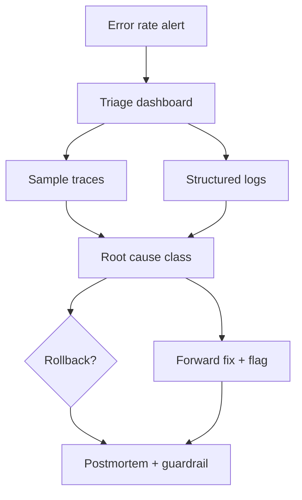

# Production Python Exercises

Synthesize error design, testing, debugging, performance, security, and observability into shippable Python services and libraries.

## Linked Topic

- [[03-Python/09-Production-Python/Error Design Exception Safety and Failure Modes|Error Design Exception Safety and Failure Modes]]
- [[03-Python/09-Production-Python/Testing with unittest pytest and Hypothesis|Testing with unittest pytest and Hypothesis]]
- [[03-Python/09-Production-Python/Debugging pdb monitoring and Remote Attach|Debugging pdb monitoring and Remote Attach]]
- [[03-Python/09-Production-Python/Measuring and Optimizing Performance|Measuring and Optimizing Performance]]
- [[03-Python/09-Production-Python/Secure Python Practices|Secure Python Practices]]
- [[03-Python/09-Production-Python/Observability Logging Tracing and Metrics|Observability Logging Tracing and Metrics]]
- [[03-Python/09-Production-Python/API Design Defensive Programming and Compatibility|API Design Defensive Programming and Compatibility]]
- [[03-Python/09-Production-Python/Operational Readiness for CLIs and Services|Operational Readiness for CLIs and Services]]

## Warm-up

1. What belongs in a structured log line for a payment failure?
2. When is `except Exception` acceptable at a service boundary?
3. Name three Python-specific security footguns (deserialization, subprocess, template injection).

## Core Drills

### Exercise 1 — Understand

**Prompt:**

Design an error taxonomy for a CLI + HTTP service: user errors, retryable infrastructure errors, and programmer errors. Map to HTTP status codes and exit codes. Relate to [[03-Python/09-Production-Python/Error Design Exception Safety and Failure Modes|Error Design Exception Safety and Failure Modes]].

Draw Mermaid from raised exception → boundary handler → client response → metric label.

**Acceptance criteria:**

- [ ] Exception types carry stable error codes, not only messages
- [ ] Retry policy tied to exception class, not string matching
- [ ] Sensitive details suppressed at outer boundary

### Exercise 2 — Implement

**Prompt:**

Extend [[03-Python/code/seb_python/logging_ctx.py|logging_ctx lab]] into a production-ready observability slice:

1. Propagate `request_id` via `contextvars` through sync and async call paths.
2. Emit JSON logs with level, timestamp, request_id, and duration_ms.
3. Add pytest verifying context isolation across concurrent tasks.

Add Hypothesis or property test for one pure function in the package (document seed).

**Acceptance criteria:**

- [ ] Logs parse as JSON; required fields present
- [ ] Context does not leak between concurrent requests in test harness
- [ ] Includes tests or reproducible verification

### Exercise 3 — Optimize

**Prompt:**

Profile a hot endpoint with `cProfile` + `snakeviz` or `py-spy`. Optimize the top frame attributable to Python code (not external I/O). Document before/after with benchmark commit hash.

**Constraints:**

- Latency / memory / throughput target: ≥ 25% p99 improvement on synthetic benchmark
- What may not change: response schema and auth checks

## Debugging Drill

**Broken behavior:** Service memory climbs; logs show normal traffic; no errors. Recent change added `@lru_cache` on a function receiving unbounded distinct keys from user input.

**Expected investigation path:**

1. Confirm unbounded cache keys via metrics or `cache_info()`.
2. Reproduce with fuzzed inputs; measure dict/cache size.
3. Fix with bounded cache, TTL, or canonicalized key space.
4. Add cache size metric and max-size test.

## Production Scenario

On-call receives alert: error rate 3× baseline after deploy. Rollback window is 15 minutes. You must decide using traces, logs, feature flags, and canary metrics.

Write the triage checklist, signals that justify rollback vs hotfix, communication template, and postmortem actions (test, lint, SLO update).

## Stretch

- Complete [[03-Python/projects/Python Runtime Toolkit/README|Python Runtime Toolkit]] portfolio milestone with runbook.
- Add secure subprocess wrapper rejecting shell=True and documenting allowlist.

## Solutions Notes

- Observability context must cross async boundaries via `contextvars`, not thread locals alone.
- Performance work requires a reproducible benchmark; optimize the measured bottleneck.
- Production exceptions are API contracts—version and document them.

## Related Notes

- [[03-Python/code/README|Python code labs]]
- [[03-Python/projects/Python Runtime Toolkit/README|Python Runtime Toolkit]]
- [[03-Python/_interview/Production Python Interview Questions|Production Python Interview Questions]]
- [[18-Security/README|Security]]
- [[16-DevOps/README|DevOps]]
- [[Career/README|Career]]
