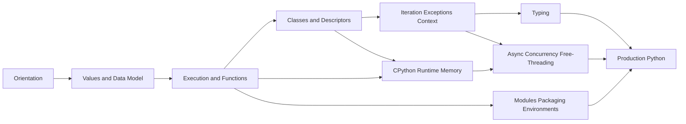

# Python Exercises

Ten production-oriented sets move from semantic prediction through mechanism implementation, measurement, debugging, and operational design on **CPython 3.14+**.

## Learning Path

## Exercise Sets

1. [[03-Python/_exercises/Orientation Exercises|Orientation Exercises]] — language vs CPython, lifecycle, REPL, introspection, portability
2. [[03-Python/_exercises/Values Types and Data Model Exercises|Values Types and Data Model Exercises]] — object model, mutability, equality, protocols, special methods
3. [[03-Python/_exercises/Execution Namespaces and Functions Exercises|Execution Namespaces and Functions Exercises]] — LEGB, closures, binding, decorators, comprehensions
4. [[03-Python/_exercises/Classes Descriptors and Metaprogramming Exercises|Classes Descriptors and Metaprogramming Exercises]] — MRO, descriptors, metaclasses, dataclasses, enums
5. [[03-Python/_exercises/Iteration Exceptions and Context Exercises|Iteration Exceptions and Context Exercises]] — iterators, generators, ExceptionGroup, context managers, contextvars
6. [[03-Python/_exercises/CPython Runtime and Memory Exercises|CPython Runtime and Memory Exercises]] — bytecode, frames, refcount, cycle GC, allocators
7. [[03-Python/_exercises/Typing Exercises|Typing Exercises]] — gradual typing, generics, protocols, CI gates, typed API design
8. [[03-Python/_exercises/Async Concurrency and Free-Threading Exercises|Async Concurrency and Free-Threading Exercises]] — asyncio, threads, processes, GIL, free-threading trade-offs
9. [[03-Python/_exercises/Modules Packaging and Environments Exercises|Modules Packaging and Environments Exercises]] — import system, wheels, lockfiles, entry points, supply chain
10. [[03-Python/_exercises/Production Python Exercises|Production Python Exercises]] — error design, testing, debugging, performance, security, observability

## Completion Standard

- Predict behavior before running code; explain mismatches from the data model and CPython mechanism.
- Implement named mechanisms with deterministic tests in [[03-Python/code/README|Python code labs]].
- Measure before optimizing; preserve a correctness oracle and document interpreter version assumptions.
- Record minimal reproduction, root cause, regression test, and operational guardrail for debugging drills.
- Complete each Mermaid production scenario with ownership, failure modes, telemetry, and rollback.

## Related Notes

- [[03-Python/README|Python]]
- [[03-Python/code/README|Python code labs]]
- [[03-Python/_interview/README|Python Interview Questions]]
- [[Career/README|Career]]
