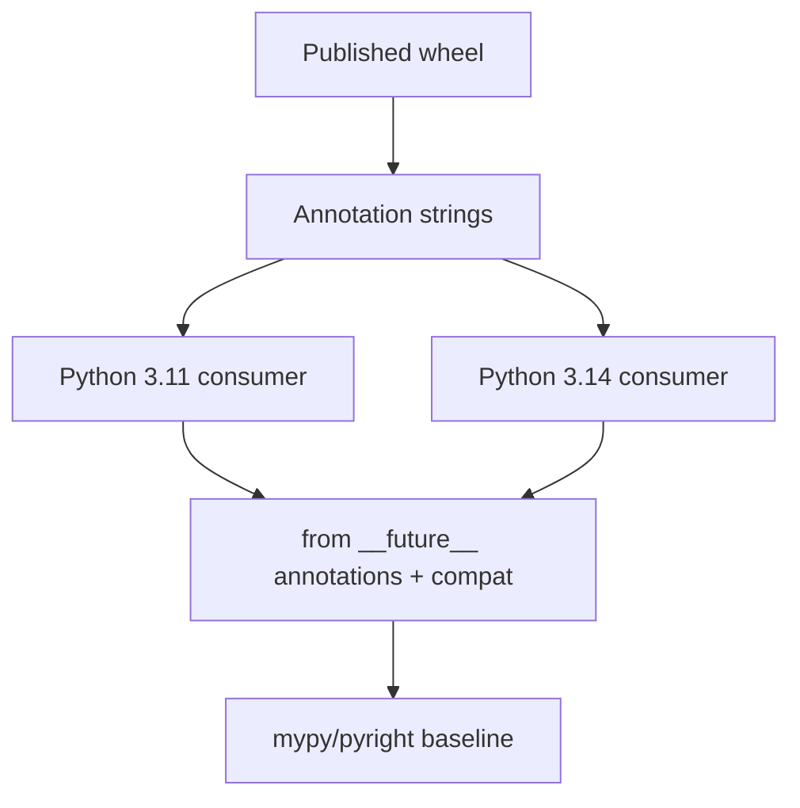

# Typing Exercises

Design gradual types, generics, protocols, and CI gates that catch real bugs without fighting the data model.

## Linked Topic

- [[03-Python/06-Typing/Gradual Typing Philosophy and Trade-offs|Gradual Typing Philosophy and Trade-offs]]
- [[03-Python/06-Typing/Annotations Deferred Evaluation and annotationlib|Annotations Deferred Evaluation and annotationlib]]
- [[03-Python/06-Typing/Generics TypeVars ParamSpecs and TypeVarTuples|Generics TypeVars ParamSpecs and TypeVarTuples]]
- [[03-Python/06-Typing/Protocols TypedDict Literal and Narrowing|Protocols TypedDict Literal and Narrowing]]
- [[03-Python/06-Typing/Runtime Checking vs Static Checking|Runtime Checking vs Static Checking]]
- [[03-Python/06-Typing/Python Typing Tools and CI Gates|Python Typing Tools and CI Gates]]
- [[03-Python/06-Typing/Typed Library API Design|Typed Library API Design]]

## Warm-up

1. What is the difference between `list[int]` and `List[int]` on Python 3.14?
2. When does `isinstance(x, Protocol)` succeed at runtime?
3. Name one bug static typing catches that unit tests often miss.

## Core Drills

### Exercise 1 — Understand

**Prompt:**

Given a function accepting `Mapping[str, int | str]` and returning a `TypedDict`, identify where narrowing is required before arithmetic. Relate to [[03-Python/06-Typing/Protocols TypedDict Literal and Narrowing|Protocols TypedDict Literal and Narrowing]].

Write Mermaid flow for type narrowing branches on `isinstance` vs `TypeGuard`.

**Acceptance criteria:**

- [ ] Union narrowing rules stated
- [ ] TypedDict total vs partial keys distinguished
- [ ] Runtime vs static checking boundaries labeled

### Exercise 2 — Implement

**Prompt:**

Extend [[03-Python/code/seb_python/plugins.py|plugins lab]] with a typed plugin registry:

1. Define a `Protocol` with `name: str` and `run(data: bytes) -> int`.
2. Register plugins via decorator; mypy/pyright must reject non-conforming plugins in CI.
3. Export public API typed with `TypeVar` bounded to the protocol.

Add `pyproject.toml` typing config snippet and pytest for runtime registration behavior.

**Acceptance criteria:**

- [ ] Static checker passes on conforming plugins, fails on intentional bad example (documented in test comments)
- [ ] Protocol structural subtyping demonstrated without inheritance
- [ ] Includes tests or reproducible verification

### Exercise 3 — Optimize

**Prompt:**

A large codebase runs mypy in 12 minutes. Introduce incremental caching, scoped module boundaries, and `--follow-imports` policy tuned for monorepo layout.

**Constraints:**

- Latency / memory / throughput target: CI typing job ≤ 4 minutes on default branch
- What may not change: strictness level for public package surface

## Debugging Drill

**Broken behavior:** Production accepts invalid payloads despite "full typing" because handlers use `# type: ignore` and `Any` at boundaries.

**Expected investigation path:**

1. Audit public API surface vs internal modules for `Any` leakage.
2. Identify untyped JSON ingress points; add `TypedDict`/`TypeAdapter` validation.
3. Replace blanket ignores with targeted casts and runtime validators where needed.
4. Add CI rule failing on new `# type: ignore` without ticket reference.

## Production Scenario

A typed SDK ships typed signatures but consumers on older Python versions break on `X | Y` syntax in annotations.

Define `from __future__ import annotations` policy, `py.typed` marker, compatibility typing stubs, and release gate before PyPI upload.

## Stretch

- Add `ParamSpec` to a decorator typing example mirroring [[03-Python/02-Execution-Namespaces-and-Functions/Decorators Internals|Decorators Internals]].
- Compare `TypeGuard` vs `cast` for JSON parsing boundaries.

## Solutions Notes

- Types erasure at runtime: validate untrusted input explicitly.
- Protocols enable structural typing; ABCs require registration/inheritance.
- CI should type-check the lowest supported version configuration consumers use.

## Related Notes

- [[03-Python/code/README|Python code labs]]
- [[03-Python/_interview/Typing Interview Questions|Typing Interview Questions]]
- [[Career/README|Career]]
