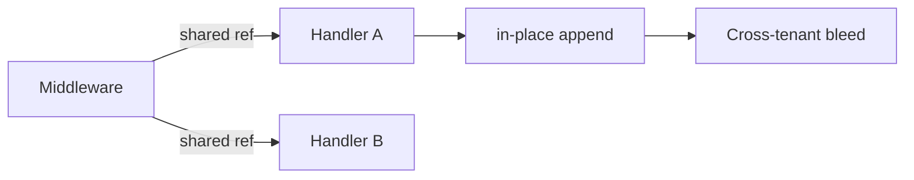

# Values Types and Data Model Exercises

Predict object identity, mutability, protocol behavior, and special-method dispatch before debugging production state corruption.

## Linked Topic

- [[03-Python/01-Values-Types-and-Data-Model/Python Object Model and PyObject|Python Object Model and PyObject]]
- [[03-Python/01-Values-Types-and-Data-Model/Built-in Types Overview|Built-in Types Overview]]
- [[03-Python/01-Values-Types-and-Data-Model/Numbers Integers Floats Decimal and Fractions|Numbers Integers Floats Decimal and Fractions]]
- [[03-Python/01-Values-Types-and-Data-Model/Strings Bytes and Unicode|Strings Bytes and Unicode]]
- [[03-Python/01-Values-Types-and-Data-Model/Truthiness Equality and Identity|Truthiness Equality and Identity]]
- [[03-Python/01-Values-Types-and-Data-Model/Mutability Sharing and Copying|Mutability Sharing and Copying]]
- [[03-Python/01-Values-Types-and-Data-Model/Sequences Mappings and Sets as Protocols|Sequences Mappings and Sets as Protocols]]
- [[03-Python/01-Values-Types-and-Data-Model/Callables and the Call Protocol|Callables and the Call Protocol]]
- [[03-Python/01-Values-Types-and-Data-Model/Special Methods and Data Model Hooks|Special Methods and Data Model Hooks]]

## Warm-up

1. When does `is` agree with `==` for `int`, `str`, and `list`? Give counterexamples.
2. What is the difference between shallow copy and deep copy for nested dicts?
3. Name three dunder methods that participate in `in` and iteration.

## Core Drills

### Exercise 1 — Understand

**Prompt:**

Analyze the snippet below without running it first; then verify. Explain every surprise using the data model.

```python
a = ([],)
b = a
a[0].append(1)
c = list(a)
d = a[:]
```

Draw a Mermaid object graph showing containers, nested mutables, and aliasing edges.

**Acceptance criteria:**

- [ ] Identity vs equality distinguished for each binding
- [ ] Shallow vs deep sharing explained for `c` and `d`
- [ ] Object graph labels mutable vs immutable nodes

### Exercise 2 — Implement

**Prompt:**

Implement a small `FrozenMapping` wrapper in [[03-Python/code/README|Python code labs]] that:

1. Rejects mutation after construction (`__setitem__`, `update`).
2. Implements `__eq__` by value and stable `__hash__` when contents are hashable.
3. Supports read-only mapping protocol (`__getitem__`, `__iter__`, `__len__`).

Add pytest cases for aliasing attempts, hash stability, and unhashable values.

**Acceptance criteria:**

- [ ] Mutation attempts raise `TypeError` with clear messages
- [ ] Equality and hashing behavior documented in docstring
- [ ] Includes tests or reproducible verification

### Exercise 3 — Optimize

**Prompt:**

A hot path copies large nested dict configs on every request (`copy.deepcopy`). Profile and replace with structural sharing or immutable snapshots while preserving isolation guarantees.

**Constraints:**

- Latency / memory / throughput target: ≥ 3× reduction in per-request allocation for a 10 KB nested config
- What may not change: callers must not observe cross-request mutation

## Debugging Drill

**Broken behavior:** Cached API responses occasionally return stale nested lists shared across tenants. No exceptions; only wrong data for some users.

**Expected investigation path:**

1. Trace config/default dict construction for mutable literals or `.get(key, [])` patterns.
2. Reproduce with two "fresh" client instances mutating nested state.
3. Fix with factory defaults (`defaultdict`, `dataclasses.field(default_factory=...)`) or immutability at boundaries.
4. Add regression test proving tenant isolation.

## Production Scenario

A multi-tenant SaaS passes "default permissions" dicts through middleware. One handler adds a role in place; other tenants inherit it intermittently.



Design boundary types (immutable snapshots, copy-on-write, or explicit `MappingProxyType`), document where copying happens, and define lint rules or code review checks.

## Stretch

- Implement a minimal `Vector` sequence type with `__len__`, `__getitem__`, and slicing; compare to `collections.abc.Sequence` registration.
- Benchmark `decimal.Decimal` vs `float` for money aggregation; document rounding policy trade-offs.

## Solutions Notes

- Mutable default arguments and shared nested structures are the most common production footguns—fix at construction boundaries.
- `==` delegates to `__eq__`; `is` compares identity; never use `is` for value comparison except singletons like `None`.
- Immutability at API boundaries beats defensive copying deep inside call trees.

## Related Notes

- [[03-Python/code/README|Python code labs]]
- [[03-Python/_interview/Values Types and Data Model Interview Questions|Values Types and Data Model Interview Questions]]
- [[04-Data-Structures/README|Data Structures]]
- [[Career/README|Career]]
