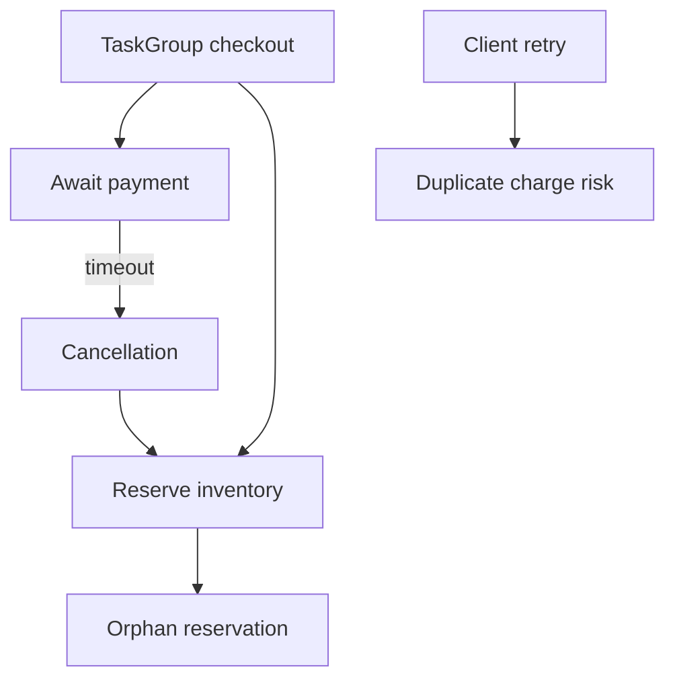

# Async Concurrency and Free-Threading Interview Questions

## Linked Topic

- [[03-Python/07-Async-Concurrency-and-Free-Threading/Concurrency Models in Python|Concurrency Models in Python]]
- [[03-Python/07-Async-Concurrency-and-Free-Threading/threading and the GIL|threading and the GIL]]
- [[03-Python/07-Async-Concurrency-and-Free-Threading/Free-Threaded CPython Trade-offs|Free-Threaded CPython Trade-offs]]
- [[03-Python/07-Async-Concurrency-and-Free-Threading/multiprocessing Shared Memory and Process Pools|multiprocessing Shared Memory and Process Pools]]
- [[03-Python/07-Async-Concurrency-and-Free-Threading/concurrent futures|concurrent futures]]
- [[03-Python/07-Async-Concurrency-and-Free-Threading/asyncio Event Loop Internals|asyncio Event Loop Internals]]
- [[03-Python/07-Async-Concurrency-and-Free-Threading/Tasks Futures and Awaitables|Tasks Futures and Awaitables]]
- [[03-Python/07-Async-Concurrency-and-Free-Threading/Async Iteration Streams and Backpressure|Async Iteration Streams and Backpressure]]
- [[03-Python/07-Async-Concurrency-and-Free-Threading/Cancellation Timeouts and TaskGroup|Cancellation Timeouts and TaskGroup]]
- [[03-Python/07-Async-Concurrency-and-Free-Threading/Interpreters Subinterpreters and Isolation|Interpreters Subinterpreters and Isolation]]

## How to Practice

1. Answer out loud in 2–5 minutes.
2. Draw event loop vs thread pool vs process pool timelines.
3. State GIL and free-threading assumptions explicitly.
4. Give a production asyncio or threading failure story.

## Conceptual

1. Compare asyncio, threading, and multiprocessing for I/O-bound vs CPU-bound workloads.
2. What is cooperative cancellation in asyncio and what can ignore it?
3. How does the GIL affect CPU-bound threads on standard CPython builds?
4. What changes operationally with free-threaded CPython (data races, extension modules)?

## Internal Implementation

1. What objects does the event loop schedule (handles, tasks, futures)?
2. How does `asyncio.to_thread` interact with the default executor?
3. What isolation do subinterpreters aim to provide vs processes (high level)?

## Trade-offs and Judgment

1. When would you choose processes over threads despite pickling cost?
2. What breaks first when blocking calls run on the event loop thread?
3. What would you not migrate to free-threading without extension audit and load testing?

## Coding / Design Prompts

1. Design bounded concurrent HTTP fetches with timeout, cancellation, and backpressure.
2. Debug hung asyncio service; outline steps using stack dumps and loop slow callback logging.

## Production Scenario

Checkout flow uses TaskGroup; payment gateway timeout cancels child tasks; inventory reservation not compensated; duplicate charges appear under retry storms.

Explain timeout budgets, compensating transactions, idempotency keys, and metrics.

## Staff-Level Follow-ups

1. How would you choose concurrency models org-wide for new Python services?
2. How would you plan a free-threaded pilot with rollback criteria?
3. What SLOs and load tests gate promotion of asyncio refactors?

## Rubric

| Signal | Weak | Strong |
| --- | --- | --- |
| First principles | "Async is faster" | Separates concurrency models and GIL |
| Trade-offs | "Use asyncio everywhere" | Names blocking, cancellation, isolation |
| Production sense | Retry until success | Idempotency, compensation, backpressure |

## Related Notes

- [[Career/README|Career]]
- [[03-Python/_exercises/Async Concurrency and Free-Threading Exercises|Async Concurrency and Free-Threading Exercises]]
- [[03-Python/code/README|Python code labs]]
