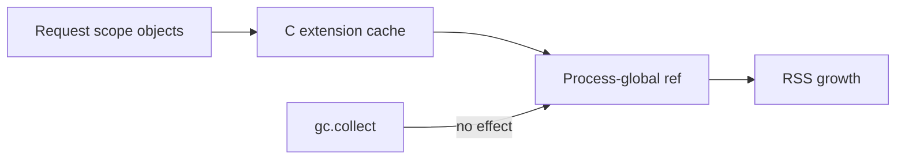

# CPython Runtime and Memory Interview Questions

## Linked Topic

- [[03-Python/05-CPython-Runtime-and-Memory/Parsing AST and Compilation Pipeline|Parsing AST and Compilation Pipeline]]
- [[03-Python/05-CPython-Runtime-and-Memory/Code Objects Frame Objects and Call Stack|Code Objects Frame Objects and Call Stack]]
- [[03-Python/05-CPython-Runtime-and-Memory/Bytecode and dis|Bytecode and dis]]
- [[03-Python/05-CPython-Runtime-and-Memory/Adaptive Specializing Interpreter|Adaptive Specializing Interpreter]]
- [[03-Python/05-CPython-Runtime-and-Memory/Reference Counting and Immortal Objects|Reference Counting and Immortal Objects]]
- [[03-Python/05-CPython-Runtime-and-Memory/Generational Cycle GC and gc Module|Generational Cycle GC and gc Module]]
- [[03-Python/05-CPython-Runtime-and-Memory/Memory Allocators Arenas and Tracing|Memory Allocators Arenas and Tracing]]
- [[03-Python/05-CPython-Runtime-and-Memory/C API Extension Boundary and Stable ABI|C API Extension Boundary and Stable ABI]]

## How to Practice

1. Answer out loud in 2–5 minutes.
2. Draw compile pipeline and call stack frame layout.
3. Separate refcount facts from cycle GC and allocator behavior.
4. Give a production memory or performance investigation story.

## Conceptual

1. What lives in a code object vs a function object vs a frame at runtime?
2. Explain reference counting and why cycles require a separate collector.
3. Why does `del` not guarantee lower RSS immediately?
4. What is the adaptive specializing interpreter optimizing (conceptually) without changing semantics?

## Internal Implementation

1. Walk a simple function through parsing, bytecode emission, and evaluation.
2. How do closure cells appear in bytecode (`LOAD_CLOSURE`, `MAKE_CELL`)?
3. What triggers generational GC cycles and what does `gc.collect()` do?

## Trade-offs and Judgment

1. When would you trust `dis` output vs profile data for optimization decisions?
2. What breaks first when C extensions hold hidden references to request objects?
3. When would you restart workers vs chase leaks in Python code?

## Coding / Design Prompts

1. Use `dis` to explain why a closure behaves differently than a default argument capture.
2. Design a leak hunt playbook using `tracemalloc`, `gc.get_referrers`, and allocation snapshots.

## Production Scenario

Workers OOM after days of uptime; profiles show steady RSS climb; extensions cache objects globally; cycle GC runs but cannot reclaim extension-held graphs.

Explain triage steps, ownership boundaries for extensions, worker recycling policy, and metrics.

## Staff-Level Follow-ups

1. How would you set memory SLOs and escalation for Python worker pools?
2. How would you audit extension modules before enabling free-threaded deployments?
3. What investment in tooling (continuous profiling, heap diff) follows a repeated OOM pattern?

## Rubric

| Signal | Weak | Strong |
| --- | --- | --- |
| First principles | "Python has GC" | Separates refcount, cycles, allocators |
| Trade-offs | "Just restart" | Names extension risk, profiling evidence |
| Production sense | Single `gc.collect()` call | Playbook, metrics, worker policy |

## Related Notes

- [[Career/README|Career]]
- [[03-Python/_exercises/CPython Runtime and Memory Exercises|CPython Runtime and Memory Exercises]]
- [[03-Python/code/README|Python code labs]]
