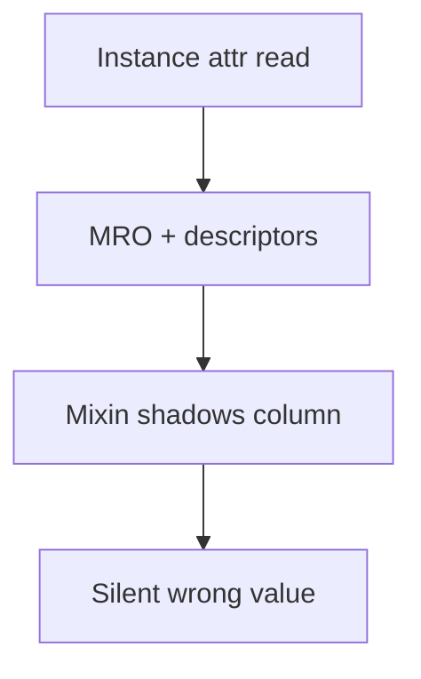

# Classes Descriptors and Metaprogramming Interview Questions

## Linked Topic

- [[03-Python/03-Classes-Descriptors-and-Metaprogramming/Classes Instances and Attribute Lookup|Classes Instances and Attribute Lookup]]
- [[03-Python/03-Classes-Descriptors-and-Metaprogramming/Inheritance MRO and super|Inheritance MRO and super]]
- [[03-Python/03-Classes-Descriptors-and-Metaprogramming/Slots Weakrefs and Object Layout|Slots Weakrefs and Object Layout]]
- [[03-Python/03-Classes-Descriptors-and-Metaprogramming/Properties and the Descriptor Protocol|Properties and the Descriptor Protocol]]
- [[03-Python/03-Classes-Descriptors-and-Metaprogramming/Metaclasses and Class Creation|Metaclasses and Class Creation]]
- [[03-Python/03-Classes-Descriptors-and-Metaprogramming/Dataclasses and Data-Oriented Classes|Dataclasses and Data-Oriented Classes]]
- [[03-Python/03-Classes-Descriptors-and-Metaprogramming/ABCs Protocols and Runtime Structural Subtyping|ABCs Protocols and Runtime Structural Subtyping]]
- [[03-Python/03-Classes-Descriptors-and-Metaprogramming/Enums and Singletons|Enums and Singletons]]
- [[03-Python/03-Classes-Descriptors-and-Metaprogramming/Dynamic Attributes getattr setattr and dict|Dynamic Attributes getattr setattr and dict]]

## How to Practice

1. Answer out loud in 2–5 minutes.
2. Draw attribute lookup flow and MRO diamond.
3. Compare dataclass, descriptor, and property approaches.
4. Give a production ORM/validation war story.

## Conceptual

1. Walk attribute lookup on an instance step by step (data descriptor, instance dict, non-data descriptor, class dict, `__getattr__`).
2. How does C3 linearization resolve the diamond problem? What does `super()` use?
3. What distinguishes data vs non-data descriptors? Where do properties fit?
4. When are metaclasses justified vs class decorators or `__init_subclass__`?

## Internal Implementation

1. How do `__slots__` change instance layout and descriptor interaction?
2. What happens during class creation (`type.__new__`, namespace merging) at a high level?
3. How does `__set_name__` participate in descriptor setup (3.6+)?

## Trade-offs and Judgment

1. When would you choose `@dataclass` vs descriptors vs Pydantic-style validation?
2. What breaks first when mixins introduce colliding attribute names in deep hierarchies?
3. What metaclass complexity would you not introduce without measurable benefit?

## Coding / Design Prompts

1. Implement a validated field descriptor with per-instance storage and clear errors.
2. Design cooperative `super()` chain across three mixins providing the same hook method.

## Production Scenario

ORM column descriptors collide after a mixin refactor; one customer segment reads stale field values; rollback is expensive due to migration coupling.

Explain detection (startup validation, tests), prevention (naming, linters), and safe migration strategy.

## Staff-Level Follow-ups

1. How would you govern metaclass and descriptor use across platform teams?
2. How would you deprecate a class hierarchy without breaking pickle/API contracts?
3. What education program reduces descriptor-related incidents in code review?

## Rubric

| Signal | Weak | Strong |
| --- | --- | --- |
| First principles | Defines property syntax | Explains lookup order and MRO |
| Trade-offs | "Metaclasses are powerful" | Chooses simplest mechanism that fits |
| Production sense | Fixes one model | Adds hierarchy validation and migration plan |

## Related Notes

- [[Career/README|Career]]
- [[03-Python/_exercises/Classes Descriptors and Metaprogramming Exercises|Classes Descriptors and Metaprogramming Exercises]]
- [[03-Python/code/README|Python code labs]]
