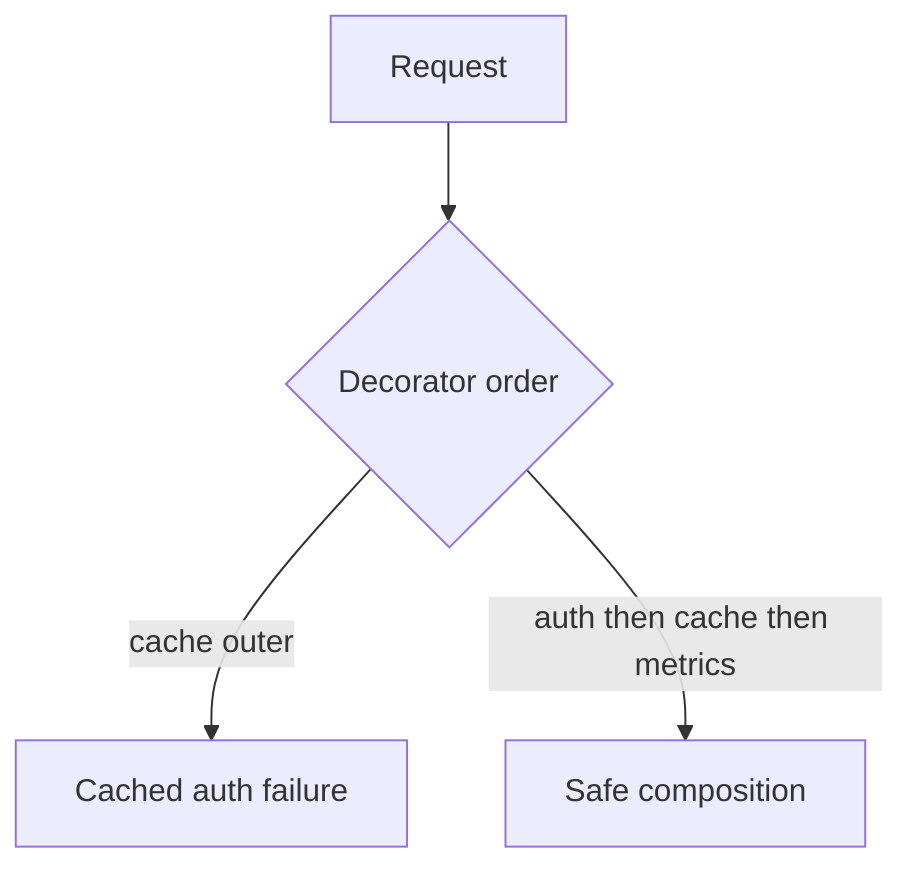

# Execution Namespaces and Functions Interview Questions

## Linked Topic

- [[03-Python/02-Execution-Namespaces-and-Functions/Lexical Structure and Compilation Units|Lexical Structure and Compilation Units]]
- [[03-Python/02-Execution-Namespaces-and-Functions/Names Scopes LEGB and Closures|Names Scopes LEGB and Closures]]
- [[03-Python/02-Execution-Namespaces-and-Functions/Functions as Objects|Functions as Objects]]
- [[03-Python/02-Execution-Namespaces-and-Functions/Argument Binding Unpacking and Keyword-Only Parameters|Argument Binding Unpacking and Keyword-Only Parameters]]
- [[03-Python/02-Execution-Namespaces-and-Functions/Decorators Internals|Decorators Internals]]
- [[03-Python/02-Execution-Namespaces-and-Functions/Comprehensions and Assignment Expressions|Comprehensions and Assignment Expressions]]
- [[03-Python/02-Execution-Namespaces-and-Functions/Exceptions and Control Flow|Exceptions and Control Flow]]
- [[03-Python/02-Execution-Namespaces-and-Functions/Recursion Stack Limits and Frame Depth|Recursion Stack Limits and Frame Depth]]

## How to Practice

1. Answer out loud in 2–5 minutes.
2. Draw LEGB scope chains and closure cells.
3. Desugar decorators and comprehensions on a whiteboard.
4. Give a production story involving closure or decorator bugs.

## Conceptual

1. Explain LEGB name resolution with nested functions and class bodies.
2. What is late binding in closures created inside loops? How do fixes differ?
3. How does argument binding work for `*args`, `**kwargs`, keyword-only, and positional-only parameters?
4. What exception semantics apply to `else`/`finally` clauses?

## Internal Implementation

1. What are closure cells and how do they differ from fast locals in bytecode?
2. How does CPython compile assignment to decide `local` vs `global` vs `nonlocal`?
3. What is the cost model for function calls and frame allocation (conceptual)?

## Trade-offs and Judgment

1. When are decorators preferable to middleware or explicit wrapper calls?
2. What breaks first when decorator order is wrong in a framework stack?
3. When would you refuse to raise `sys.setrecursionlimit` in production?

## Coding / Design Prompts

1. Implement a retry decorator with exponential backoff preserving function metadata.
2. Refactor recursive tree walking to iterative form without changing output order.

## Production Scenario

Middleware decorators for auth, caching, and metrics compose differently; one ordering serves cached 401 responses to authenticated users under race.

Explain how you document composition rules, test ordering, and expose metadata for frameworks.

## Staff-Level Follow-ups

1. How would you create org-wide guidelines for decorator stacks in web/CLI frameworks?
2. How would you migrate a codebase from implicit globals to explicit dependency injection?
3. What static or dynamic analysis would you add after a closure-related incident?

## Rubric

| Signal | Weak | Strong |
| --- | --- | --- |
| First principles | "Closures capture variables" | Explains cells, binding time, bytecode |
| Trade-offs | "Decorators are clean" | Names ordering, testability, debugging cost |
| Production sense | Fixes one handler | Standardizes composition and regression tests |

## Related Notes

- [[Career/README|Career]]
- [[03-Python/_exercises/Execution Namespaces and Functions Exercises|Execution Namespaces and Functions Exercises]]
- [[03-Python/code/README|Python code labs]]
