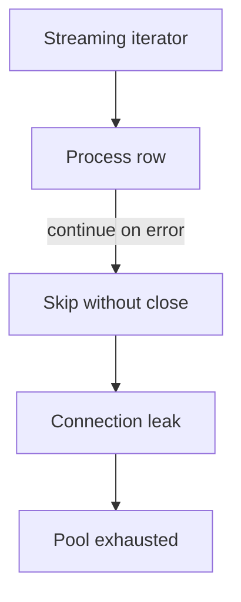

# Iteration Exceptions and Context Interview Questions

## Linked Topic

- [[03-Python/04-Iteration-Exceptions-and-Context/Iterator Protocol|Iterator Protocol]]
- [[03-Python/04-Iteration-Exceptions-and-Context/Generators and Generator Internals|Generators and Generator Internals]]
- [[03-Python/04-Iteration-Exceptions-and-Context/yield from and Generator Delegation|yield from and Generator Delegation]]
- [[03-Python/04-Iteration-Exceptions-and-Context/Exception Hierarchy ExceptionGroup and except star|Exception Hierarchy ExceptionGroup and except star]]
- [[03-Python/04-Iteration-Exceptions-and-Context/Context Managers and contextlib|Context Managers and Contextlib]]
- [[03-Python/04-Iteration-Exceptions-and-Context/Context Variables|Context Variables]]
- [[03-Python/04-Iteration-Exceptions-and-Context/Resource Cleanup and Cancellation Semantics|Resource Cleanup and Cancellation Semantics]]

## How to Practice

1. Answer out loud in 2–5 minutes.
2. Draw generator state transitions and context manager exit paths.
3. Compare `except*` vs flat exception handling.
4. Give a production resource-leak or partial-failure example.

## Conceptual

1. What is the iterator protocol vs the generator protocol?
2. How does `yield from` delegate `send`, `throw`, and `close`?
3. When must you call `generator.close()` and what is `GeneratorExit`?
4. How do `ExceptionGroup` and `except*` change error routing in concurrent code?

## Internal Implementation

1. What frame state does a suspended generator retain?
2. How does `@contextmanager` desugar to `__enter__`/`__exit__`?
3. How do `contextvars` propagate across asyncio tasks vs threads?

## Trade-offs and Judgment

1. When would you stream with generators vs async iteration vs batch lists?
2. What breaks first when cleanup lives only in caller code instead of context managers?
3. When would you avoid `except*` flattening in public API surfaces?

## Coding / Design Prompts

1. Implement a paginated lazy iterator with guaranteed cleanup on early exit.
2. Design partial-failure reporting for a batch job using structured exception groups.

## Production Scenario

ETL workers leak DB connections when skipping bad rows; pool exhaustion causes cascading timeouts; metrics show no Python exceptions at process level.

Explain diagnosis, fix patterns (`contextlib`, `try/finally`, `ExitStack`), and alerts you would add.

## Staff-Level Follow-ups

1. How would you standardize resource management patterns across data and API teams?
2. How would you design cancellation semantics for long-running batch jobs?
3. What library or framework changes would you fund after a major leak incident?

## Rubric

| Signal | Weak | Strong |
| --- | --- | --- |
| First principles | "Use with statement" | Explains generator/context protocols |
| Trade-offs | "Generators save memory" | Names backpressure, cleanup, partial failure |
| Production sense | Restarts workers daily | Fixes lifecycle + adds pool metrics |

## Related Notes

- [[Career/README|Career]]
- [[03-Python/_exercises/Iteration Exceptions and Context Exercises|Iteration Exceptions and Context Exercises]]
- [[03-Python/code/README|Python code labs]]
