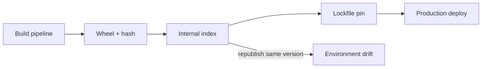

# Modules Packaging and Environments Interview Questions

## Linked Topic

- [[03-Python/08-Modules-Packaging-and-Environments/Import System and Module Objects|Import System and Module Objects]]
- [[03-Python/08-Modules-Packaging-and-Environments/Packages Namespace Packages and init|Packages Namespace Packages and init]]
- [[03-Python/08-Modules-Packaging-and-Environments/Virtual Environments and Interpreter Isolation|Virtual Environments and Interpreter Isolation]]
- [[03-Python/08-Modules-Packaging-and-Environments/pyproject Build Backends and Wheels|pyproject Build Backends and Wheels]]
- [[03-Python/08-Modules-Packaging-and-Environments/Dependency Locking and Reproducibility|Dependency Locking and Reproducibility]]
- [[03-Python/08-Modules-Packaging-and-Environments/Entry Points Plugins and Console Scripts|Entry Points Plugins and Console Scripts]]
- [[03-Python/08-Modules-Packaging-and-Environments/Editable Installs and Development Layouts|Editable Installs and Development Layouts]]
- [[03-Python/08-Modules-Packaging-and-Environments/Distribution Signing and Supply-Chain Integrity|Distribution Signing and Supply-Chain Integrity]]

## How to Practice

1. Answer out loud in 2–5 minutes.
2. Draw import graph and package layout (`src/` vs flat).
3. State reproducibility and supply-chain controls.
4. Give a production import shadowing or dependency incident.

## Conceptual

1. How does Python locate modules (`sys.path`, finders, loaders)?
2. What is a namespace package and how does it differ from a regular package?
3. What problems do virtual environments solve vs containers?
4. How do entry points decouple installed distribution from import name?

## Internal Implementation

1. What happens on first import vs subsequent imports (module cache)?
2. How can import cycles arise and what are safe break strategies?
3. What does an editable install change in metadata and path resolution?

## Trade-offs and Judgment

1. When would you choose `src/` layout over flat layout?
2. What breaks first when optional dependencies are undeclared in metadata?
3. When would you pin hashes in lockfiles vs allow ranged updates?

## Coding / Design Prompts

1. Design a plugin system using entry points with typed registration and failure isolation.
2. Diagnose `ImportError` caused by script shadowing package on `sys.path[0]`.

## Production Scenario

Internal PyPI serves a patched wheel without version bump; consumers with lockfiles do not pick up fix; production and staging diverge silently.

Explain immutability policy, yank procedures, lockfile update workflow, and verification gates.

## Staff-Level Follow-ups

1. How would you standardize Python packaging across dozens of services?
2. How would you integrate SBOM/signing into promotion pipelines?
3. What migration plan moves monorepo scripts to console scripts without downtime?

## Rubric

| Signal | Weak | Strong |
| --- | --- | --- |
| First principles | "Use pip install" | Explains import system and packaging layers |
| Trade-offs | "Pin everything" | Balances reproducibility and security updates |
| Production sense | Manual pip on servers | Lockfiles, hashes, rollback, index policy |

## Related Notes

- [[Career/README|Career]]
- [[03-Python/_exercises/Modules Packaging and Environments Exercises|Modules Packaging and Environments Exercises]]
- [[03-Python/code/README|Python code labs]]
