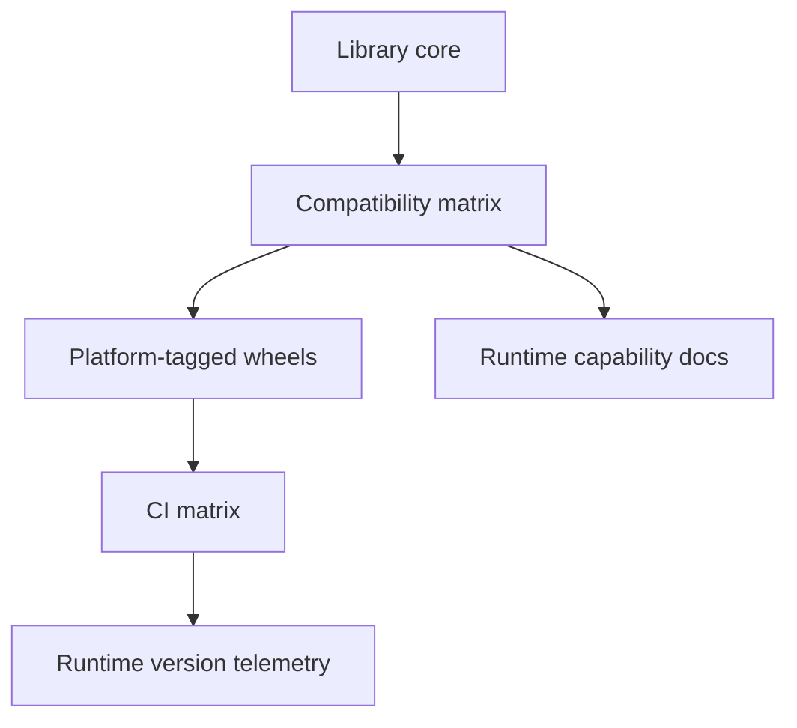

# Orientation Interview Questions

## Linked Topic

- [[03-Python/00-Orientation/Why Python Exists|Why Python Exists]]
- [[03-Python/00-Orientation/CPython Alternatives and Portability|CPython Alternatives and Portability]]
- [[03-Python/00-Orientation/Python Program Lifecycle|Python Program Lifecycle]]
- [[03-Python/00-Orientation/The REPL Debugger and Introspection Surface|The REPL Debugger and Introspection Surface]]

## How to Practice

1. Answer out loud in 2–5 minutes.
2. Draw the language–CPython–environment boundary.
3. State portable guarantees before version-specific internals.
4. Give a production deployment or portability example.

## Conceptual

1. What are the Python language, the standard library, CPython, and alternate implementations (PyPy, GraalPy, MicroPython)?
2. Which behaviors are defined by the language reference vs left implementation-defined?
3. How do script execution, `python -m`, and console scripts differ in import context?
4. What introspection tools (`inspect`, `dis`, `sys`, debugger) reveal at each lifecycle stage?

## Internal Implementation

1. Walk source through tokenize → parse → AST → bytecode → frame evaluation on CPython.
2. What does the REPL do differently from running a module (compilation units, future imports)?
3. How can two CPython 3.14 builds differ (free-threading, debug, platform) while remaining conforming?

## Trade-offs and Judgment

1. When would you document PyPy support vs CPython-only features?
2. What breaks first when production invokes packages via ad-hoc `PYTHONPATH` instead of installed wheels?
3. Which compatibility promises would you avoid before measuring consumer demand?

## Coding / Design Prompts

1. Implement a runtime probe reporting version, implementation, free-threading hint, and effective import roots.
2. Review a Dockerfile that runs `python app/main.py` from repo root; redesign for reproducible package imports.

## Production Scenario

A library must support CPython 3.12–3.14+, optional free-threaded workers, and internal PyPI consumers on Linux and macOS.

Explain testing matrix, wheel tagging, feature detection vs version checks, and how you communicate unsupported combinations.

## Staff-Level Follow-ups

1. How would you define organization-wide Python version and free-threading adoption policy?
2. How would you migrate services from script-on-`PYTHONPATH` to packaged entry points without a flag day?
3. What evidence justifies dropping a Python minor version, and how do you communicate deprecation?

## Rubric

| Signal | Weak | Strong |
| --- | --- | --- |
| First principles | Lists version numbers | Separates language, stdlib, CPython, deployment |
| Trade-offs | "Always use latest" | Names portability, extensions, ABI, ops cost |
| Production sense | Tests one laptop | Defines matrix, entry points, telemetry, rollback |

## Related Notes

- [[Career/README|Career]]
- [[03-Python/_exercises/Orientation Exercises|Orientation Exercises]]
- [[03-Python/code/README|Python code labs]]
