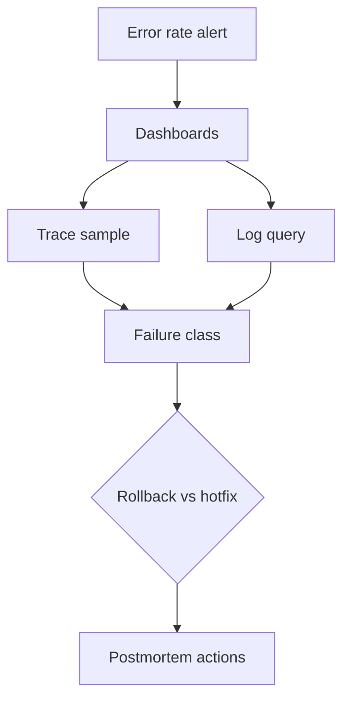

# Production Python Interview Questions

## Linked Topic

- [[03-Python/09-Production-Python/Error Design Exception Safety and Failure Modes|Error Design Exception Safety and Failure Modes]]
- [[03-Python/09-Production-Python/Testing with unittest pytest and Hypothesis|Testing with unittest pytest and Hypothesis]]
- [[03-Python/09-Production-Python/Debugging pdb monitoring and Remote Attach|Debugging pdb monitoring and Remote Attach]]
- [[03-Python/09-Production-Python/Measuring and Optimizing Performance|Measuring and Optimizing Performance]]
- [[03-Python/09-Production-Python/Secure Python Practices|Secure Python Practices]]
- [[03-Python/09-Production-Python/Observability Logging Tracing and Metrics|Observability Logging Tracing and Metrics]]
- [[03-Python/09-Production-Python/API Design Defensive Programming and Compatibility|API Design Defensive Programming and Compatibility]]
- [[03-Python/09-Production-Python/Operational Readiness for CLIs and Services|Operational Readiness for CLIs and Services]]

## How to Practice

1. Answer out loud in 2–5 minutes.
2. Draw request path with logs, metrics, traces, and error boundaries.
3. State Python-specific security and performance pitfalls.
4. Give an on-call or postmortem story with concrete signals.

## Conceptual

1. How should exceptions be designed at library vs service boundaries?
2. What belongs in structured logs for operability and security?
3. Compare pytest, Hypothesis, and integration tests—where does each earn its keep?
4. Name Python-specific security risks (pickle, YAML, subprocess, template injection).

## Internal Implementation

1. How do `contextvars` propagate through asyncio vs thread pools for tracing?
2. What do `cProfile`, `py-spy`, and `tracemalloc` each reveal?
3. How can unbounded `@lru_cache` or global registries cause production failures?

## Trade-offs and Judgment

1. When is broad `except Exception` acceptable at a top-level handler?
2. What breaks first at 10× traffic without backpressure on queues and caches?
3. What optimization would you not ship without benchmark evidence and rollback?

## Coding / Design Prompts

1. Design JSON logging with request correlation across async middleware.
2. Write a triage checklist for error-rate alert after deploy (signals, rollback, comms).

## Production Scenario

Deploy increases p99 latency slightly but error rate triples; traces show timeouts in payment client; logs lack correlation id; rollback window is 15 minutes.

Explain decision criteria, stakeholder comms, guardrails added post-incident, and how Python tooling helped or failed.

## Staff-Level Follow-ups

1. How would you define production readiness gates for Python services org-wide?
2. How would you balance velocity and strictness for observability and typing standards?
3. What platform investments (shared middleware, CI templates) prevent repeat incidents?

## Rubric

| Signal | Weak | Strong |
| --- | --- | --- |
| First principles | "Add more logs" | Designs error, log, and trace model |
| Trade-offs | "Always rollback" | Uses signals, blast radius, fix forward |
| Production sense | Hero debugging | Runbooks, metrics, tests, postmortem culture |

## Related Notes

- [[Career/README|Career]]
- [[03-Python/_exercises/Production Python Exercises|Production Python Exercises]]
- [[03-Python/code/README|Python code labs]]
- [[18-Security/README|Security]]
- [[16-DevOps/README|DevOps]]
