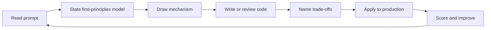

# Python Interview Questions

Ten interview sets assess semantic reasoning, CPython implementation knowledge, engineering judgment, production experience, and staff-level leadership on **CPython 3.14+**.

## Practice Loop

## Interview Sets

1. [[03-Python/_interview/Orientation Interview Questions|Orientation Interview Questions]]
2. [[03-Python/_interview/Values Types and Data Model Interview Questions|Values Types and Data Model Interview Questions]]
3. [[03-Python/_interview/Execution Namespaces and Functions Interview Questions|Execution Namespaces and Functions Interview Questions]]
4. [[03-Python/_interview/Classes Descriptors and Metaprogramming Interview Questions|Classes Descriptors and Metaprogramming Interview Questions]]
5. [[03-Python/_interview/Iteration Exceptions and Context Interview Questions|Iteration Exceptions and Context Interview Questions]]
6. [[03-Python/_interview/CPython Runtime and Memory Interview Questions|CPython Runtime and Memory Interview Questions]]
7. [[03-Python/_interview/Typing Interview Questions|Typing Interview Questions]]
8. [[03-Python/_interview/Async Concurrency and Free-Threading Interview Questions|Async Concurrency and Free-Threading Interview Questions]]
9. [[03-Python/_interview/Modules Packaging and Environments Interview Questions|Modules Packaging and Environments Interview Questions]]
10. [[03-Python/_interview/Production Python Interview Questions|Production Python Interview Questions]]

## Evaluation Standard

- Conceptual answers define the model and its boundary (language vs CPython vs extension ABI).
- Internals answers explain mechanism without presenting implementation details as specification.
- Coding answers cover edge cases, complexity, tests, and resource cleanup.
- Trade-off answers name alternatives, costs, reversibility, and evidence.
- Production answers include failure modes, security, observability, and operations.
- Staff-level answers connect technical choices to migration, ownership, standards, and business risk.

## Related Notes

- [[Career/README|Career]]
- [[03-Python/_exercises/README|Python Exercises]]
- [[03-Python/code/README|Python code labs]]
