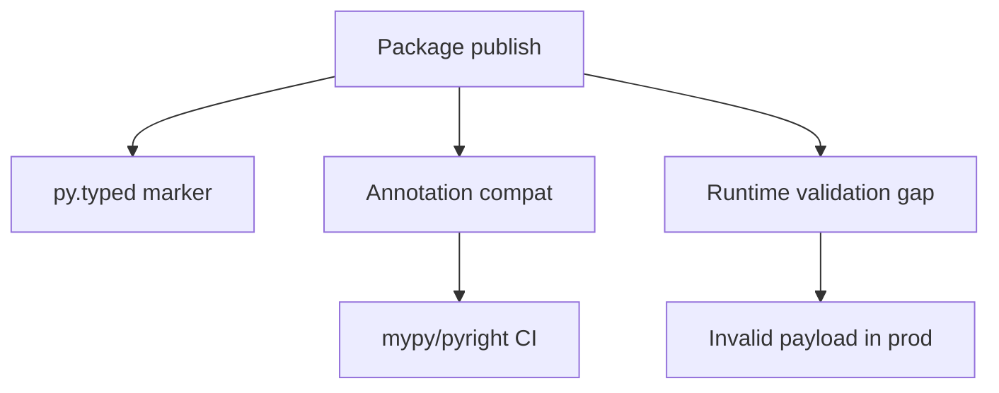

# Typing Interview Questions

## Linked Topic

- [[03-Python/06-Typing/Gradual Typing Philosophy and Trade-offs|Gradual Typing Philosophy and Trade-offs]]
- [[03-Python/06-Typing/Annotations Deferred Evaluation and annotationlib|Annotations Deferred Evaluation and annotationlib]]
- [[03-Python/06-Typing/Generics TypeVars ParamSpecs and TypeVarTuples|Generics TypeVars ParamSpecs and TypeVarTuples]]
- [[03-Python/06-Typing/Protocols TypedDict Literal and Narrowing|Protocols TypedDict Literal and Narrowing]]
- [[03-Python/06-Typing/Runtime Checking vs Static Checking|Runtime Checking vs Static Checking]]
- [[03-Python/06-Typing/Python Typing Tools and CI Gates|Python Typing Tools and CI Gates]]
- [[03-Python/06-Typing/Typed Library API Design|Typed Library API Design]]

## How to Practice

1. Answer out loud in 2–5 minutes.
2. Draw static vs runtime checking boundaries on a diagram.
3. State what types erase at runtime and what still validates.
4. Give a production incident types could have prevented.

## Conceptual

1. What is gradual typing and how does it differ from mandatory static typing?
2. Explain `Protocol` structural subtyping vs ABC nominal typing.
3. How do `TypeVar`, `ParamSpec`, and bounded generics help API authors?
4. What is narrowing and when do type checkers accept it?

## Internal Implementation

1. How does `from __future__ import annotations` change runtime behavior?
2. What does the `typing` module store vs what `inspect.signature` returns at runtime?
3. How do checkers approximate control flow for `isinstance` and `TypeGuard`?

## Trade-offs and Judgment

1. When would you add runtime validation (Pydantic, `TypeAdapter`) beyond static types?
2. What breaks first when `# type: ignore` proliferates at JSON boundaries?
3. What strictness would you not enable repo-wide without incremental rollout?

## Coding / Design Prompts

1. Design a typed plugin registry using `Protocol` and reject bad plugins in CI.
2. Refactor untyped JSON ingress to `TypedDict` + narrowing with clear error messages.

## Production Scenario

A "fully typed" SDK ships `py.typed` but consumers on 3.11 break on modern union syntax in signatures; runtime validation is absent at HTTP boundaries.

Explain release gates, annotation compatibility policy, and where runtime checks are mandatory.

## Staff-Level Follow-ups

1. How would you roll out strict typing across a monorepo with legacy modules?
2. How would you measure ROI of typing CI time vs incident reduction?
3. What standards would you set for public API typing and deprecation?

## Rubric

| Signal | Weak | Strong |
| --- | --- | --- |
| First principles | "Types catch bugs" | Explains gradual model and erasure |
| Trade-offs | "Enable strict everywhere" | Phased rollout, runtime boundaries |
| Production sense | Ignores consumer Python versions | py.typed, compat, validation policy |

## Related Notes

- [[Career/README|Career]]
- [[03-Python/_exercises/Typing Exercises|Typing Exercises]]
- [[03-Python/code/README|Python code labs]]
