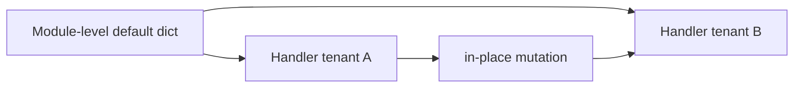

# Values Types and Data Model Interview Questions

## Linked Topic

- [[03-Python/01-Values-Types-and-Data-Model/Python Object Model and PyObject|Python Object Model and PyObject]]
- [[03-Python/01-Values-Types-and-Data-Model/Built-in Types Overview|Built-in Types Overview]]
- [[03-Python/01-Values-Types-and-Data-Model/Numbers Integers Floats Decimal and Fractions|Numbers Integers Floats Decimal and Fractions]]
- [[03-Python/01-Values-Types-and-Data-Model/Strings Bytes and Unicode|Strings Bytes and Unicode]]
- [[03-Python/01-Values-Types-and-Data-Model/Truthiness Equality and Identity|Truthiness Equality and Identity]]
- [[03-Python/01-Values-Types-and-Data-Model/Mutability Sharing and Copying|Mutability Sharing and Copying]]
- [[03-Python/01-Values-Types-and-Data-Model/Sequences Mappings and Sets as Protocols|Sequences Mappings and Sets as Protocols]]
- [[03-Python/01-Values-Types-and-Data-Model/Callables and the Call Protocol|Callables and the Call Protocol]]
- [[03-Python/01-Values-Types-and-Data-Model/Special Methods and Data Model Hooks|Special Methods and Data Model Hooks]]

## How to Practice

1. Answer out loud in 2–5 minutes.
2. Draw object graphs for aliasing and copying.
3. State protocol vs concrete type trade-offs.
4. Give a production bug caused by mutability sharing.

## Conceptual

1. What is a Python object at the language level (`PyObject` head, type pointer, refcount—conceptually)?
2. Explain `==`, `is`, and `hash()` relationships and why mutable objects are often unhashable.
3. How do sequences, mappings, and iterables relate via protocols vs inheritance?
4. When would you choose `bytes` vs `str` vs `memoryview` at a system boundary?

## Internal Implementation

1. How does CPython represent small ints and string interning (high level, version-aware caveats)?
2. What happens on `list.append` at amortized cost and allocation strategy (conceptual)?
3. How does operator dispatch consult special methods on left/right operands?

## Trade-offs and Judgment

1. When would you use immutability at API boundaries vs copy-on-write vs defensive `deepcopy`?
2. What breaks first when default mutable arguments leak shared state across requests?
3. Float vs `Decimal` for money—what would you not ship without explicit policy?

## Coding / Design Prompts

1. Implement a read-only mapping wrapper with value equality and conditional hashability.
2. Debug a function that mutates a caller's list; redesign signatures to make ownership explicit.

## Production Scenario

Multi-tenant config defaults use shared nested dicts; one handler adds permissions in place, causing cross-tenant authorization drift without exceptions.

Explain detection, fix, lint/review guardrails, and how you validate isolation in tests.

## Staff-Level Follow-ups

1. How would you standardize boundary types (TypedDict, dataclass, immutable mappings) across teams?
2. How would you audit a large codebase for mutable shared state anti-patterns?
3. What metrics or chaos tests would you add after a data-bleed incident?

## Rubric

| Signal | Weak | Strong |
| --- | --- | --- |
| First principles | Recites "lists are mutable" | Explains object graph, protocols, dispatch |
| Trade-offs | "Always copy" | Chooses boundary strategy with cost model |
| Production sense | Fixes one bug | Adds systemic tests, lint, and review rules |

## Related Notes

- [[Career/README|Career]]
- [[03-Python/_exercises/Values Types and Data Model Exercises|Values Types and Data Model Exercises]]
- [[03-Python/code/README|Python code labs]]
