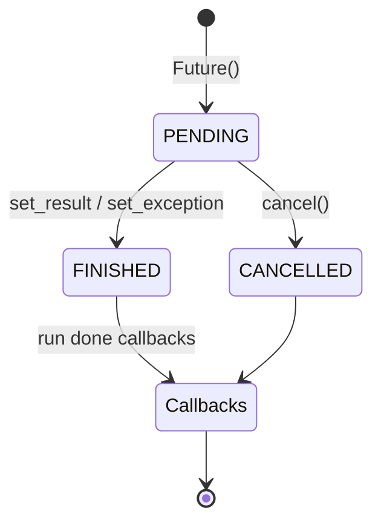

# Asyncio Scheduler From Scratch

## One-Line Purpose

Build a minimal coroutine scheduler with `Future`, task creation, await resumption, and cancellation to understand how asyncio moves work without claiming CPython event-loop parity.

## Status

**Active.** The implementation lives in [[03-Python/code/seb_python/asyncio_lite.py|asyncio_lite.py]] and its executable checks live in [[03-Python/code/tests/test_labs.py|test_labs.py]].

## Prerequisites

[[03-Python/07-Async-Concurrency-and-Free-Threading/Tasks Futures and Awaitables|Tasks Futures and Awaitables]], [[03-Python/07-Async-Concurrency-and-Free-Threading/asyncio Event Loop Internals|asyncio Event Loop Internals]], generators, and `StopIteration` value propagation.

## Architecture



```mermaid
flowchart LR
    Loop[EventLoop.run_until_complete] --> Ready[Ready queue FIFO]
    Ready --> Send[coro.send(None)]
    Send --> Await{awaits Future?}
    Await -->|pending| Callback[add_done_callback resume]
    Await -->|done| Ready
    Send --> Stop[StopIteration sets result]
```

The public learning surfaces are `Future`, `EventLoop`, `CancelledError`, and `sleep_ticks`. Read [[03-Python/projects/Asyncio Scheduler From Scratch/Architecture|Architecture]] before extending behavior.

## Acceptance Criteria

- [ ] `run_until_complete` executes a coroutine that awaits an already-resolved `Future`.
- [ ] Double settlement raises `InvalidStateError`.
- [ ] Cancellation transitions to `CANCELLED` and `result()` raises `CancelledError`.
- [ ] Unsupported awaitables become `TypeError` on the task future.

## Run and Test

From the repository root:

```bash
cd 03-Python/code
python -m pip install -e ".[dev]"
python -m pytest -q tests/test_labs.py -k "test_asyncio_lite"
```

Run the complete Python lab suite with `python -m pytest -q`. Keep experiments in [[03-Python/code|03-Python/code]]; this directory contains documentation, not a second implementation.

## Limitations Versus CPython/stdlib

- Single-threaded FIFO ready queue; no fair scheduling, priorities, or `call_soon`/`call_later`.
- Only bare `Future` awaitables; no `Task`, `TaskGroup`, sockets, subprocesses, or thread offload.
- No exception chaining across callback boundaries matching asyncio debug mode.
- `sleep_ticks` schedules helper coroutines rather than modeling timer handles.

## Production Trade-off

A tiny scheduler makes await/resume visible, but production asyncio relies on selector integration, signal handling, context var propagation guarantees, and cancellation scopes that this lab does not reproduce.

## Exercises and Reflection

1. Add a `Task` wrapper that logs state transitions.
2. Support awaiting another coroutine by wrapping it in an internal future.
3. Detect deadlock when the ready queue empties while tasks remain blocked.

Reflect: identify one invariant the tests prove, one they do not prove, and one production failure mode hidden by the lab's small scale.

## Interview Questions

- What does `await` desugar to at the coroutine frame level?
- Why is cooperative cancellation insufficient for blocking system calls?

## Related Notes

- [[03-Python/projects/Asyncio Scheduler From Scratch/Architecture|Architecture]]
- [[03-Python/projects/Python Runtime Toolkit/README|Python Runtime Toolkit]]
- [[03-Python/07-Async-Concurrency-and-Free-Threading/asyncio Event Loop Internals|asyncio Event Loop Internals]]
- [[03-Python/code/tests/test_labs.py|Python lab tests]]
