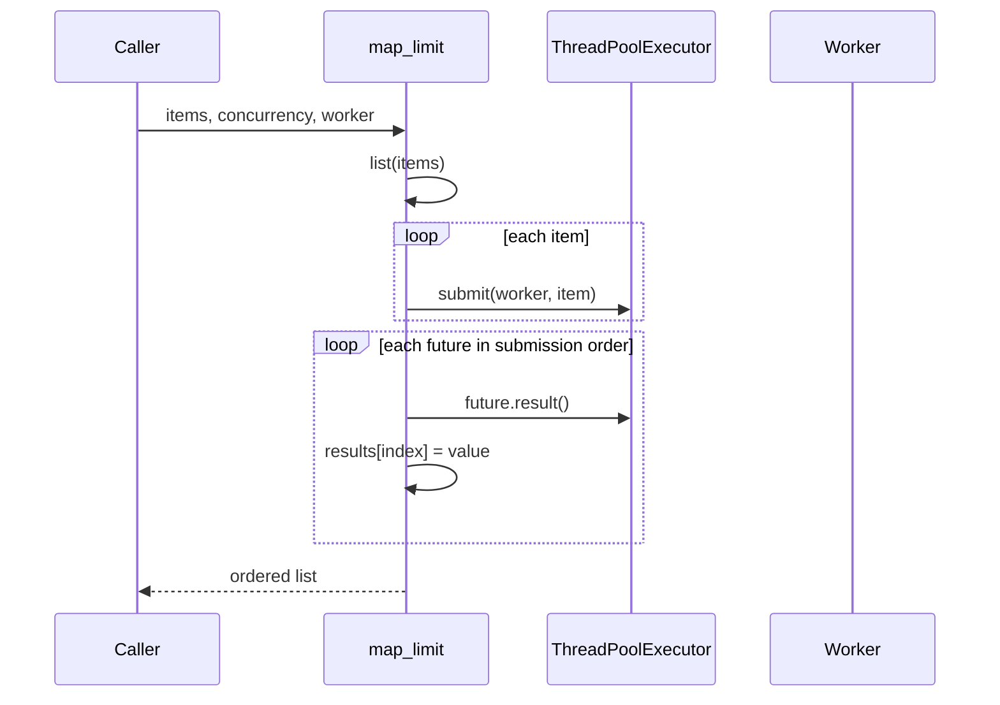

# Architecture — Bounded Worker Orchestrator

## Summary

The lab combines thread-pool parallelism with explicit concurrency caps and optional semaphore guards. Source of truth: [[03-Python/code/seb_python/concurrency.py|concurrency.py]].

## map_limit Data Flow

## Invariants

- `map_limit` rejects concurrency less than one.
- Results preserve input order despite completion order.
- Empty iterables return an empty list without spawning workers.
- `BoundedSemaphorePool.run` releases the semaphore in `finally`.

## Failure Model

Any worker exception propagates from `future.result()` and aborts aggregation. There is no partial result return. Semaphore misuse (negative size) fails at construction.

## Complexity and Ownership

Submission is O(n); result collection is O(n) with up to `concurrency` active threads. Memory includes the materialized input list and result buffer.

## Trade-offs and stdlib Gaps

| Gap | Engineering consequence |
| --- | --- |
| List materialization | Unbounded input size can exhaust memory |
| Sequential result wait | Tail latency if early futures finish last |
| No cancellation | Long-running workers continue after caller abort |
| GIL for CPU work | Threads do not parallelize CPU-bound Python compute |

See [[03-Python/projects/Python Runtime Toolkit/ADR/0003-concurrency-model|ADR-0003]] for portfolio-level concurrency boundaries.

## Evolution Rules

- Preserve ordering semantics unless a versioned API adds streaming modes.
- Add tests for worker exceptions and zero/negative concurrency before changing validation.
- Do not claim asyncio or multiprocessing parity without dedicated adapters.

## Related Documents

- [[03-Python/projects/Bounded Worker Orchestrator/README|Project README]]
- [[03-Python/projects/Python Runtime Toolkit/ADR/0003-concurrency-model|ADR-0003 Concurrency Model]]
- [[03-Python/projects/Resource Pool and ExitStack/README|Resource Pool and ExitStack]]
- [[03-Python/07-Async-Concurrency-and-Free-Threading/Concurrency Models in Python|Concurrency Models in Python]]
