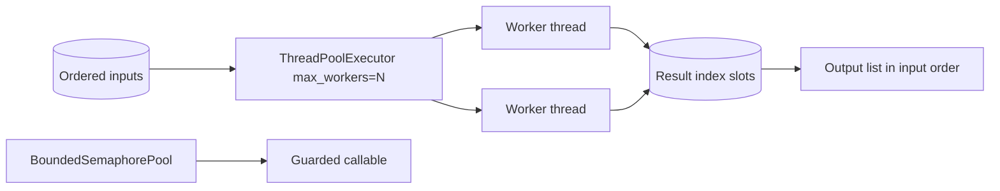

# Bounded Worker Orchestrator

## One-Line Purpose

Bound parallel work with a thread pool, preserve result order, and expose semaphore-guarded critical sections to understand backpressure without pretending to replace `concurrent.futures` or process pools.

## Status

**Active.** The implementation lives in [[03-Python/code/seb_python/concurrency.py|concurrency.py]] and its executable checks live in [[03-Python/code/tests/test_labs.py|test_labs.py]].

## Prerequisites

[[03-Python/07-Async-Concurrency-and-Free-Threading/concurrent futures|concurrent futures]], [[03-Python/07-Async-Concurrency-and-Free-Threading/threading and the GIL|threading and the GIL]], and [[01-Computer-Science/05-Concurrency-Fundamentals/Backpressure and Resource Contention|Backpressure and Resource Contention]].

## Architecture



The public learning surfaces are `map_limit` and `BoundedSemaphorePool`. Read [[03-Python/projects/Bounded Worker Orchestrator/Architecture|Architecture]] before extending behavior.

## Acceptance Criteria

- [ ] `map_limit` rejects concurrency less than one.
- [ ] Results preserve input order despite completion order.
- [ ] Empty iterables return an empty list without spawning workers.
- [ ] `BoundedSemaphorePool.run` executes the callable and releases the semaphore in `finally`.

## Run and Test

From the repository root:

```bash
cd 03-Python/code
python -m pip install -e ".[dev]"
python -m pytest -q tests/test_labs.py -k "test_map_limit"
```

Run the complete Python lab suite with `python -m pytest -q`. Keep experiments in [[03-Python/code|03-Python/code]]; this directory contains documentation, not a second implementation.

## Limitations Versus CPython/stdlib

- Uses `ThreadPoolExecutor.result()` sequentially after submit; not streaming `as_completed`.
- No cancellation, timeouts, retry policy, or per-item error isolation.
- Thread-based only; no process pool, asyncio integration, or free-threading benchmarks.
- `map_limit` materializes the iterable to a list up front.

## Production Trade-off

Ordered indexed results simplify downstream aggregation, but waiting on futures in submission order can increase tail latency compared to consuming completions as they arrive.

## Exercises and Reflection

1. Add fail-slow mode returning `(index, result | exception)` pairs.
2. Support bounded `map_limit` over a generator with a max in-flight window.
3. Compare throughput for I/O-bound versus CPU-bound workers under the GIL.

Reflect: identify one invariant the tests prove, one they do not prove, and one production failure mode hidden by the lab's small scale.

## Interview Questions

- When should you choose threads versus processes versus asyncio for parallel work in Python?
- Why does bounded concurrency differ from rate limiting?

## Related Notes

- [[03-Python/projects/Bounded Worker Orchestrator/Architecture|Architecture]]
- [[03-Python/projects/Python Runtime Toolkit/README|Python Runtime Toolkit]]
- [[03-Python/07-Async-Concurrency-and-Free-Threading/concurrent futures|concurrent futures]]
- [[03-Python/code/tests/test_labs.py|Python lab tests]]
