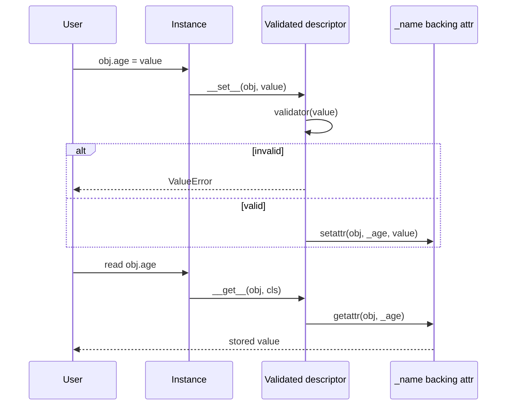

# Architecture — Descriptor Validated Fields

## Summary

The lab isolates the descriptor protocol's write path behind a small typed API. Source of truth: [[03-Python/code/seb_python/descriptors.py|descriptors.py]]. Tests call public behavior rather than private storage layout.

## Component and Data Flow

## Invariants

- `Validated` rejects invalid values with a stable `ValueError` message.
- Valid assignments persist and round-trip through `__get__`.
- `__set_name__` binds the public and private backing attribute names.
- `is_data_descriptor` returns true when `__set__` or `__delete__` exists on the descriptor type.

## Failure Model

Validation failures raise `ValueError` synchronously at assignment time. There is no partial update: either the backing attribute is written or the previous value remains. Callers remain responsible for object construction order when descriptors require manual `__set_name__` in tests.

## Complexity and Ownership

The component owns only per-descriptor validator callables and bound names. It performs no I/O. Validation cost is O(1) per assignment plus whatever the supplied validator does.

## Trade-offs and CPython Gaps

| Gap | Engineering consequence |
| --- | --- |
| No `__delete__` | Cannot model nullable fields that remove backing storage on delete |
| No slot layout | Real classes using `__slots__` change descriptor interaction |
| Callable validators only | No declarative schema, no error aggregation across fields |
| Manual `__set_name__` in tests | Production classes created normally invoke `__set_name__` automatically |

Using descriptors keeps field policy on the class object, but frameworks often centralize validation at serialization boundaries to produce structured multi-field errors.

## Evolution Rules

- Preserve assignment-time validation unless a versioned contract documents deferred validation.
- Add a failing test in [[03-Python/code/tests/test_labs.py|test_labs.py]] before fixing a discovered edge case.
- Do not claim `property` or dataclass parity without explicit conformance tests.
- Document slot, weakref, and metaclass interactions before extending into production-like models.

## Related Documents

- [[03-Python/projects/Descriptor Validated Fields/README|Project README]]
- [[03-Python/projects/Python Runtime Toolkit/Architecture|Toolkit Architecture]]
- [[03-Python/projects/Python Runtime Toolkit/Testing|Toolkit Testing]]
- [[03-Python/03-Classes-Descriptors-and-Metaprogramming/Properties and the Descriptor Protocol|Properties and the Descriptor Protocol]]
