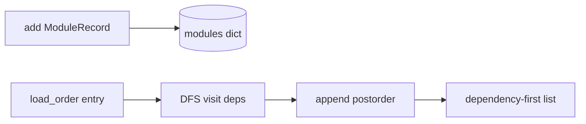
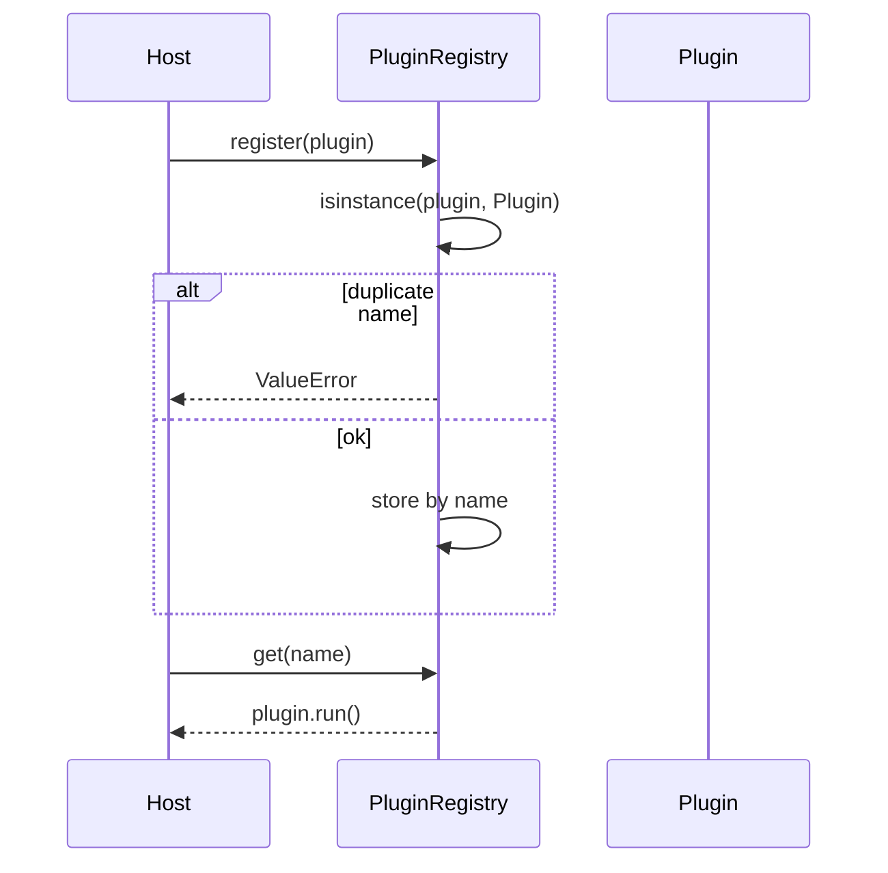

# Architecture — Import Hook Plugin Loader

## Summary

Two cooperating models share the extensibility theme: topological load planning via `ImportGraph`, and structural typing via `PluginRegistry`. Sources: [[03-Python/code/seb_python/imports.py|imports.py]] and [[03-Python/code/seb_python/plugins.py|plugins.py]].

## Import Graph Traversal

## Plugin Registration

## Invariants

- Duplicate module and plugin names are rejected at registration time.
- Dependencies appear before dependents in `load_order`.
- Missing modules raise `ImportError` with the missing name.
- Cycles raise `ImportError` mentioning the revisiting module.
- Plugins must satisfy the runtime-checkable `Plugin` protocol.

## Failure Model

Graph errors fail before any simulated load executes. Registry errors are immediate at registration. There is no partial registry state on duplicate plugin rejection after a successful insert of a different name.

## Complexity and Ownership

Graph operations are O(V + E) for vertices and edges. Registry lookups are O(1) average by name. No filesystem or network access occurs.

## Trade-offs and importlib Gaps

| Gap | Engineering consequence |
| --- | --- |
| No meta_path hooks | Cannot teach finder/loader split directly |
| Protocol-only plugins | No wheel scanning, hash pinning, or sandbox |
| First-cycle error | Operators must reconstruct SCC manually |
| Sorted plugin names | Differs from entry-point discovery order unless documented |

Production systems combine lockfiles, signed artifacts, and explicit plugin allowlists. This lab keeps graph and protocol semantics inspectable.

## Evolution Rules

- Keep graph planning pure: no module execution during ordering.
- Add tests for missing dependency chains before changing error types.
- Any future dynamic loading must pass through [[03-Python/projects/Python Runtime Toolkit/Security|Security]] resource limits.

## Related Documents

- [[03-Python/projects/Import Hook Plugin Loader/README|Project README]]
- [[03-Python/projects/Python Runtime Toolkit/Architecture|Toolkit Architecture]]
- [[03-Python/projects/Python Runtime Toolkit/Security|Toolkit Security]]
- [[03-Python/08-Modules-Packaging-and-Environments/Entry Points Plugins and Console Scripts|Entry Points Plugins and Console Scripts]]
