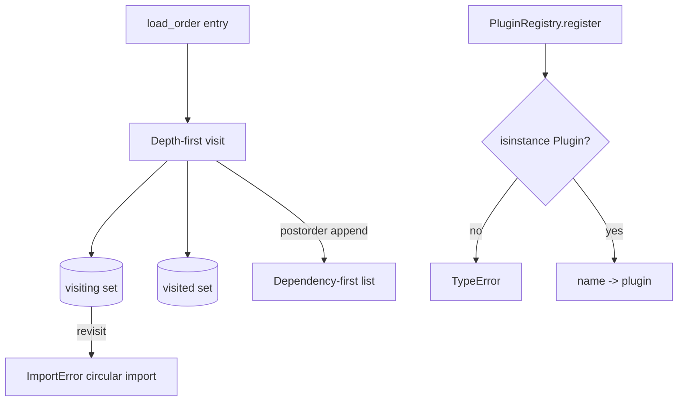

# Import Hook Plugin Loader

## One-Line Purpose

Model dependency-first module ordering, cycle detection, and typed plugin registration to understand import graphs and entry-point style extensibility without executing arbitrary import hooks.

## Status

**Active.** Import ordering lives in [[03-Python/code/seb_python/imports.py|imports.py]]; plugin contracts live in [[03-Python/code/seb_python/plugins.py|plugins.py]]. Executable checks live in [[03-Python/code/tests/test_labs.py|test_labs.py]].

## Prerequisites

[[03-Python/08-Modules-Packaging-and-Environments/Import System and Module Objects|Import System and Module Objects]], [[03-Python/08-Modules-Packaging-and-Environments/Entry Points Plugins and Console Scripts|Entry Points Plugins and Console Scripts]], directed graphs, and [[03-Python/03-Classes-Descriptors-and-Metaprogramming/ABCs Protocols and Runtime Structural Subtyping|ABCs Protocols and Runtime Structural Subtyping]].

## Architecture



The public learning surfaces are `ImportGraph`, `ModuleRecord`, `Plugin`, and `PluginRegistry`. Read [[03-Python/projects/Import Hook Plugin Loader/Architecture|Architecture]] before extending behavior.

## Acceptance Criteria

- [ ] Duplicate module names are rejected at registration time.
- [ ] Dependencies appear before dependents in `load_order`.
- [ ] Missing modules raise `ImportError` with the missing name.
- [ ] Cycles raise `ImportError` mentioning the revisiting module.
- [ ] Plugins must satisfy the `Plugin` protocol; duplicate names are rejected.

## Run and Test

From the repository root:

```bash
cd 03-Python/code
python -m pip install -e ".[dev]"
python -m pytest -q tests/test_labs.py -k "test_import_graph or test_plugin_registry"
```

Run the complete Python lab suite with `python -m pytest -q`. Keep experiments in [[03-Python/code|03-Python/code]]; this directory contains documentation, not a second implementation.

## Limitations Versus CPython/stdlib

- Graph planner only: not `sys.meta_path`, `importlib`, namespace packages, or dynamic execution.
- No live bindings, relative imports, package `__path__`, or top-level await ordering.
- Plugin registry is in-memory; no setuptools entry points, zip imports, or signature verification.
- Cycle errors report the first revisiting node, not the full strongly connected component.

## Production Trade-off

Explicit graphs make dependency mistakes visible early, but real import systems must also handle lazy imports, circular import recovery, and supply-chain integrity that this lab deliberately excludes.

## Exercises and Reflection

1. Return the full cycle path instead of the first repeated node.
2. Add transitive dependents for incremental rebuild planning.
3. Load plugins from a declarative manifest with schema validation.

Reflect: identify one invariant the tests prove, one they do not prove, and one production failure mode hidden by the lab's small scale.

## Interview Questions

- How does Python differ between import-time side effects and explicit plugin registration?
- Why can circular imports sometimes "work" in CPython but remain fragile?

## Related Notes

- [[03-Python/projects/Import Hook Plugin Loader/Architecture|Architecture]]
- [[03-Python/projects/Python Runtime Toolkit/README|Python Runtime Toolkit]]
- [[03-Python/08-Modules-Packaging-and-Environments/Import System and Module Objects|Import System and Module Objects]]
- [[03-Python/code/tests/test_labs.py|Python lab tests]]
