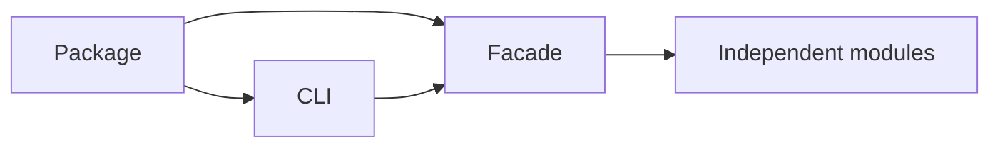

# ADR-0001: Use One Package with Independent Internal Modules

## Status

Accepted on 2026-07-21.

## Context

Nine related labs—descriptors, iterators, context teardown, asyncio-lite, import graph, plugins, concurrency, logging, plus extended vm/gc/mro curriculum—need a coherent portfolio surface without erasing distinct invariants or creating operationally meaningless services.

## Decision

Publish one installable package (`seb-python`) with explicit public re-exports and one thin CLI (`pyrt`). Keep each mechanism in its existing file under [[03-Python/code/seb_python|seb_python]]; add a facade and adapter without moving domain logic into the CLI.

## Options Considered

- One package: simple installation, integration tests, and version story; releases are coupled.
- Many packages: independent versions; excessive release overhead for educational modules.
- Microservices: process isolation; unjustified networking, deployment, and failure complexity for in-memory labs.

## Consequences

Public exports and CLI JSON become compatibility surfaces. Internal modules remain testable in isolation. A defect in one module may require a package release, but no module may import the CLI.

## Follow-ups

- Add facade export and wheel smoke tests.
- Enforce dependency direction in review.
- Revisit only if release cadence or consumer evidence justifies package splitting.

## Related Documents

- [[03-Python/projects/Python Runtime Toolkit/Architecture|Architecture]]
- [[03-Python/projects/Python Runtime Toolkit/API|API]]
