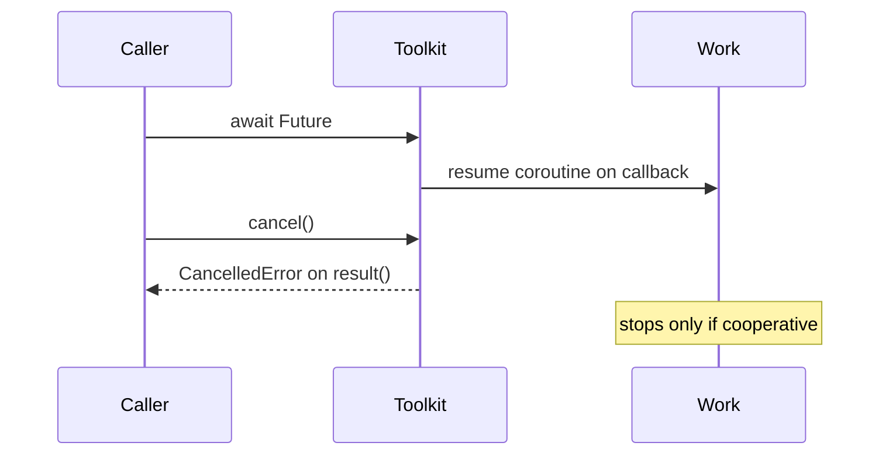

# ADR-0002: Make Async Ordering and Cancellation Explicit

## Status

Accepted on 2026-07-21.

## Context

asyncio-lite futures, done callbacks, and coroutine resume ordering have observable semantics. Cancellation is cooperative and cannot guarantee termination of blocking work outside the scheduler.

## Decision

Document and test future settlement rules, callback invocation after completion, resume-after-await ordering, and `CancelledError` on cancelled futures. Use stable errors/exit codes at the CLI boundary. Never describe cancellation as proof that underlying blocking threads or system calls stopped.

## Options Considered

- Explicit contracts: more tests and compatibility obligations, but deterministic learning and safer consumers.
- Best-effort unspecified ordering: simpler implementation, but race-prone and unteachable.
- Forceful process isolation: stronger termination, but outside this in-process toolkit's scope.

## Consequences

Ordering changes require a compatibility decision. Operations must cooperate with cancellation semantics. Tests avoid wall-clock sleeps except where `sleep_ticks` explicitly models scheduling turns.

## Follow-ups

- Add deadlock and double-settle tests.
- Specify CLI mapping for cancel paths.
- Link all stdlib asyncio gaps from [[03-Python/projects/Python Runtime Toolkit/API|API]].

## Related Documents

- [[03-Python/projects/Asyncio Scheduler From Scratch/Architecture|Asyncio Scheduler Architecture]]
- [[03-Python/projects/Python Runtime Toolkit/Testing|Testing]]
