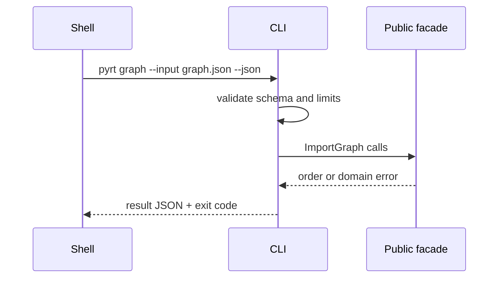

# API — Python Runtime Toolkit

## Library Surface

| Module | Implemented symbols | Contract summary |
| --- | --- | --- |
| descriptors | `Descriptor`, `Validated`, `is_data_descriptor` | validation on assignment, backing storage |
| iterators | `CountUp`, `countdown`, `GeneratorMachine` | iterator protocol and generator send/close |
| context | `ContextStack` | ExitStack-like LIFO teardown |
| asyncio_lite | `Future`, `EventLoop`, `CancelledError`, `sleep_ticks` | minimal coroutine scheduling |
| imports | `ImportGraph`, `ModuleRecord` | dependency-first order, cycle detection |
| plugins | `Plugin`, `PluginRegistry` | runtime-checkable protocol registry |
| concurrency | `map_limit`, `BoundedSemaphorePool` | ordered bounded threads + semaphore guard |
| logging_ctx | `correlation_id`, `bind_correlation`, `reset_correlation`, `configure_logger` | contextvar JSON logging |

Source: [[03-Python/code/seb_python|seb_python]]. These are educational APIs, not drop-in replacements for stdlib or framework APIs.

## CLI Contract (Target)

Syntax: `pyrt <descriptors|iterators|context|async|graph|plugins|workers|logging> --input <json> --json`. The adapter must read bounded JSON, write one JSON result to stdout, diagnostics to stderr, and never execute input as code.

## Error Model

| Exit | Code | Meaning | Caller action |
| --- | --- | --- | --- |
| 0 | OK | Completed | Consume stdout |
| 2 | INVALID_INPUT | Parse/schema failure | Correct input |
| 3 | DOMAIN_ERROR | Cycle, missing dependency, invalid transition | Inspect details |
| 4 | CANCELLED | Cancellation or asyncio-lite cancel | Retry only if safe |
| 70 | INTERNAL_ERROR | Unexpected defect | Preserve stderr and report |

## Compatibility

Semantic versioning applies after the first tagged package release. Export names, JSON fields, exit codes, and ordering are compatibility surfaces. CPython/stdlib parity is not.

## Related Documents

- [[03-Python/projects/Python Runtime Toolkit/ADR/0001-package-boundary|ADR-0001]]
- [[03-Python/projects/Python Runtime Toolkit/Testing|Testing]]
- [[03-Python/code/tests/test_labs.py|test_labs.py]]
