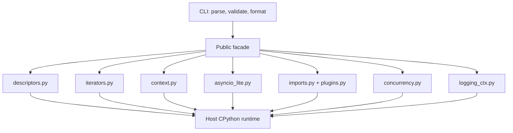
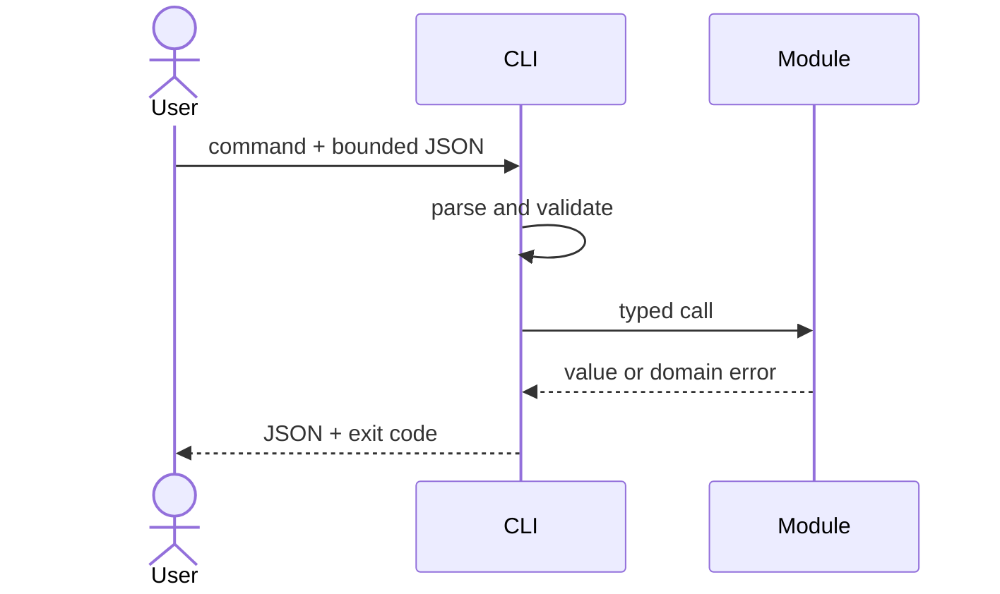

# Architecture — Python Runtime Toolkit

## Summary

A modular monolith is the correct boundary: one installable package, independent domain modules under [[03-Python/code/seb_python|seb_python]], no network services or persistent store. The CLI validates and serializes input; domain modules own behavior.

## Data Flow

## Key Components

| Component | Responsibility | Boundary |
| --- | --- | --- |
| Public facade | Stable exports and semantic versioning | No mechanism policy |
| CLI adapter | Parsing, limits, JSON, exit codes | No domain logic |
| Domain modules | Runtime-mechanism models | No I/O |
| pytest suite | Behavioral and integration contracts | No private-state coupling |

## Supporting Labs (Toolkit Context)

| Module | Role in portfolio |
| --- | --- |
| `iterators` | Iterator and generator state machine for protocol teaching |
| `exceptions` | ExceptionGroup routing (related cleanup semantics) |
| `vm`, `gc_sim`, `mro` | Extended CPython labs linked from curriculum, not CLI v1 |

## Quality Attributes

- Correctness: explicit descriptor, teardown, scheduling, and ordering invariants; differential tests only where stdlib comparison is meaningful.
- Security: no `eval`, dynamic imports of user paths, or implicit filesystem access from CLI JSON.
- Performance: O(V+E) graph traversal and bounded worker counts; benchmarks gate only demonstrated regressions.
- Operability: structured stderr diagnostics; stdout remains machine-readable JSON.

## Trade-offs

One package simplifies learning, versioning, and integration but couples releases. A thin CLI is less flexible than embedded APIs but provides reproducible demonstrations. Educational implementations maximize inspectability rather than CPython conformance or peak performance.

## Decisions

- [[03-Python/projects/Python Runtime Toolkit/ADR/0001-package-boundary|ADR-0001: Package Boundary]]
- [[03-Python/projects/Python Runtime Toolkit/ADR/0002-async-contracts|ADR-0002: Async Contracts]]
- [[03-Python/projects/Python Runtime Toolkit/ADR/0003-concurrency-model|ADR-0003: Concurrency Model]]

## Related Documents

- [[03-Python/projects/Python Runtime Toolkit/Requirements|Requirements]]
- [[03-Python/projects/Python Runtime Toolkit/API|API]]
- [[03-Python/projects/Python Runtime Toolkit/Testing|Testing]]
