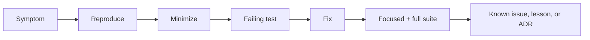

# Debug Diary — Python Runtime Toolkit

## Investigation Index

| Date | Observation | Finding | Prevention | Status |
| --- | --- | --- | --- | --- |
| 2026-07-21 | Documentation requested a library/CLI while code currently exposes source modules | Integration boundary is not yet implemented; claiming runnable `pyrt` would be false | Mark CLI as target, add package smoke and contract tests before claiming completion | tracked |
| 2026-07-21 | `EventLoop` uses list pop(0) for ready queue | O(n) pop is acceptable for lab scale but not production scheduling | Document complexity gap; benchmark before optimizing | accepted for lab |

## Debug Protocol

Reproduce with the smallest input, capture Python/pytest versions and exact command, classify contract versus implementation failure, add a failing test, then fix without weakening assertions. Preserve ordering traces, graph fixtures, and cancellation paths when relevant.

Escalate release-impacting or repeated failures to [[03-Python/projects/Python Runtime Toolkit/Postmortem|Postmortem]].

## Related Documents

- [[03-Python/projects/Python Runtime Toolkit/Known Issues|Known Issues]]
- [[03-Python/09-Production-Python/Debugging pdb monitoring and Remote Attach|Debugging pdb monitoring and Remote Attach]]
