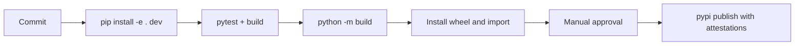

# Deployment — Python Runtime Toolkit

## Environments

| Environment | Purpose | Promotion rule |
| --- | --- | --- |
| local | implementation and focused tests | editable install and pytest pass |
| CI | reproducible multi-platform verification | required checks and wheel smoke test pass |
| PyPI release | immutable library/CLI artifact | reviewed tag, provenance, and manual approval |



## Release and Rollback

Build wheels and sdist from [[03-Python/code|03-Python/code]] using `pyproject.toml`. Inspect artifact contents before publishing. Pin CI Python versions and use least-privilege trusted publishing. PyPI versions are immutable: rollback means yanking or deprecating the bad version, restoring the last known-good recommendation, and publishing a corrected version.

## Local Bootstrap

```bash
cd 03-Python/code
python -m pip install -e ".[dev]"
python -m pytest -q
python -m build
```

## Checklist

- [ ] Editable install and `python -m pytest -q` pass from a clean checkout.
- [ ] Wheel smoke import resolves public facade on supported CPython platforms.
- [ ] Artifact excludes tests, journals, secrets, and local caches.
- [ ] Changelog, compatibility notes, and provenance are recorded.

## Related Documents

- [[03-Python/projects/Python Runtime Toolkit/Testing|Testing]]
- [[03-Python/projects/Python Runtime Toolkit/Monitoring|Monitoring]]
