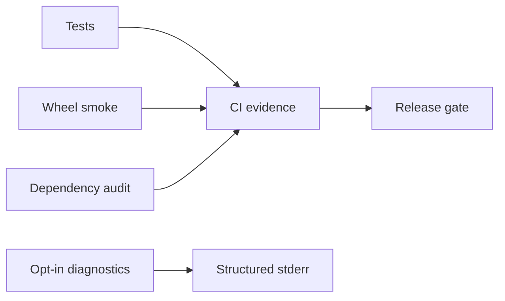

# Monitoring — Python Runtime Toolkit

## Operability Model

This is a local library/CLI, not an always-on service; service availability SLOs would be misleading. Release health is measured through CI, wheel smoke tests, issue trends, and opt-in diagnostics.

| Signal | Target | Evidence |
| --- | --- | --- |
| Supported-platform verification | 100% required jobs pass | CI checks |
| Wheel smoke success | 100% before publish | install/import run |
| Deterministic CLI errors | 100% contract tests | exit-code suite |
| Critical dependency exposure | 0 unmitigated releasable findings | audit record |

## Diagnostics

Never emit telemetry by default. With an explicit debug flag, report command, duration bucket, input-size bucket, module, and stable error code; never report raw values, paths, environment variables, or stack traces to stdout.

Contextvar logging in [[03-Python/code/seb_python/logging_ctx.py|logging_ctx.py]] demonstrates correlation propagation suitable for services, but the toolkit itself does not phone home.

## Triage

A reproducible wrong result or wheel import failure blocks release. Performance observations become regressions only against versioned benchmark fixtures. Link confirmed defects to [[03-Python/projects/Python Runtime Toolkit/Debug Diary|Debug Diary]] and [[03-Python/projects/Python Runtime Toolkit/Known Issues|Known Issues]].

## Related Documents

- [[03-Python/09-Production-Python/Observability Logging Tracing and Metrics|Observability Logging Tracing and Metrics]]
- [[03-Python/projects/Python Runtime Toolkit/Deployment|Deployment]]
