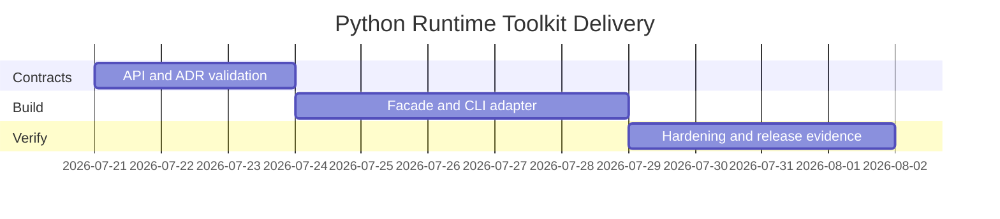

# Planning — Python Runtime Toolkit

## Problem Statement

The existing labs in [[03-Python/code|03-Python/code]] are individually useful but lack a discoverable package surface, CLI workflow, compatibility contract, and release evidence suitable for a portfolio.

## Success Definition

Every documented capability is importable and demonstrable through stable contracts; a clean checkout installs and passes all tests; documentation states CPython/stdlib gaps without implying interpreter conformance.

## Scope

In scope: package facade, CLI adapter, descriptors, iterators/generators, context teardown, asyncio-lite, import graph + plugin registry, bounded workers, contextvar logging, JSON contracts, tests, release artifact, security checks, and operational diagnostics.

Out of scope: web frameworks, ORMs, databases, replacing CPython, arbitrary plugin execution, persistence, and networking.

## Milestones

| Milestone | Outcome | Exit criteria |
| --- | --- | --- |
| M1 Contracts | Public exports and CLI schemas fixed | ADRs accepted; contract tests fail for missing adapter |
| M2 Integration | Library and CLI vertical slice | Nine commands pass positive and negative tests |
| M3 Hardening | Release-ready evidence | clean install, pytest, wheel smoke, docs match behavior |

## Risks

| Risk | Impact | Mitigation |
| --- | --- | --- |
| Docs exceed implementation | Misleading portfolio | Mark current versus target contracts and test every claimed command |
| CPython parity implied | Incorrect learning | Maintain explicit limitations and differential test boundaries |
| CLI accepts unsafe input | Resource exhaustion | Size, depth, item-count, and concurrency limits |

## Dependencies

CPython 3.11+ (3.14+ target for curriculum claims), setuptools, pytest. See [[03-Python/projects/Python Runtime Toolkit/Roadmap|Roadmap]].

## Related Documents

- [[03-Python/projects/Python Runtime Toolkit/Requirements|Requirements]]
- [[03-Python/projects/Python Runtime Toolkit/Roadmap|Roadmap]]
