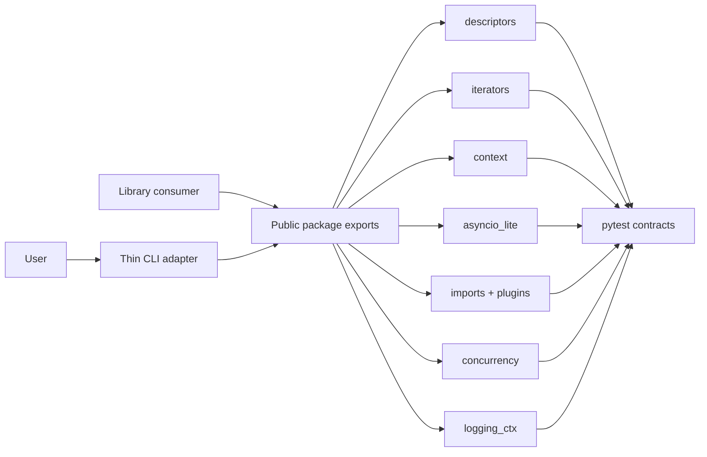

# Python Runtime Toolkit

## One-Line Purpose

A tested Python library and thin CLI learning surface that exposes selected CPython runtime mechanics: validated descriptors, iterators/generators, resource teardown, asyncio-lite scheduling, import/plugin graphs, bounded worker orchestration, typed contracts, and contextvar structured logging.

## Status

**Active.** Core modules and tests exist in [[03-Python/code/seb_python|seb_python]] and [[03-Python/code/tests/test_labs.py|test_labs.py]]. Package facade, public re-exports, and CLI integration are the active portfolio scope.

This toolkit is **not a web framework, ORM, database layer, CPython replacement, or production asyncio runtime**. It is an inspectable educational model with explicit behavioral limits.

## Goals

- Present nine integrated capabilities through one versioned package boundary and a deterministic CLI.
- Preserve small modules that can be tested and reasoned about independently.
- Make errors, ordering, cancellation, and CPython/stdlib gaps visible.
- Demonstrate production disciplines: contracts, security, tests, releases, and observability.

## Non-Goals

- Web frameworks, ORMs, databases, or persistence layers.
- Replacing CPython, `asyncio`, `importlib`, or `concurrent.futures`.
- Arbitrary code execution, remote plugin loading, or sandbox escape claims.
- Network services, long-running daemons, or UI rendering.

## Architecture Snapshot



## Document Map

- [[03-Python/projects/Python Runtime Toolkit/Planning|Planning]] · [[03-Python/projects/Python Runtime Toolkit/Requirements|Requirements]] · [[03-Python/projects/Python Runtime Toolkit/Architecture|Architecture]]
- [[03-Python/projects/Python Runtime Toolkit/API|API]] · [[03-Python/projects/Python Runtime Toolkit/Testing|Testing]] · [[03-Python/projects/Python Runtime Toolkit/Security|Security]]
- [[03-Python/projects/Python Runtime Toolkit/Deployment|Deployment]] · [[03-Python/projects/Python Runtime Toolkit/Monitoring|Monitoring]] · [[03-Python/projects/Python Runtime Toolkit/Roadmap|Roadmap]]
- [[03-Python/projects/Python Runtime Toolkit/Engineering Journal|Engineering Journal]] · [[03-Python/projects/Python Runtime Toolkit/Debug Diary|Debug Diary]]
- [[03-Python/projects/Python Runtime Toolkit/Known Issues|Known Issues]] · [[03-Python/projects/Python Runtime Toolkit/Lessons Learned|Lessons Learned]]
- [[03-Python/projects/Python Runtime Toolkit/Ideas|Ideas]] · [[03-Python/projects/Python Runtime Toolkit/Postmortem|Postmortem]]
- [[03-Python/projects/Python Runtime Toolkit/ADR/0001-package-boundary|ADR-0001]] · [[03-Python/projects/Python Runtime Toolkit/ADR/0002-async-contracts|ADR-0002]] · [[03-Python/projects/Python Runtime Toolkit/ADR/0003-concurrency-model|ADR-0003]]

## Mini Projects

| Mini project | Module focus |
| --- | --- |
| [[03-Python/projects/Descriptor Validated Fields/README\|Descriptor Validated Fields]] | `Validated`, descriptor protocol |
| [[03-Python/projects/Resource Pool and ExitStack/README\|Resource Pool and ExitStack]] | `ContextStack`, `BoundedSemaphorePool` |
| [[03-Python/projects/Asyncio Scheduler From Scratch/README\|Asyncio Scheduler From Scratch]] | `EventLoop`, `Future` |
| [[03-Python/projects/Import Hook Plugin Loader/README\|Import Hook Plugin Loader]] | `ImportGraph`, `PluginRegistry` |
| [[03-Python/projects/Bounded Worker Orchestrator/README\|Bounded Worker Orchestrator]] | `map_limit`, worker bounds |

## Run and Test

```bash
cd 03-Python/code
python -m pip install -e ".[dev]"
python -m pytest -q
```

The documented CLI target is `pyrt <command> --json`; until its adapter is added under [[03-Python/code|03-Python/code]], use the imported Python APIs described in [[03-Python/projects/Python Runtime Toolkit/API|API]].

## Portfolio Acceptance Checklist

- [ ] All documented capabilities are exported from one package boundary.
- [ ] CLI output is deterministic JSON and errors use stable non-zero exit codes.
- [ ] Unit and integration tests cover happy paths, edge cases, ordering, and cancellation.
- [ ] Package ships typed public symbols and excludes test fixtures from artifacts.
- [ ] Security and monitoring checks pass before a tagged release.

## Related Notes

- [[03-Python/code/README|Python Code Labs]]
- [[03-Python/README|Python Track]]
- [[Projects/README|Projects]]
