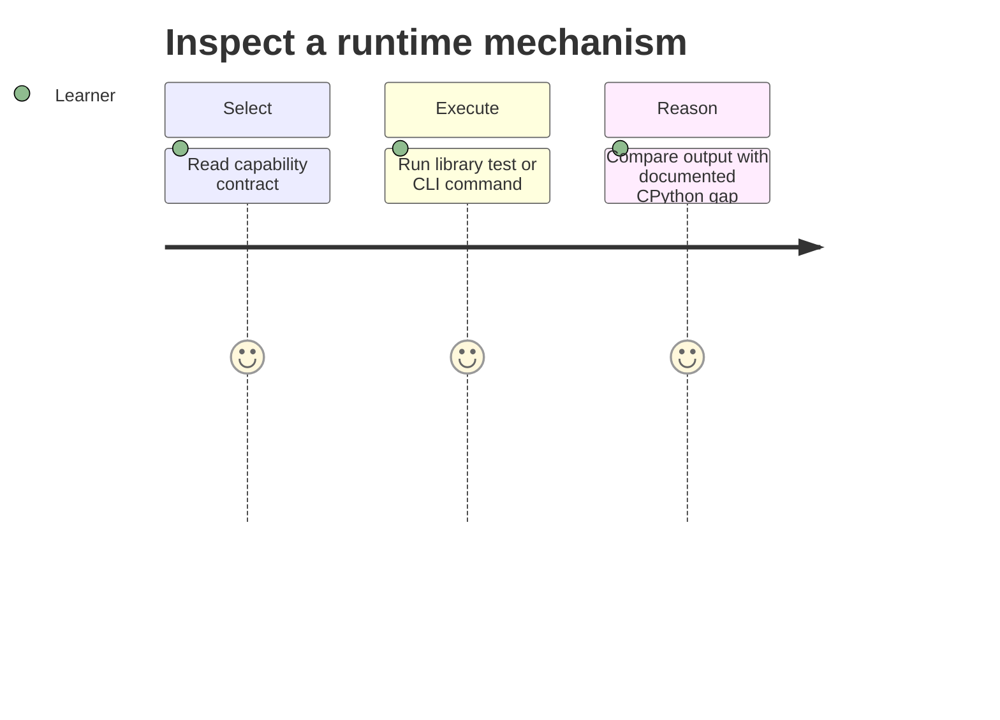

# Requirements — Python Runtime Toolkit

## Actors

| Actor | Goal |
| --- | --- |
| Learner | Inspect mechanisms and reproduce edge cases |
| Library consumer | Import typed, documented APIs |
| CLI user | Run deterministic examples without writing code |
| Maintainer | Change modules without silently breaking contracts |

## Functional Requirements

| ID | Requirement | Acceptance |
| --- | --- | --- |
| FR-001 | Export all nine documented capabilities | Import smoke test resolves every documented symbol |
| FR-002 | Offer JSON CLI commands for each capability | Valid input yields documented JSON and exit 0 |
| FR-003 | Reject invalid and over-limit input | Stable error code, stderr diagnostic, non-zero exit |
| FR-004 | Preserve documented async ordering and cancellation | asyncio-lite tests pass |
| FR-005 | Preserve ordered worker results under concurrency caps | map_limit tests pass |
| FR-006 | Explain CPython/stdlib gaps | Every capability links limitations and tests |

## Non-Functional Requirements

| ID | Category | Requirement | Measurement |
| --- | --- | --- | --- |
| NFR-001 | Correctness | Deterministic results for deterministic inputs | 100% contract suite pass |
| NFR-002 | Performance | Bounded graph/input/worker work | configured limits enforced before work |
| NFR-003 | Security | Never evaluate user code | no `eval`, `exec`, or import-by-path from CLI |
| NFR-004 | Portability | Supported CPython on Windows/Linux/macOS | CI matrix passes |
| NFR-005 | Observability | Machine output separated from diagnostics | JSON stdout; structured stderr |

## Traceability

FR-001/2 map to the facade and CLI integration suite; FR-003 maps to [[03-Python/projects/Python Runtime Toolkit/Security|Security]]; FR-004 maps to [[03-Python/projects/Python Runtime Toolkit/ADR/0002-async-contracts|ADR-0002]]; FR-005 maps to [[03-Python/projects/Python Runtime Toolkit/ADR/0003-concurrency-model|ADR-0003]]; FR-006 maps to mini-project READMEs.

## Related Documents

- [[03-Python/projects/Python Runtime Toolkit/API|API]]
- [[03-Python/projects/Python Runtime Toolkit/Testing|Testing]]
