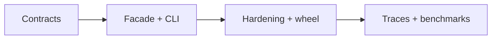

# Roadmap — Python Runtime Toolkit

## Current Phase

P0 contract and integration design is active. Core educational modules exist; distributable product boundaries do not.

| Phase | Outcome | Exit criteria |
| --- | --- | --- |
| P0 | Truthful contracts and decisions | requirements, API, security, tests, ADRs reviewed |
| P1 | Integrated vertical slice | nine exports and nine CLI commands pass contracts |
| P2 | Release-ready artifact | CI matrix, audit, wheel smoke, docs match behavior |
| P3 | Evidence-led enhancements | trace/benchmark work justified by measured learning need |

## Now

Define facade exports, CLI JSON schemas, resource ceilings, error codes, and missing module tests.

## Next

Implement the `pyrt` adapter in [[03-Python/code|03-Python/code]], then add clean-install and wheel checks.

## Later

Evaluate trace mode, Hypothesis suites, and visualization from [[03-Python/projects/Python Runtime Toolkit/Ideas|Ideas]]. Do not add web, ORM, database, or CPython-replacement scope.

## Related Documents

- [[03-Python/projects/Python Runtime Toolkit/Planning|Planning]]
- [[03-Python/projects/Python Runtime Toolkit/Known Issues|Known Issues]]
