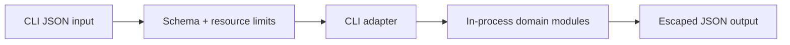

# Security — Python Runtime Toolkit

## Trust Boundaries

## Threat Model

| Threat | Example | Control |
| --- | --- | --- |
| Code execution | input treated as Python source | parse JSON only; forbid `eval`, `exec`, `compile` |
| Resource exhaustion | huge graph or concurrency | byte, depth, node, edge, item, and concurrency caps |
| Unsafe deserialization | pickle or yaml load gadgets | JSON only at CLI boundary |
| Terminal injection | control characters in errors | JSON escaping and structured diagnostics |
| Supply-chain compromise | malicious dependency/update | minimal dependencies, lock review, provenance |

## Controls

The package needs no credentials, network access, filesystem writes, or authentication for core labs. Plugin registry accepts in-memory objects only in v1; it must never claim safe execution of arbitrary third-party modules. Thread pools are not isolation boundaries.

## Security Acceptance

- Negative tests cover malformed, oversized, deeply nested, cyclic, and cancelled inputs.
- Dependency audit findings are triaged by exploitability, not blindly suppressed.
- Release token scope is publish-only and unavailable to pull-request jobs.
- Security limitations link to [[03-Python/projects/Python Runtime Toolkit/Known Issues|Known Issues]] and [[03-Python/projects/Python Runtime Toolkit/Postmortem|Postmortem]].

## Related Documents

- [[03-Python/projects/Python Runtime Toolkit/Requirements|Requirements]]
- [[03-Python/09-Production-Python/Secure Python Practices|Secure Python Practices]]
