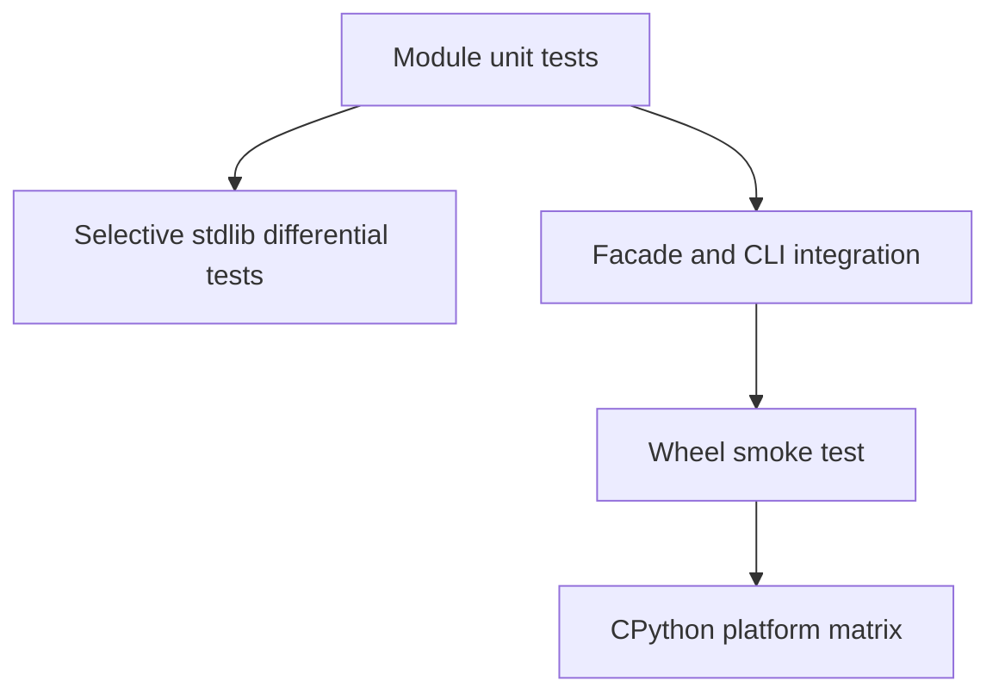

# Testing — Python Runtime Toolkit

## Strategy



## Test Layers

| Layer | Coverage |
| --- | --- |
| Unit | descriptors, iterators, context teardown, asyncio-lite, import graph, plugins, workers, logging |
| Property/model | graph invariants, once-only future settlement, output order |
| Differential | only overlapping stdlib behavior; documented deviations remain explicit |
| Integration | exports, JSON schemas, stderr/stdout separation, exit codes |
| Package | install wheel, import facade, invoke CLI entry point |

## Current Command

```bash
cd 03-Python/code
python -m pip install -e ".[dev]"
python -m pytest -q
```

Current executable coverage is [[03-Python/code/tests/test_labs.py|test_labs.py]]. Required additions include facade export smoke tests, CLI schema validation, hostile graph fixtures, asyncio deadlock detection, worker exception paths, and packed-artifact smoke tests.

## Module Test Filters

| Capability | pytest filter |
| --- | --- |
| Descriptors | `-k test_descriptor_validation` |
| Context / pool | `-k test_context_stack_cleanup or test_map_limit` |
| Asyncio-lite | `-k test_asyncio_lite` |
| Import + plugins | `-k test_import_graph or test_plugin_registry` |
| Logging | `-k test_contextvar_logging` |
| Iterators | `-k test_iterators_and_generators` |

## Definition of Done

Tests assert failure modes and observable ordering, avoid wall-clock dependence where possible, and pass repeatedly without network access. Coverage percentage cannot replace invariant-oriented cases.

## Related Documents

- [[03-Python/projects/Python Runtime Toolkit/API|API]]
- [[03-Python/09-Production-Python/Testing with unittest pytest and Hypothesis|Testing with unittest pytest and Hypothesis]]
