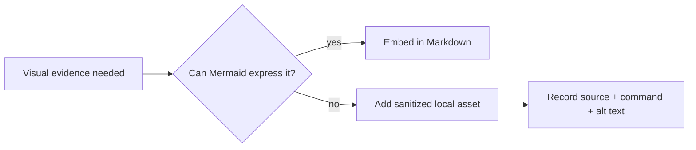

# Assets — Python Runtime Toolkit

## Purpose

Store project-local exported diagrams, benchmark fixtures, and sanitized CLI screenshots only when Mermaid or text cannot express the evidence.

## Rules

- Prefer Mermaid embedded in [[03-Python/projects/Python Runtime Toolkit/Architecture|Architecture]], [[03-Python/projects/Python Runtime Toolkit/Security|Security]], and [[03-Python/projects/Python Runtime Toolkit/Testing|Testing]].
- Use descriptive lowercase filenames with a date or semantic version when time-dependent.
- Include source, generation command, license, and accessibility description beside every binary asset.
- Never commit credentials, environment dumps, user paths, production data, unredacted terminal output, or generated wheel artifacts.
- Keep executable fixtures in [[03-Python/code/tests|code/tests]], not in this documentation directory.

## Related Documents

- [[03-Python/projects/Python Runtime Toolkit/README|Project README]]
- [[03-Python/code/README|Python Code Labs]]
