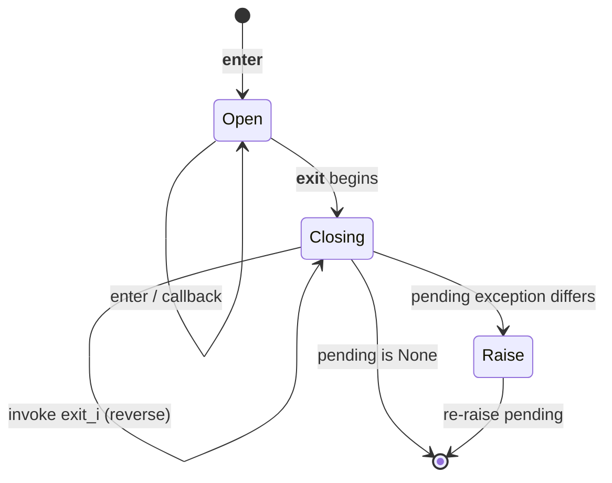
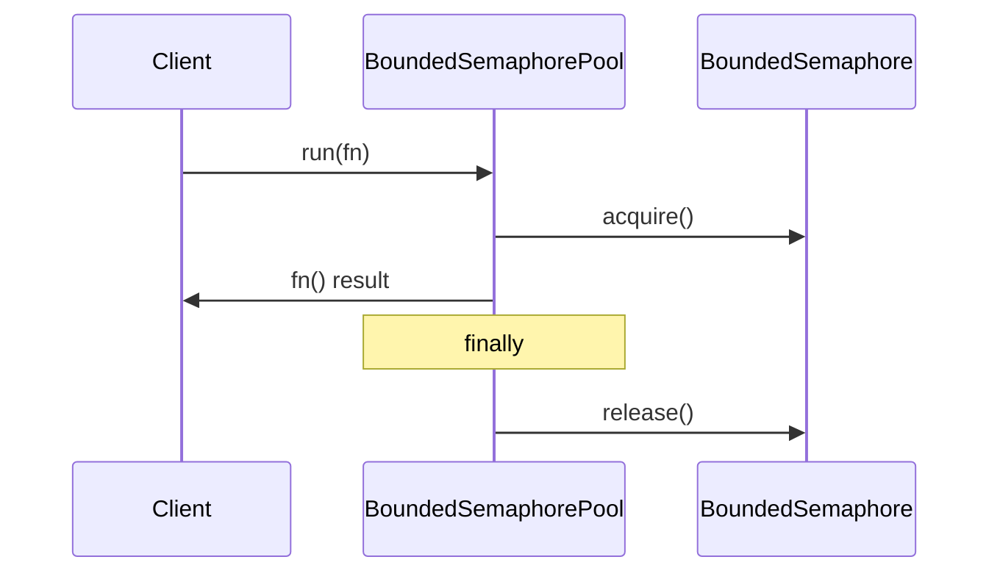

# Architecture — Resource Pool and ExitStack

## Summary

Two complementary mechanisms teach resource lifecycle control: composable synchronous teardown via `ContextStack`, and bounded mutual exclusion via `BoundedSemaphorePool`. Sources: [[03-Python/code/seb_python/context.py|context.py]] and [[03-Python/code/seb_python/concurrency.py|concurrency.py]].

## Teardown State Machine

## Pool Acquire/Release

## Invariants

- `enter` calls `__enter__` and registers `__exit__` for LIFO cleanup.
- Registered callbacks run during teardown in reverse registration order.
- Nested `__exit__` exceptions replace the active exception per the lab's modeled PEP 343 behavior.
- `BoundedSemaphorePool` rejects non-positive sizes and always releases in `finally`.

## Failure Model

Context manager failures during unwind may replace the active exception. Suppression occurs only when an `__exit__` returns true for the active exception. Pool acquisition failure blocks until a slot frees; there is no timeout or deadlock detection.

## Complexity and Ownership

`ContextStack` stores O(n) exit callbacks for n registered resources. Pool size is fixed at construction. Neither component performs network or filesystem I/O.

## Trade-offs and stdlib Gaps

| Gap | Engineering consequence |
| --- | --- |
| No async ExitStack | asyncio cleanup requires `AsyncExitStack` patterns |
| Semaphore-only pool | No pre-warmed connections, validation, or metrics |
| In-process only | Cannot survive process crash mid-hold |
| Thread-based pool helper | CPU-bound Python work still contends on the GIL |

Production services combine context-managed scopes with external pool libraries (SQLAlchemy, urllib3, custom queues) that add health checks and observability.

## Evolution Rules

- Preserve LIFO teardown ordering unless documented otherwise.
- Add failing tests for suppression, nested exceptions, and double-release guards before changing unwind logic.
- Keep pool scope limited to in-process semaphores; document when thread pools belong in the worker orchestrator mini-project.

## Related Documents

- [[03-Python/projects/Resource Pool and ExitStack/README|Project README]]
- [[03-Python/projects/Bounded Worker Orchestrator/README|Bounded Worker Orchestrator]]
- [[03-Python/projects/Python Runtime Toolkit/Architecture|Toolkit Architecture]]
- [[03-Python/04-Iteration-Exceptions-and-Context/Resource Cleanup and Cancellation Semantics|Resource Cleanup and Cancellation Semantics]]
