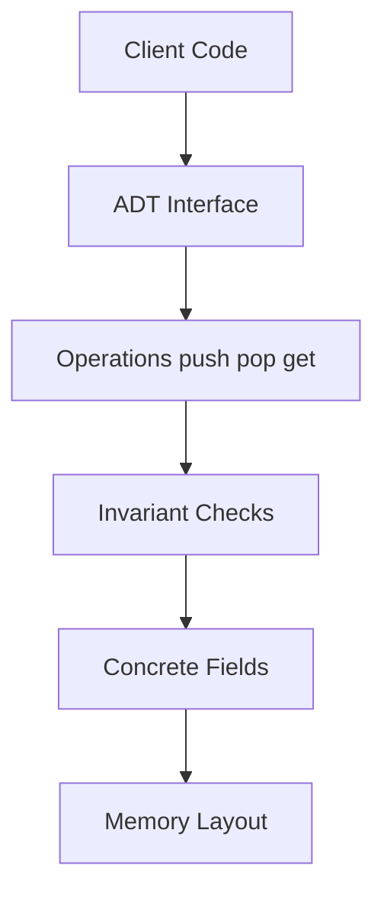
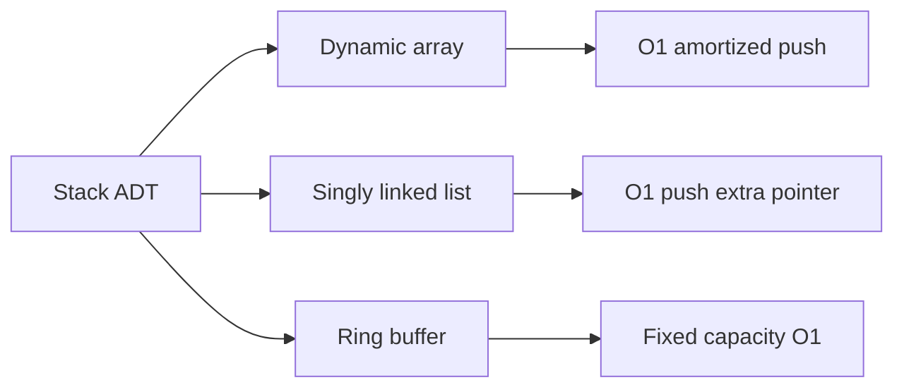
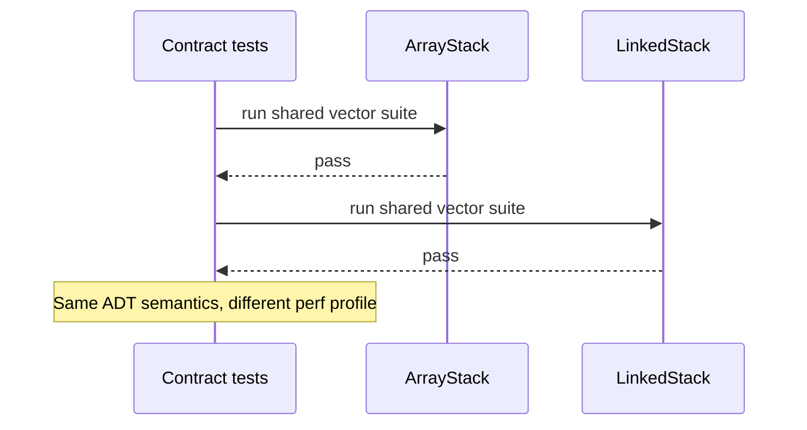

# Abstract Data Types vs Concrete Structures

## Overview

An **abstract data type (ADT)** specifies a set of **operations** and their **semantic contracts** without fixing how data is stored. A **concrete data structure** is a particular memory layout plus algorithms that implement those operations while preserving **invariants**.

Example: a **Stack** ADT defines `push`, `pop`, and LIFO ordering. You can implement it with a dynamic array, a singly linked list, or a fixed ring buffer—same ADT, different trade-offs. Confusing the ADT with one implementation leads to wrong complexity claims and brittle APIs.

This note is foundational for [[04-Data-Structures/README|Data Structures]]: every module names an ADT first, then compares representations.

## Learning Objectives

- Define ADT operations, preconditions, postconditions, and invariants separately from representation
- Map one ADT to multiple concrete structures with a complexity comparison table
- Explain why Java `List` interface vs `ArrayList`/`LinkedList` embodies this split
- Design APIs that leak minimal representation details
- Recognize when ADT semantics force a specific representation choice

## Prerequisites

- [[04-Data-Structures/00-Orientation-and-Contracts/Why Data Structures Exist|Why Data Structures Exist]]
- [[01-Computer-Science/09-Correctness-and-Reliability/Invariants Assertions and Contracts|Invariants Assertions and Contracts]]

## Difficulty

`beginner`

## Estimated Time

- Reading: 1.5 hours
- Exercises: 2 hours
- Mini project: 3 hours

## History

The ADT concept emerged from **data abstraction** research (Liskov, Parnas, Guttag, 1970s): modules should expose behavior, hide representation. CLU (1974) and later Modula-2, Ada, and C++ abstract classes formalized the idea. The **STL** (Stepanov, 1990s) pushed **generic programming**: algorithms written against ADT concepts (`ForwardIterator`, `RandomAccessIterator`) independent of container.

Modern languages blur the line: Python's `list` is concrete; TypeScript's `ReadonlyArray<T>` is closer to an ADT view. Production code still benefits from explicitly asking: *what operations does my module need*, not *what class name did I import*.

## Problem It Solves

Teams that conflate ADT and implementation:

| Mistake | Consequence |
| --- | --- |
| "We use a list" without LIFO/FIFO semantics | Wrong Big-O on middle operations |
| Exposing internal array on a Stack | Callers break LIFO invariants |
| Swapping `LinkedList` for `ArrayList` silently | Iterator invalidation, memory profile change |
| Testing only one representation | Missed edge cases on resize/rehash |

Separating ADT from structure enables **substitution**, **testing against contracts**, and **honest documentation** of complexity.

## Internal Implementation

An ADT implementation bundle:

1. **Public interface** — operation names, error types, iterator contracts
2. **Private fields** — backing store, metadata
3. **Core algorithms** — mutation paths that restore invariants
4. **Optional views** — read-only or lazy projections



See [[04-Data-Structures/00-Orientation-and-Contracts/Interface Design Capacity Errors and Iteration|Interface Design Capacity Errors and Iteration]] for API surface design.

## Mermaid Diagrams

### Structure: one ADT, many structures



### Sequence: substitution under test



## Examples

### Minimal Example

TypeScript — ADT interface with array backing:

```typescript
interface Stack<T> {
  push(value: T): void;
  pop(): T | undefined;
  peek(): T | undefined;
  readonly size: number;
}

class ArrayStack<T> implements Stack<T> {
  private data: T[] = [];

  push(value: T): void {
    this.data.push(value);
  }

  pop(): T | undefined {
    return this.data.pop();
  }

  peek(): T | undefined {
    return this.data[this.data.length - 1];
  }

  get size(): number {
    return this.data.length;
  }
}
```

Python — `Protocol` as ADT, list as structure:

```python
from typing import Generic, Protocol, TypeVar

T = TypeVar("T")


class Stack(Protocol[T]):
    def push(self, value: T) -> None: ...
    def pop(self) -> T: ...
    def peek(self) -> T: ...
    def __len__(self) -> int: ...


class ListStack(Generic[T]):
    def __init__(self) -> None:
        self._data: list[T] = []

    def push(self, value: T) -> None:
        self._data.append(value)

    def pop(self) -> T:
        return self._data.pop()

    def peek(self) -> T:
        return self._data[-1]

    def __len__(self) -> int:
        return len(self._data)
```

### Production-Shaped Example

Expose ADT; hide representation; forbid random access on a stack used for undo:

```typescript
export class UndoStack {
  private readonly stack = new ArrayStack<Command>();

  execute(cmd: Command): void {
    cmd.run();
    this.stack.push(cmd);
  }

  undo(): void {
    const cmd = this.stack.pop();
    if (!cmd) throw new Error("nothing to undo");
    cmd.revert();
  }

  // Deliberately NO getAt(i) — would violate Stack ADT semantics
}
```

Cross-link: [[04-Data-Structures/03-Stacks-Queues-and-Deques/Stacks|Stacks]] for LIFO specialization.

## Operation Complexity

Stack ADT — comparison of concrete implementations (n = size):

| Operation | Dynamic array | Singly linked list | Fixed ring buffer |
| --- | --- | --- | --- |
| `push` | O(1) amortized | O(1) | O(1) if not full |
| `pop` | O(1) | O(1) | O(1) if not empty |
| `peek` | O(1) | O(1) | O(1) |
| Memory | ~n × elem size | n × (elem + pointer) | cap × elem size |
| Iterator order | LIFO via index | LIFO via walk | LIFO with wrap |

Queue ADT implementations differ—see [[04-Data-Structures/03-Stacks-Queues-and-Deques/Queues|Queues]].

## Invariants

**Stack ADT (semantic):**

1. If `pop` succeeds, the returned element is the most recently `push`ed still stored.
2. `size` equals the number of elements logically in the stack.
3. `peek` does not change logical contents.

**ArrayStack (representation):**

1. `data.length === size` (no slack required for stack-only use).
2. Top element at `data[size - 1]` when `size > 0`.

Representation invariants imply ADT invariants when operations are correct—see [[04-Data-Structures/00-Orientation-and-Contracts/Invariants Representation and Debug Assertions|Invariants Representation and Debug Assertions]].

## Trade-offs

| Dimension | Upside | Downside | When it matters |
| --- | --- | --- | --- |
| ADT-first design | Swappable implementations | Indirection / generics cost | Libraries, test doubles |
| Leaky abstraction | Performance hooks | Clients depend on layout | Premature optimization |
| Multiple impls | Benchmark per workload | Duplicated invariant logic | Shared test vectors |
| Stdlib concrete types | Speed to ship | Hidden resize/rehash | Hot path profiling |

### When to Use

- Library boundaries and plugins where representation may change
- Contract testing with shared JSON vectors ([[04-Data-Structures/code/README|code labs]])
- Teaching and interviews—state ADT before coding

### When Not to Use

- Inner loops where one representation is measured and fixed (document the choice)
- Over-abstracting a one-off script with three operations total

## Exercises

1. Write ADT operations (signatures + semantics) for a **Bag** (multiset with insert/remove-any).
2. Implement `Stack<T>` with array and linked list; run identical test cases on both.
3. List three methods that would **break** Stack semantics if added to the public API.
4. Compare Python `collections.deque` as Queue vs list—ADT fit and complexity.
5. Diagram Map ADT vs hash table vs balanced tree—ordering guarantees.

## Mini Project

**Dual Implementation Lab**

Implement `Queue<T>` as ring buffer and linked queue. Share one test suite. Document where they diverge in memory and p99 latency on your machine.

## Portfolio Project

In [[04-Data-Structures/projects/Structures Workbench/README|Structures Workbench]], register each structure with its ADT name, representation, and invariant checklist.

## Interview Questions

1. Define ADT vs data structure in interview-ready sentences.
2. Can two structures implement the same ADT with different worst-case bounds? Example.
3. Why should `Stack` not expose `get(i)`?
4. What is an iterator contract, and how can it differ between representations?
5. How does Java's `List` relate to this note?

### Stretch / Staff-Level

1. Design an ADT for a time-series window with O(1) min/max—what representations exist?
2. When does exposing "internal capacity" help vs hurt operability?

## Common Mistakes

- Calling `ArrayList` "the stack" without LIFO discipline
- Putting domain logic inside a generic container class
- Testing implementation details (array length) instead of ADT semantics
- Using ADT names for structures that violate semantics (e.g., random-access "stack")

## Best Practices

- Name modules after ADTs (`PriorityQueue`), files after representation if multiple (`ring_queue.ts`)
- Document pre/postconditions on public methods
- Run shared vectors across all implementations of an ADT
- Leak representation only via opt-in types (`asMutSlice()` patterns)

## Summary

Abstract data types describe *what* operations mean; concrete structures describe *how* memory and algorithms deliver those operations under stated invariants. Separating the two enables substitution, honest complexity tables, and tests that target semantics instead of accidental layout. Production code should default to ADT-shaped interfaces at module boundaries while permitting representation commits—and documentation—inside performance-critical components.

## Further Reading

- [[01-Computer-Science/09-Correctness-and-Reliability/Invariants Assertions and Contracts|Invariants Assertions and Contracts]]
- Liskov & Guttag — *Abstraction and Specification in Program Development*
- Stepanov — STL and generic programming essays

## Related Notes

- [[04-Data-Structures/00-Orientation-and-Contracts/Why Data Structures Exist|Why Data Structures Exist]]
- [[04-Data-Structures/00-Orientation-and-Contracts/Interface Design Capacity Errors and Iteration|Interface Design Capacity Errors and Iteration]]
- [[04-Data-Structures/03-Stacks-Queues-and-Deques/Stacks|Stacks]]
- [[04-Data-Structures/03-Stacks-Queues-and-Deques/Queues|Queues]]
- [[04-Data-Structures/06-Heaps-and-Priority-Queues/Priority Queue ADT|Priority Queue ADT]]

## Progress Checklist

- [ ] Explained from first principles
- [ ] Drew at least one Mermaid diagram
- [ ] Implemented a minimal version
- [ ] Documented trade-offs and non-goals
- [ ] Completed exercises
- [ ] Practiced interview questions aloud
- [ ] Linked prerequisites and dependents
