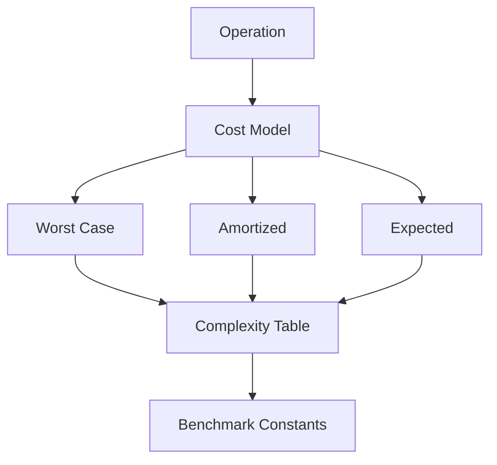
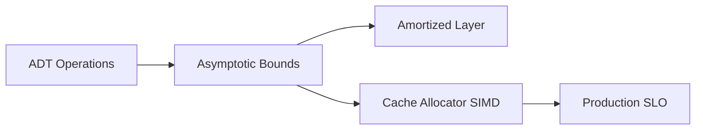
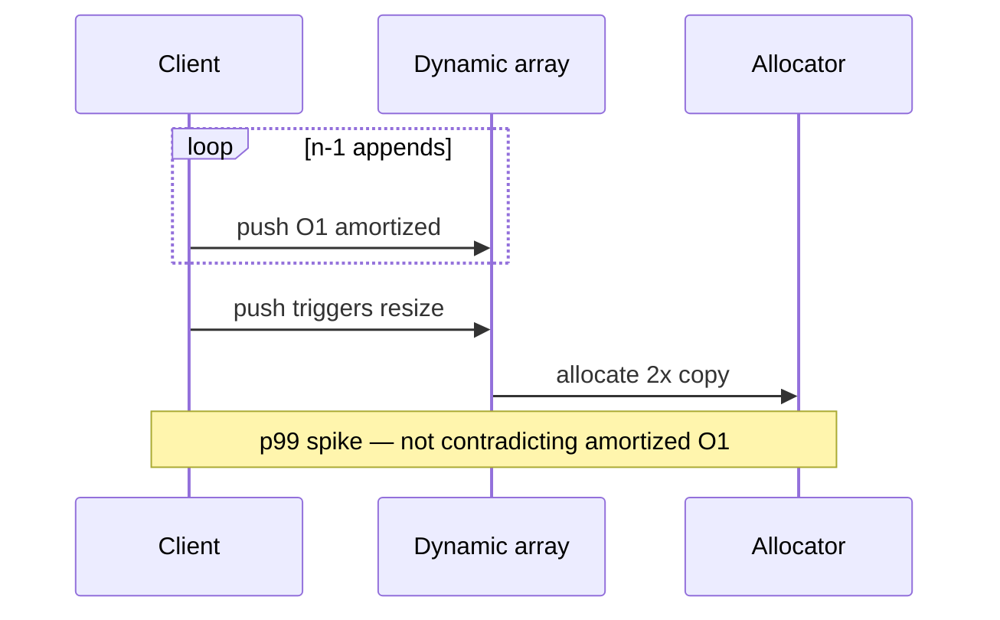

# Complexity Tables Amortization and Practical Constants

## Overview

**Complexity tables** document time and space bounds per operation for a concrete structure under explicit assumptions. **Amortized analysis** averages expensive rare operations (e.g., dynamic array doubling) over a sequence so most operations remain cheap. **Practical constants**—cache lines, allocator behavior, pointer size, load factor—often dominate asymptotics at production scale.

This note teaches how to read, write, and challenge complexity claims in [[04-Data-Structures/README|Data Structures]] without hand-waving "it's O(1) because the doc says so."

## Learning Objectives

- Build operation-level complexity tables with worst, amortized, and expected columns
- Apply aggregate and potential-method amortization to dynamic array growth
- State assumptions (SUHA, balanced tree, bounded capacity) alongside bounds
- Explain when Big-O misleads due to constants and hardware locality
- Connect analysis to [[01-Computer-Science/02-Machine-Model/Cache Hierarchy and Locality|cache effects]]

## Prerequisites

- [[01-Computer-Science/08-Languages-and-Computation/Computational Complexity Primer|Computational Complexity Primer]]
- [[04-Data-Structures/00-Orientation-and-Contracts/Why Data Structures Exist|Why Data Structures Exist]]

## Difficulty

`intermediate`

## Estimated Time

- Reading: 2 hours
- Exercises: 3 hours
- Mini project: 4 hours

## History

Knuth's **amortized analysis** (1980s) formalized intuition about dynamic table doubling. Tarjan's work on union-find and splay trees expanded the toolkit. Engineering practice added **expected-case** hash analysis (SUHA) and **worst-case** awareness after algorithmic complexity attacks (hash flooding).

Modern profiling (cache miss counters, allocators, SIMD) reminds us that **1970s RAM models** are necessary but insufficient for SLO-driven systems.

## Problem It Solves

| Failure mode | Missing analysis piece |
| --- | --- |
| "Append is O(1)" without amortized qualifier | Surprise latency on resize |
| Expected O(1) hash treated as worst-case | DoS under adversarial keys |
| Linked list "O(1) insert" ignoring search | Hidden linear scan |
| Ignoring n=50 vs n=50M crossover | Wrong structure at scale |

Complexity tables force **operation-granular honesty** before code review or architecture sign-off.

## Internal Implementation

Analysis pipeline for any structure in this track:

1. List **operations** from the ADT interface
2. Identify **dominant steps** (comparisons, copies, pointer hops, hashes)
3. Classify **worst**, **amortized**, **expected** where applicable
4. Note **space** including metadata and slack capacity
5. Validate with **microbenchmarks** + **shared test vectors**



### Amortized doubling (sketch)

Appending to a dynamic array that doubles when full: charge 3 credits per insert—1 pays the insert, 2 bank for future copy. Over n appends, total copy work is n + n/2 + n/4 + … < 2n, hence **O(1) amortized** per append. See [[04-Data-Structures/01-Contiguous-Sequences/Dynamic Arrays and Amortized Growth|Dynamic Arrays and Amortized Growth]].

## Mermaid Diagrams

### Structure: analysis layers



### Sequence: resize spike in production



## Examples

### Minimal Example

TypeScript — documenting bounds in code:

```typescript
/**
 * Dynamic append table (this module):
 * - push: O(1) amortized, O(n) worst case on resize
 * - pop: O(1)
 * - get(i): O(1)
 * Space: O(n) elements + O(n) worst-case slack after growth
 */
class IntVec {
  private data: number[] = [];
  push(x: number): void {
    this.data.push(x);
  }
}
```

Python — timing resize vs steady state:

```python
import time

def bench_push(n: int) -> tuple[float, float]:
    xs: list[int] = []
    t0 = time.perf_counter()
    for i in range(n):
        xs.append(i)
    steady = time.perf_counter() - t0

    xs.clear()
    t1 = time.perf_counter()
    for i in range(n):
        if i == n // 2 and len(xs) == i:
            xs.extend([0] * (len(xs) or 1))  # force growth pattern
        xs.append(i)
    forced = time.perf_counter() - t1
    return steady, forced

s, f = bench_push(200_000)
assert s > 0  # exercise: compare constants on your machine
```

### Production-Shaped Example

Document complexity in an API alongside metrics for resize events:

```typescript
export interface VecMetrics {
  resizeCount: number;
  elementsCopied: number;
}

export class InstrumentedVec<T> {
  private buf: T[] = [];
  readonly metrics: VecMetrics = { resizeCount: 0, elementsCopied: 0 };

  /** Amortized O(1); worst O(n) when capacity exhausted */
  push(value: T): void {
    const before = this.buf.length;
    this.buf.push(value);
    if (this.buf.length < before) throw new Error("unexpected shrink");
    // V8/JS engines hide resize; metrics hook via custom growth in native code
  }
}
```

Cross-link: [[01-Computer-Science/02-Machine-Model/Measuring Computer Performance|Measuring Computer Performance]].

## Operation Complexity

Reference table for structures introduced in modules 00–03 (proofs in module notes):

| Structure | Operation | Worst | Amortized | Expected | Space |
| --- | --- | --- | --- | --- | --- |
| Fixed array | access `i` | O(1) | O(1) | O(1) | O(n) |
| Dynamic array | push back | O(n) | O(1) | O(1) | O(n) |
| Dynamic array | insert at `i` | O(n) | O(n) | O(n) | O(n) |
| Singly linked list | prepend | O(1) | O(1) | O(1) | O(n) |
| Singly linked list | find | O(n) | O(n) | O(n) | O(n) |
| Stack (array) | push/pop | O(n)* | O(1) | O(1) | O(n) |
| Queue (ring) | enqueue/dequeue | O(1) | O(1) | O(1) | O(cap) |
| Deque (array) | push/pop both ends | O(n)** | O(1) | O(1) | O(n) |

\*Worst on implicit resize if stack shares dynamic array growth.  
\*\*Middle operations O(n); ends amortized O(1) in typical chunked implementations.

## Invariants

Analysis invariants (meta):

1. Every table entry names the **variable** (n, cap, load factor α).
2. **Worst** and **amortized** are never conflated in public docs.
3. Expected bounds cite **assumption** (random hash, uniform input).
4. Space includes **metadata** (pointers, capacity slack, sentinel nodes).

## Trade-offs

| Dimension | Upside | Downside | When it matters |
| --- | --- | --- | --- |
| Worst-case focus | Safe for adversarial input | Pessimistic for typical load | Security, realtime |
| Amortized focus | Matches batch workloads | Rare spikes violate p99 | Streaming ingest |
| Expected focus | Matches hash/table theory | False if assumptions break | User-generated keys |
| Constant tuning | Wins at moderate n | Fragile across hardware | Hot loops |

### When to Use

- API docs, design reviews, and structure selection matrices
- Explaining p99 spikes that still satisfy amortized bounds
- Interview answers that mention assumptions

### When Not to Use

- Replacing measurement on production traffic shapes
- Arguing correctness—complexity does not prove invariants

## Exercises

1. Prove aggregate O(1) amortized append for doubling growth from empty.
2. Construct a sequence of n appends with Θ(n log n) total cost if growth factor is 1.1 instead of 2.
3. Fill complexity columns for `deque` push/pop at both ends (Python docs vs array-backed model).
4. When is expected O(1) hash lookup **not** acceptable for an API gateway?
5. Microbenchmark: find n where linked list scan beats array scan on your CPU (if ever).

## Mini Project

**Complexity Table Generator**

For `ArrayStack`, `RingQueue`, and `SinglyLinkedList`, auto-generate a Markdown table from a YAML spec of operations; validate one row with a timed experiment.

## Portfolio Project

Add a **Complexity & Metrics** panel to [[04-Data-Structures/projects/Structures Workbench/README|Structures Workbench]] showing worst/amortized bounds and live resize counters per structure.

## Interview Questions

1. Difference between amortized O(1) and average O(1)?
2. Why can dynamic array push be O(n) worst case but O(1) amortized?
3. What assumption underlies expected O(1) hash table lookup?
4. Name a structure where worst-case and amortized differ dramatically.
5. Why do constants matter at n=1000?

### Stretch / Staff-Level

1. Potential method proof for binary counter increment (CLRS Exercise).
2. How do you document amortized bounds in a latency SLO contract?

## Common Mistakes

- Stating "O(1)" without operation name or case type
- Using amortized bounds for realtime hard guarantees without buffering
- Ignoring **hidden O(n)** work (hash rehash, deque compaction)
- Comparing structures at asymptotic level only

## Best Practices

- Three-column tables: worst / amortized / expected
- Footnote assumptions and iterator invalidation rules
- Pair analysis with [[04-Data-Structures/00-Orientation-and-Contracts/Memory Layout Locality and Allocation Patterns|locality notes]]
- Benchmark with production key distributions

## Summary

Complexity tables translate ADT operations into resource bounds under explicit assumptions. Amortized analysis explains how expensive rare events (resize, rehash) spread across many cheap operations, while expected analysis models typical randomness that adversaries may break. Production selection requires all three layers— asymptotics, constants, and hardware locality—documented honestly in every structure module of this track.

## Further Reading

- [[01-Computer-Science/08-Languages-and-Computation/Computational Complexity Primer|Computational Complexity Primer]]
- CLRS — Chapter 17 (Amortized Analysis)
- Tarjan — amortized complexity survey

## Related Notes

- [[04-Data-Structures/01-Contiguous-Sequences/Dynamic Arrays and Amortized Growth|Dynamic Arrays and Amortized Growth]]
- [[04-Data-Structures/00-Orientation-and-Contracts/Memory Layout Locality and Allocation Patterns|Memory Layout Locality and Allocation Patterns]]
- [[04-Data-Structures/02-Linked-Structures/Linked vs Contiguous Trade-offs|Linked vs Contiguous Trade-offs]]
- [[01-Computer-Science/02-Machine-Model/Measuring Computer Performance|Measuring Computer Performance]]

## Progress Checklist

- [ ] Explained from first principles
- [ ] Drew at least one Mermaid diagram
- [ ] Implemented a minimal version
- [ ] Documented trade-offs and non-goals
- [ ] Completed exercises
- [ ] Practiced interview questions aloud
- [ ] Linked prerequisites and dependents
