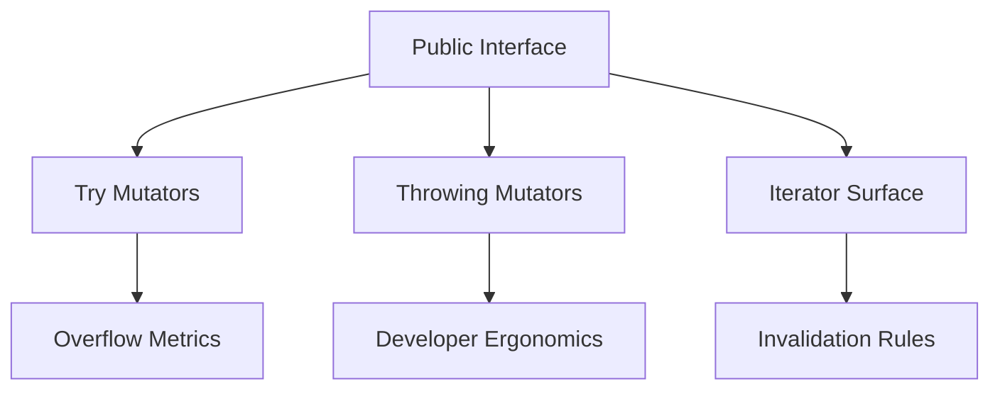
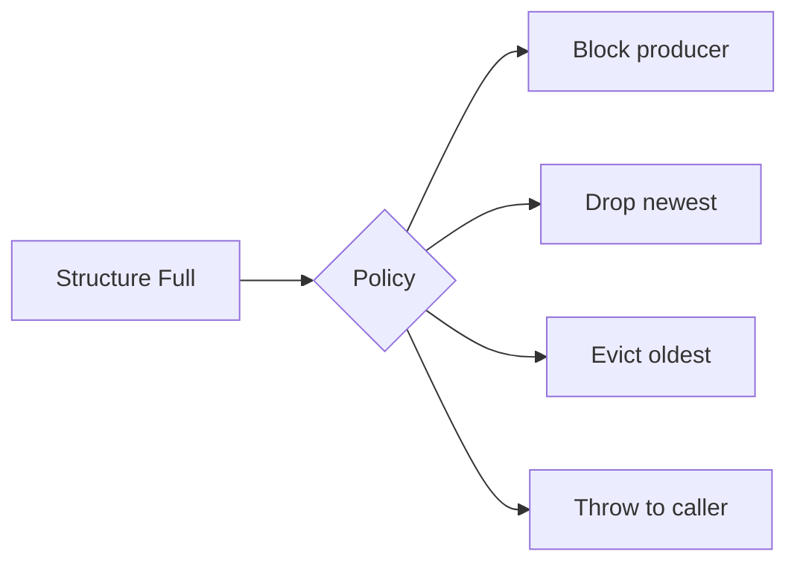
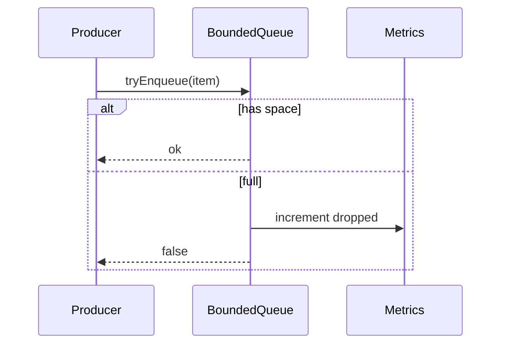

# Interface Design Capacity Errors and Iteration

## Overview

**Interface design** for containers specifies how callers observe size, capacity, failure, and traversal. **Capacity errors** arise when bounded structures reject inserts or when growth fails (OOM)—production APIs must choose **throw**, **Result**, or **silent drop** deliberately. **Iteration contracts** define snapshot vs live views, invalidation on mutation, and whether order is guaranteed.

Poor interfaces cause more production incidents than wrong Big-O constants: ambiguous full/empty queues, iterators surviving resize, and unchecked `pop()` on empty stacks.

## Learning Objectives

- Design container APIs with explicit size, capacity, and overflow semantics
- Compare error models: exceptions, optional returns, Result types, errno-style
- Document iterator invalidation rules per representation
- Choose between index iteration, cursor, and external iterator patterns
- Align public surface with ADT semantics from [[04-Data-Structures/00-Orientation-and-Contracts/Abstract Data Types vs Concrete Structures|Abstract Data Types vs Concrete Structures]]

## Prerequisites

- [[04-Data-Structures/00-Orientation-and-Contracts/Abstract Data Types vs Concrete Structures|Abstract Data Types vs Concrete Structures]]
- [[04-Data-Structures/00-Orientation-and-Contracts/Invariants Representation and Debug Assertions|Invariants Representation and Debug Assertions]]

## Difficulty

`intermediate`

## Estimated Time

- Reading: 2 hours
- Exercises: 2 hours
- Mini project: 3 hours

## History

C arrays exposed no bounds checking; Java collections added iterators (1990s) with **fail-fast** `ConcurrentModificationException`. C++ STL formalized iterator categories (input, forward, random access). Rust `Iterator` trait encodes ownership and invalidation in the type system. Go prefers multiple return values `(value, ok)`.

Modern services need **backpressure** (bounded queues) and **observable drops**—interface design is operability design.

## Problem It Solves

| API smell | Production risk |
| --- | --- |
| `push` always succeeds | OOM kill under burst |
| `pop()` returns null without distinction empty vs error | Silent logic bugs |
| Iterator during mutation | Use-after-free / skipped elements |
| Exposed internal array mutation | Broken invariants |

Explicit contracts enable **metrics**, **retries**, and **load shedding**.

## Internal Implementation

Interface layers:

1. **Core mutators** — `push`, `pop`, `insert`, `remove`
2. **Queries** — `size`, `empty`, `capacity`, `full`
3. **Try variants** — `tryPush`, `tryDequeue` for bounded paths
4. **Iteration** — `for..of`, `iter()`, index where ADT allows
5. **Views** — read-only slices with lifetime rules



## Mermaid Diagrams

### Structure: error strategy fork



### Sequence: bounded enqueue with backpressure



## Examples

### Minimal Example

TypeScript — explicit try vs throw:

```typescript
class FixedStack<T> {
  private buf: (T | undefined)[];
  private top = 0;

  constructor(capacity: number) {
    this.buf = new Array(capacity);
  }

  tryPush(value: T): boolean {
    if (this.top >= this.buf.length) return false;
    this.buf[this.top++] = value;
    return true;
  }

  push(value: T): void {
    if (!this.tryPush(value)) throw new Error("stack overflow");
  }

  pop(): T {
    if (this.top === 0) throw new Error("stack underflow");
    return this.buf[--this.top] as T;
  }
}
```

Python — `(value, ok)` vs exceptions:

```python
class FixedStack:
    def __init__(self, capacity: int) -> None:
        self._buf: list[object | None] = [None] * capacity
        self._top = 0

    def try_push(self, value: object) -> bool:
        if self._top >= len(self._buf):
            return False
        self._buf[self._top] = value
        self._top += 1
        return True

    def pop(self) -> object:
        if self._top == 0:
            raise IndexError("stack underflow")
        self._top -= 1
        item = self._buf[self._top]
        self._buf[self._top] = None
        return item
```

### Production-Shaped Example

Queue with metrics and iterator snapshot copy:

```typescript
export class BoundedQueue<T> {
  private readonly buf: T[];
  private head = 0;
  private size = 0;

  constructor(
    private readonly capacity: number,
    readonly metrics = { enqueued: 0, dropped: 0 },
  ) {
    this.buf = new Array(capacity);
  }

  tryEnqueue(item: T): boolean {
    if (this.size >= this.capacity) {
      this.metrics.dropped++;
      return false;
    }
    const tail = (this.head + this.size) % this.capacity;
    this.buf[tail] = item;
    this.size++;
    this.metrics.enqueued++;
    return true;
  }

  /** Snapshot iterator — safe if queue not mutated during walk */
  *snapshot(): Generator<T> {
    for (let i = 0; i < this.size; i++) {
      yield this.buf[(this.head + i) % this.capacity];
    }
  }
}
```

Cross-link: [[04-Data-Structures/03-Stacks-Queues-and-Deques/Bounded Buffers and Producer-Consumer Interfaces|Bounded Buffers and Producer-Consumer Interfaces]].

## Operation Complexity

| API operation | Typical cost | Notes |
| --- | --- | --- |
| `size` / `empty` | O(1) | Must stay O(1) for hot paths |
| `tryPush` | O(1) | Same as mutator without throw |
| Full iterator walk | O(n) | Snapshot may copy O(n) |
| Fail-fast detect | O(1) per step | Modification counter check |

## Invariants

Interface-facing invariants:

1. **`try*` methods never throw** for capacity/full/empty—they return boolean or Result
2. **Throwing methods document** overflow/underflow as documented errors
3. **Iterators document** invalidation on which mutators (especially resize)
4. **`size` consistent** with logical element count after every public call

## Trade-offs

| Dimension | Upside | Downside | When it matters |
| --- | --- | --- | --- |
| Throw on overflow | Simple caller code | Hard to shed load | Internal tools |
| try + metrics | Operability | Verbose callers | Streaming services |
| Fail-fast iterators | Detect concurrent bugs | Not full concurrency safe | Multi-thread misuse |
| Snapshot iterate | Safe point-in-time | Extra memory/time | Debugging, RPC listing |

### When to Use

- Bounded buffers in ingest paths
- Libraries exported to multiple teams
- Any structure with iterator exposure

### When Not to Use

- Throwing for control flow in tight inner loops (prefer try)
- Live iterators without documented invalidation rules

## Exercises

1. Design API for deque with `pushFront`, `pushBack`, and documented throw vs try variants.
2. Write iterator invalidation table for dynamic array vs linked list.
3. Implement fail-fast modification counter for array-backed list.
4. Compare Rust `Iterator` consume vs Python generator during mutation.
5. Specify metrics for a 10k-capacity event buffer under burst.

## Mini Project

**API Review Checklist**

Create a one-page checklist (capacity, errors, iteration, metrics) and apply it to three stdlib containers in TS and Python.

## Portfolio Project

Standardize error/iterator contracts across all structures in [[04-Data-Structures/projects/Structures Workbench/README|Structures Workbench]] with shared enum `OverflowPolicy`.

## Interview Questions

1. How should a bounded queue behave when full in production?
2. What is iterator invalidation?
3. Difference between fail-fast and concurrent-safe iteration?
4. When expose `capacity()` vs hide it?
5. Why offer both `pop()` and `tryPop()`?

### Stretch / Staff-Level

1. Design versioning iterators for concurrent lock-free structures (conceptual).
2. Map overflow policies to SLO tiers (lossy vs blocking).

## Common Mistakes

- Using exceptions for expected backpressure
- Returning `undefined` for both empty and error without type distinction
- Documenting "Iterable" without mutation rules
- Leaking mutable internal array references

## Best Practices

- Separate `try*` from throwing convenience wrappers
- Export overflow/drop metrics to observability
- Document iterator snapshot vs live in one obvious place
- Match [[04-Data-Structures/00-Orientation-and-Contracts/Invariants Representation and Debug Assertions|invariant checks]] to public API

## Summary

Container interfaces encode operational policy: how full capacity surfaces as errors or metrics, and how traversal interacts with mutation. Production-grade designs prefer explicit try paths for backpressure, document iterator invalidation, and keep size queries O(1). ADT semantics remain primary; the interface is how teams observe and survive failure under load.

## Further Reading

- [[01-Computer-Science/09-Correctness-and-Reliability/Invariants Assertions and Contracts|Invariants Assertions and Contracts]]
- Java Collections Framework iterator fail-fast documentation
- Rust std::vec::Drain ownership patterns

## Related Notes

- [[04-Data-Structures/03-Stacks-Queues-and-Deques/Bounded Buffers and Producer-Consumer Interfaces|Bounded Buffers and Producer-Consumer Interfaces]]
- [[04-Data-Structures/01-Contiguous-Sequences/Ring Buffers as Contiguous Queues|Ring Buffers as Contiguous Queues]]
- [[04-Data-Structures/00-Orientation-and-Contracts/Abstract Data Types vs Concrete Structures|Abstract Data Types vs Concrete Structures]]
- [[04-Data-Structures/13-Concurrency-Aware-Structures/Thread-Safety Classes|Thread-Safety Classes]]

## Progress Checklist

- [ ] Explained from first principles
- [ ] Drew at least one Mermaid diagram
- [ ] Implemented a minimal version
- [ ] Documented trade-offs and non-goals
- [ ] Completed exercises
- [ ] Practiced interview questions aloud
- [ ] Linked prerequisites and dependents
