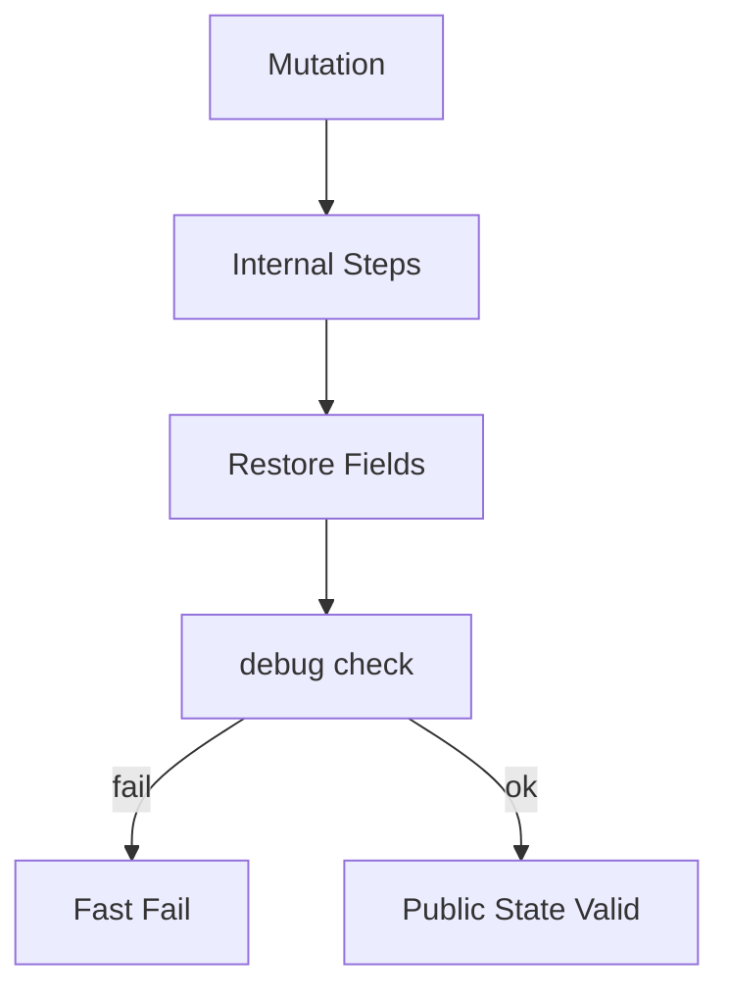
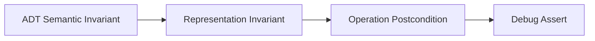
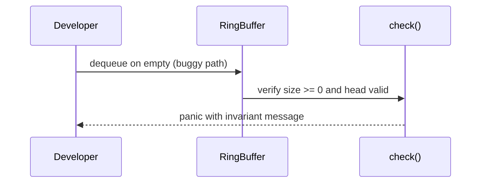

# Invariants Representation and Debug Assertions

## Overview

An **invariant** is a predicate on a structure's state that must hold after every public operation (and often after each internal mutation step). **Representation invariants** tie private fields to ADT semantics (e.g., `size <= capacity`). **Debug assertions** re-check invariants in development and test builds to catch corruption early—before silent data loss in production.

Data structure bugs are disproportionately costly: corrupted linked pointers, off-by-one ring indices, and stale size fields manifest as heisenbugs. This note connects CS correctness foundations to every implementation in [[04-Data-Structures/README|Data Structures]].

## Learning Objectives

- Distinguish ADT semantic invariants from representation invariants
- Write check functions invoked after mutations in debug/test builds
- Map invariants to test cases and property-based tests
- Explain when to strip assertions in production vs keep cheap checks
- Relate invariants to iterator validity and concurrent visibility

## Prerequisites

- [[01-Computer-Science/09-Correctness-and-Reliability/Invariants Assertions and Contracts|Invariants Assertions and Contracts]]
- [[04-Data-Structures/00-Orientation-and-Contracts/Abstract Data Types vs Concrete Structures|Abstract Data Types vs Concrete Structures]]

## Difficulty

`intermediate`

## Estimated Time

- Reading: 2 hours
- Exercises: 3 hours
- Mini project: 4 hours

## History

**Design by contract** (Meyer, Eiffel) popularized pre/postconditions and class invariants. C `assert`, Rust `debug_assert!`, Go race detector, and Python `-O` stripping reflect a split: **fail fast in dev**, **minimal overhead in prod**. Formal methods (Dafny, Lean) prove invariants; this track uses **executable checks** as the pragmatic bridge.

## Problem It Solves

| Bug class | Invariant violated | Detection |
| --- | --- | --- |
| Ring buffer full/empty ambiguity | `size` vs head/tail relation | `checkRing()` |
| Linked list cycle | Acyclicity + reachability from head | Floyd or visited set in debug |
| Dynamic array stale length | `len != logical count` | `assert len <= cap` |
| BST ordering broken | Left < node < right | Inorder monotonic check |

Without invariants, "it works on my tests" collapses under edge cases and concurrency.

## Internal Implementation

Invariant workflow:

1. **Document** invariants in module header comment
2. **Establish** on constructor (`check()` at end)
3. **Preserve** in private helpers—assume invariant holds at entry, restore at exit
4. **Verify** in `check()` called from public mutators (debug only)
5. **Test** with property generators targeting boundary states



See [[01-Computer-Science/09-Correctness-and-Reliability/Failure Modes and Fault Models|Failure Modes and Fault Models]] for operational response.

## Mermaid Diagrams

### Structure: invariant layers



### Sequence: failed assertion during development



## Examples

### Minimal Example

TypeScript — dynamic array invariants:

```typescript
class Vec<T> {
  private data: T[] = [];

  private check(): void {
    if (process.env.NODE_ENV === "production") return;
    if (this.data.length < 0) throw new Error("length negative");
  }

  push(value: T): void {
    this.data.push(value);
    this.check();
  }

  pop(): T | undefined {
    const v = this.data.pop();
    this.check();
    return v;
  }
}
```

Python — explicit `__post_init__` style check:

```python
from dataclasses import dataclass


@dataclass
class RingBuffer:
    cap: int
    buf: list[int | None]
    head: int = 0
    size: int = 0

    def __post_init__(self) -> None:
        self._check()

    def _check(self) -> None:
        assert 0 <= self.size <= self.cap
        assert 0 <= self.head < self.cap
        assert len(self.buf) == self.cap

    def enqueue(self, x: int) -> bool:
        if self.size >= self.cap:
            return False
        tail = (self.head + self.size) % self.cap
        self.buf[tail] = x
        self.size += 1
        self._check()
        return True
```

Cross-link: [[04-Data-Structures/01-Contiguous-Sequences/Ring Buffers as Contiguous Queues|Ring Buffers as Contiguous Queues]].

### Production-Shaped Example

Cheap production checks vs expensive debug-only graph validation:

```typescript
export class ProductionQueue<T> {
  private size = 0;
  private readonly cap: number;

  constructor(capacity: number) {
    this.cap = capacity;
  }

  /** O(1) cheap sanity — keep in prod if negligible */
  private cheapCheck(): void {
    if (this.size < 0 || this.size > this.cap) {
      throw new Error("queue size corrupted");
    }
  }

  /** O(n) — test builds only */
  debugValidateChain(): void {
    if (process.env.NODE_ENV === "production") return;
    // walk storage verifying no holes in logical order
  }
}
```

## Operation Complexity

| Activity | Time | When run |
| --- | --- | --- |
| `check()` fixed fields | O(1) | After each mutator |
| Acyclic list verify | O(n) | Debug/test |
| BST order verify | O(n) | Debug/test |
| Property test round | O(k × op cost) | CI |

Assertions do not change advertised ADT bounds if disabled in production—they are engineering safety nets.

## Invariants

Meta-invariants for invariant systems:

1. **`check()` is pure** — does not mutate state (except logging counters).
2. **Public methods end in valid state** or throw without partial ADT exposure.
3. **Private helpers** document `(requires inv, ensures inv)`.
4. **Concurrency**: invariant checks run under the same lock as mutation or on quiescent snapshots.

Example ring buffer representation invariants:

1. `0 <= size <= capacity`
2. Logical element count equals `size`, not inferred from head==tail alone
3. All indices in `[0, capacity)` for stored slots

## Trade-offs

| Dimension | Upside | Downside | When it matters |
| --- | --- | --- | --- |
| Debug asserts | Fast defect localization | CPU in hot loops | Development CI |
| O(n) checks | Catches deep corruption | Too slow for prod | Small structures |
| Formal proof | Strongest guarantee | Costly | Safety-critical |
| No checks | Max speed | Silent corruption | After exhaustive test |

### When to Use

- Every custom structure in [[04-Data-Structures/code/README|code labs]]
- After refactors touching pointer/index arithmetic
- Property-based tests for ADT laws

### When Not to Use

- O(n) validation on multi-GB structures every request
- Asserts that mutate or depend on wall-clock timing

## Exercises

1. Write invariants for a singly linked stack (with and without size field).
2. Implement `check()` for a doubly linked list with sentinel head/tail.
3. Break an invariant intentionally; capture the failing assert in a test.
4. Convert three invariants into Hypothesis/fast-check properties.
5. List invariants broken by concurrent unsynchronized access (link [[01-Computer-Science/05-Concurrency-Fundamentals/Race Conditions|Race Conditions]]).

## Mini Project

**Invariant Test Harness**

Build a macro/decorator `@after_mutate_check` for TS and Python lab structures; run shared vectors with asserts enabled.

## Portfolio Project

Document per-structure invariant lists in [[04-Data-Structures/projects/Structures Workbench/README|Structures Workbench]] with toggleable runtime validation.

## Interview Questions

1. Define representation invariant vs ADT invariant.
2. Why check invariants after public methods, not only in tests?
3. Can `assert` run in production? When should it?
4. How do sentinels simplify invariant statements?
5. What invariant does a binary heap maintain?

### Stretch / Staff-Level

1. Design invariant checking for a concurrent queue without stopping the world.
2. Compare assert-style checks to Rust's type-driven ownership for list safety.

## Common Mistakes

- Checking only happy paths
- Using head==tail alone for ring full/empty
- Assertions that side-effect (logging that allocates)
- Removing checks without fuzz/property coverage

## Best Practices

- One `check()` function listing all predicates in comments
- Mirror invariants in module note **Invariants** section
- Fail with messages naming expected vs actual fields
- Keep expensive validation in test targets only

## Summary

Invariants connect ADT promises to concrete fields; debug assertions enforce them at mutation boundaries so corruption surfaces immediately. Representation invariants make complexity proofs meaningful—operations assume valid state. Production systems strip expensive checks but should document predicates, test them heavily in CI, and retain cheap sanity guards where failure indicates catastrophic bugs.

## Further Reading

- [[01-Computer-Science/09-Correctness-and-Reliability/Invariants Assertions and Contracts|Invariants Assertions and Contracts]]
- Meyer — *Object-Oriented Software Construction* (Design by Contract)
- Rustonomicon — unsafe and invariant documentation patterns

## Related Notes

- [[04-Data-Structures/00-Orientation-and-Contracts/Abstract Data Types vs Concrete Structures|Abstract Data Types vs Concrete Structures]]
- [[04-Data-Structures/02-Linked-Structures/Doubly Linked Lists and Sentinels|Doubly Linked Lists and Sentinels]]
- [[04-Data-Structures/01-Contiguous-Sequences/Ring Buffers as Contiguous Queues|Ring Buffers as Contiguous Queues]]
- [[04-Data-Structures/05-Trees-and-Ordered-Maps/Binary Search Trees|Binary Search Trees]]

## Progress Checklist

- [ ] Explained from first principles
- [ ] Drew at least one Mermaid diagram
- [ ] Implemented a minimal version
- [ ] Documented trade-offs and non-goals
- [ ] Completed exercises
- [ ] Practiced interview questions aloud
- [ ] Linked prerequisites and dependents
