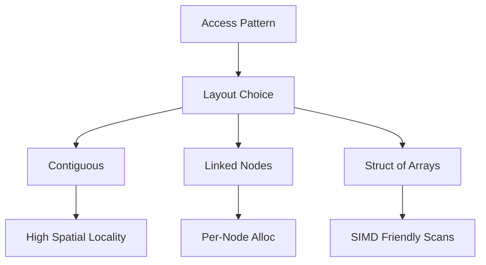
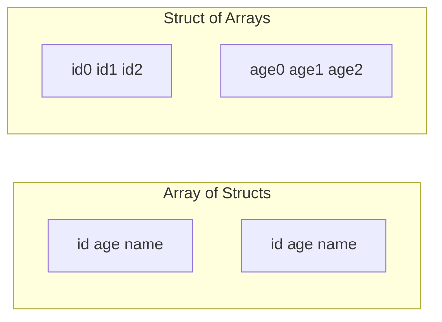
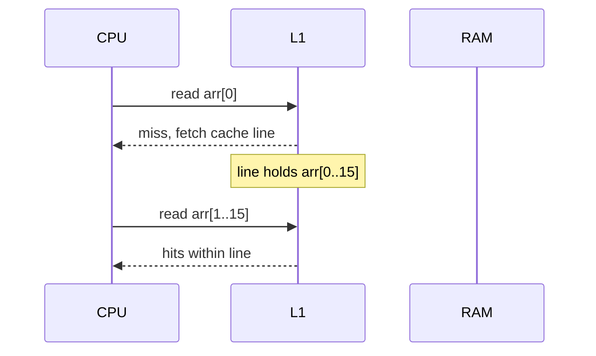

# Memory Layout Locality and Allocation Patterns

## Overview

**Memory layout** determines how elements sit in address space: contiguous blocks, pointer-linked nodes, struct-of-arrays vs array-of-structs, alignment and padding. **Locality** (temporal and spatial) governs cache hit rates and therefore real-world latency. **Allocation patterns**—per-object heap, bump-pointer arenas, pools—shape fragmentation, GC pressure, and tail latency.

Choosing a data structure is choosing a layout. This note connects hardware reality from [[01-Computer-Science/02-Machine-Model/Cache Hierarchy and Locality|Cache Hierarchy and Locality]] to container design in [[04-Data-Structures/README|Data Structures]].

## Learning Objectives

- Explain spatial vs temporal locality with structure examples
- Compare array-of-structs vs struct-of-arrays for scan workloads
- Describe arena/bump allocation and when it beats malloc-per-node
- Predict cache behavior of linked vs contiguous traversals
- Relate allocation to language runtimes (JS heap, Python object headers)

## Prerequisites

- [[01-Computer-Science/02-Machine-Model/Cache Hierarchy and Locality|Cache Hierarchy and Locality]]
- [[01-Computer-Science/03-Memory-and-Addressing/Pointers References and Aliasing|Pointers References and Aliasing]]
- [[04-Data-Structures/00-Orientation-and-Contracts/Why Data Structures Exist|Why Data Structures Exist]]

## Difficulty

`intermediate`

## Estimated Time

- Reading: 2 hours
- Exercises: 3 hours
- Mini project: 4 hours

## History

Early systems used **static arrays** and manual overlays. Heap allocators (Knuth, 1960s) enabled linked structures. **Slab allocators** (Bonwick) and **arena allocation** optimized kernel and compiler workloads. Modern CPUs widened the gap between **L1 latency (~1 ns)** and **DRAM (~100 ns)**, making layout decisive for "O(n)" scans.

Data-oriented design (Acton, game engines) revived **SoA** layouts for SIMD-friendly passes.

## Problem It Solves

| Workload | Bad layout | Symptom |
| --- | --- | --- |
| Column scan on objects | AoS with cold fields | Cache line waste |
| Graph BFS | pointer-chasing list | Miss per edge |
| Many small nodes | malloc each insert | Allocator lock contention |
| Short-lived batch | general heap | Fragmentation |

Layout-aware structures trade algorithmic flexibility for **bytes touched per operation**.

## Internal Implementation

Key layout primitives:

1. **Contiguous storage** — `T[]` or byte slab with stride
2. **Indirect storage** — node `{ value, next }` scattered in heap
3. **Embedded storage** — small buffer optimization (SSO) inline in object
4. **Arena** — bump pointer, bulk free on scope end



Cross-link: [[04-Data-Structures/02-Linked-Structures/Linked vs Contiguous Trade-offs|Linked vs Contiguous Trade-offs]].

## Mermaid Diagrams

### Structure: AoS vs SoA



### Sequence: cache line on array scan



## Examples

### Minimal Example

TypeScript — contiguous vs linked memory profile:

```typescript
type Node = { v: number; next: Node | null };

function buildLinked(n: number): Node | null {
  let head: Node | null = null;
  for (let i = 0; i < n; i++) head = { v: i, next: head };
  return head;
}

function buildArray(n: number): number[] {
  const a: number[] = [];
  for (let i = 0; i < n; i++) a.push(i);
  return a;
}
// Linked: ~n allocations; Array: amortized contiguous growth
```

Python — SoA for summing ages:

```python
from dataclasses import dataclass


@dataclass(slots=True)
class User:
    user_id: int
    age: int


users_aos: list[User] = [User(i, 20 + (i % 50)) for i in range(10_000)]
sum_aos = sum(u.age for u in users_aos)

ids = list(range(10_000))
ages = [20 + (i % 50) for i in range(10_000)]
sum_soa = sum(ages)
assert sum_aos == sum_soa
```

### Production-Shaped Example

Arena allocator for parsing pipeline (bulk free after request):

```typescript
export class Arena {
  private chunks: Uint8Array[] = [];
  private offset = 0;

  alloc(size: number): Uint8Array {
    const CHUNK = 64 * 1024;
    if (!this.chunks.length || this.offset + size > CHUNK) {
      this.chunks.push(new Uint8Array(CHUNK));
      this.offset = 0;
    }
    const base = this.chunks[this.chunks.length - 1];
    const view = base.subarray(this.offset, this.offset + size);
    this.offset += size;
    return view;
  }

  reset(): void {
    this.chunks = [];
    this.offset = 0;
  }
}
```

See [[04-Data-Structures/projects/Dynamic Array and Arena Lab/README|Dynamic Array and Arena Lab]].

## Operation Complexity

Layout affects **constants**, not always exponents:

| Layout | Sequential scan | Insert middle | Alloc amortized |
| --- | --- | --- | --- |
| Contiguous array | O(n) minimal constants | O(n) moves | O(1) amortized push back |
| Linked list | O(n) high miss rate | O(1) with node ptr | O(1) per node malloc |
| Arena bump | O(1) alloc | N/A (no individual free) | O(1) until chunk full |
| SoA columns | O(n) on one field | O(n) if interleaved rebuild | Depends on column growth |

## Invariants

Arena allocator:

1. Allocated slices do not overlap within active chunk sequence
2. `reset()` invalidates all prior slices—callers must not retain them
3. Chunk size ≥ maximum single allocation request or dedicated slow path

Contiguous vector:

1. Elements `[0, size)` are initialized and logically live
2. Capacity slack `[size, capacity)` is uninitialized for typed views—do not read

## Trade-offs

| Dimension | Upside | Downside | When it matters |
| --- | --- | --- | --- |
| Contiguous | Scan bandwidth | Resize/copy cost | Analytics |
| Linked | Stable node identity | Poor locality | LRU intrusive links |
| Arena | Fast alloc, bulk free | No partial reclaim | Parsers, compilers |
| Pool | Fixed size, low frag | Cap on live objects | Network buffers |
| SoA | Field scans | Join cost for whole record | ECS, ML features |

### When to Use

- Profiling shows cache misses dominate
- Batch lifetimes (request-scoped arenas)
- SIMD or columnar analytics on one field

### When Not to Use

- Long-lived heterogeneous object graphs without clear ownership
- Frequent individual deletes in mixed-size workloads (arena unsuitable)

## Exercises

1. Measure sequential sum on 1M-element linked list vs array (same payload size estimate).
2. Compute struct padding for `{ char c; int x; }` vs `{ int x; char c; }` on your platform.
3. Design layout for 10M users filtered by age daily—AoS or SoA?
4. When does Python `list` of objects defeat locality vs array of floats?
5. Sketch arena lifecycle for an HTTP request handler.

## Mini Project

**Layout Benchmark Memo**

Implement AoS vs SoA filter on 5M records; chart time and RSS; tie results to cache line size from CPU docs.

## Portfolio Project

Add **Layout Profile** cards to [[04-Data-Structures/projects/Structures Workbench/README|Structures Workbench]] (bytes/element, alloc pattern, scan friendliness).

## Interview Questions

1. Define spatial and temporal locality.
2. Why is linked list traversal often slower than array scan despite same Big-O?
3. What is an arena allocator?
4. AoS vs SoA — when does each win?
5. How does object header overhead affect small-node structures?

### Stretch / Staff-Level

1. False sharing in concurrent counters—link to padding strategies (module 13 preview).
2. When would you mmap a file for a read-mostly contiguous structure?

## Common Mistakes

- Choosing linked lists for cache-heavy scans
- Ignoring alignment padding in memory budgets
- Retaining arena pointers after `reset()`
- Assuming GC languages erase allocation layout costs

## Best Practices

- Profile with cache miss hardware counters where available
- Co-locate fields accessed together; split hot/cold columns
- Prefer bulk allocation for ephemeral graphs
- Document iterator stability vs layout moves

## Summary

Memory layout is the physical realization of a data structure; locality and allocation strategy determine whether asymptotic complexity matches observed latency. Contiguous layouts win scans; linked nodes win stable identity and O(1) splices at known positions; arenas win batch lifetimes. Production engineering pairs layout choice with measurement on real hardware, not RAM-only Big-O alone.

## Further Reading

- [[01-Computer-Science/02-Machine-Model/Cache Hierarchy and Locality|Cache Hierarchy and Locality]]
- [[01-Computer-Science/03-Memory-and-Addressing/Memory Hierarchy Trade-offs|Memory Hierarchy Trade-offs]]
- Acton — data-oriented design talks
- [[04-Data-Structures/02-Linked-Structures/Linked vs Contiguous Trade-offs|Linked vs Contiguous Trade-offs]]

## Related Notes

- [[04-Data-Structures/01-Contiguous-Sequences/Fixed-Capacity Arrays|Fixed-Capacity Arrays]]
- [[04-Data-Structures/01-Contiguous-Sequences/Multidimensional Arrays and Strides|Multidimensional Arrays and Strides]]
- [[04-Data-Structures/02-Linked-Structures/Singly Linked Lists|Singly Linked Lists]]
- [[04-Data-Structures/00-Orientation-and-Contracts/Complexity Tables Amortization and Practical Constants|Complexity Tables Amortization and Practical Constants]]

## Progress Checklist

- [ ] Explained from first principles
- [ ] Drew at least one Mermaid diagram
- [ ] Implemented a minimal version
- [ ] Documented trade-offs and non-goals
- [ ] Completed exercises
- [ ] Practiced interview questions aloud
- [ ] Linked prerequisites and dependents
