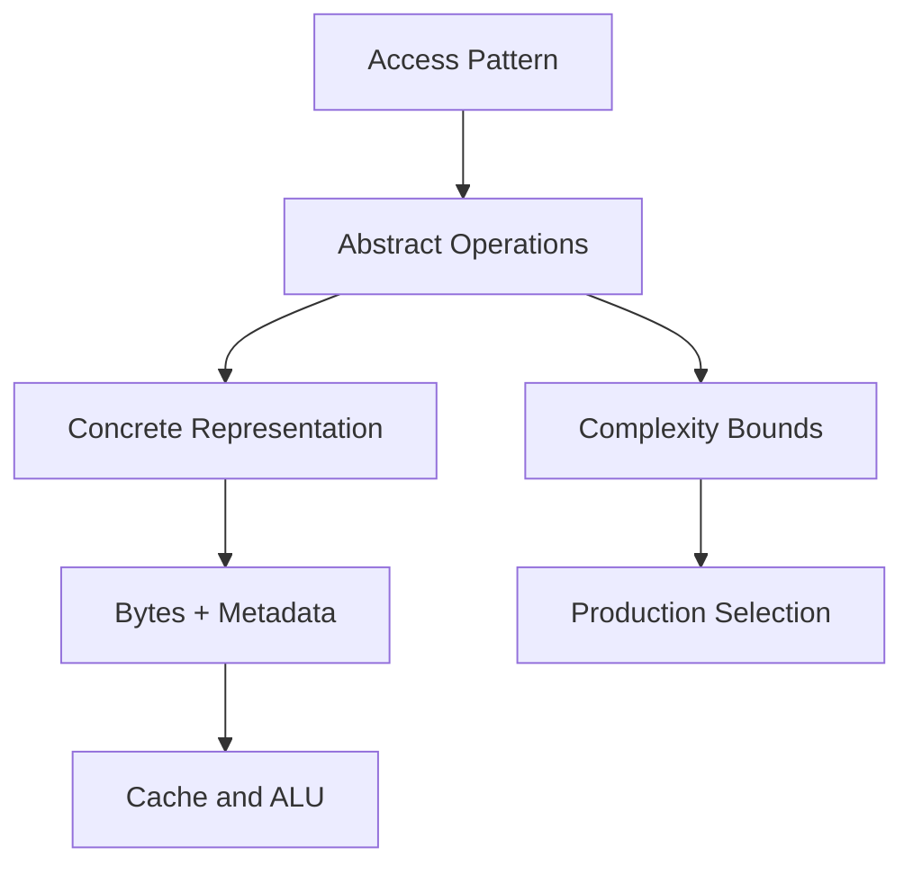
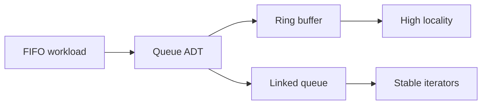

# Why Data Structures Exist

## Overview

**Data structures** are deliberate organizations of data in memory (or on disk) that make specific **operations** cheap while accepting costs on others. They are not "containers you pick from a menu"—they are **contracts** between representation and algorithm: if you know how elements are laid out, you can bound time and space for insert, lookup, delete, and traversal.

Raw memory is an undifferentiated byte array. Programs need **named access patterns**: append-only logs, keyed lookup, ordered ranges, priority ordering, and graph adjacency. A data structure is the bridge from **problem semantics** ("I need FIFO order with O(1) enqueue") to **machine reality** (contiguous ring buffer with head/tail indices and modulo arithmetic).

This note anchors the [[04-Data-Structures/README|Data Structures track]]: later modules implement concrete shapes; here we establish *why* those shapes exist before *how* to code them.

## Learning Objectives

- Explain data structures as operation-bounded memory organizations, not language builtins
- Connect problem access patterns to ADT choice before implementation
- Distinguish this track's scope from [[05-Algorithms/README|Algorithms]], [[08-Databases/README|Databases]], and [[07-Backend/README|Backend]]
- Identify failure modes when developers treat library containers as black boxes
- Articulate why production systems need invariant-aware structure selection

## Prerequisites

- [[01-Computer-Science/00-Orientation/How Computers Run Programs|How Computers Run Programs]]
- [[01-Computer-Science/01-Information-and-Representation/Bits Bytes and Information|Bits Bytes and Information]]
- [[01-Computer-Science/08-Languages-and-Computation/Computational Complexity Primer|Computational Complexity Primer]]

## Difficulty

`beginner`

## Estimated Time

- Reading: 1.5 hours
- Exercises: 2 hours
- Mini project: 2 hours

## History

Early computers programmed in machine code with fixed arrays and manual pointer arithmetic. As software grew, **reusable abstractions** emerged: Fortran arrays (1950s), Lisp cons cells (1958), ALGOL records, then C structs and pointers. The term **abstract data type (ADT)** crystallized in the 1970s (Liskov, Guttag): separate *what* operations mean from *how* they are stored.

Library evolution—STL (C++), Java Collections, Python `list`/`dict`, JavaScript `Map`—hid complexity behind stable interfaces. That success created a new failure mode: engineers who know API names but not **layout, invariants, or amortized costs**. This track restores first-principles literacy without rejecting standard libraries.

## Problem It Solves

Without explicit structure choice, teams default to whatever the language provides:

| Symptom | Root cause | Structure-aware fix |
| --- | --- | --- |
| p99 latency spikes on "simple" appends | Dynamic array reallocation + copy | Pre-size, ring buffer, or chunked growth |
| Memory bloat on sparse boolean flags | `boolean[]` per flag | [[04-Data-Structures/01-Contiguous-Sequences/Bitsets and Compact Boolean Arrays|Bitset]] |
| O(n) middle deletes in hot paths | Dynamic array used as deque | [[04-Data-Structures/02-Linked-Structures/Doubly Linked Lists and Sentinels|Doubly linked list]] or dedicated deque |
| Hash DoS or pathological rehash | Wrong equality/hash contract | [[04-Data-Structures/04-Hash-Tables-and-Sets/Hash-Flooding DoS and Randomized Hashing|Hash flooding defenses]] |
| Cache misses dominate profiling | Pointer-chasing linked structure | Contiguous layout or struct-of-arrays |

Data structures exist to **align memory layout with access patterns** so complexity claims are honest under production load.

## Internal Implementation

At the machine level, every structure reduces to:

1. **Storage** — bytes in RAM (heap, stack, mmap, arena)
2. **Metadata** — length, capacity, head/tail, root pointer, load factor
3. **Operations** — read/write rules that preserve **invariants**



The "implementation" of data structures as a discipline is this pipeline—not a single algorithm. See [[04-Data-Structures/00-Orientation-and-Contracts/Abstract Data Types vs Concrete Structures|Abstract Data Types vs Concrete Structures]] and [[04-Data-Structures/00-Orientation-and-Contracts/Invariants Representation and Debug Assertions|Invariants Representation and Debug Assertions]].

## Mermaid Diagrams

### Structure: from problem to representation



### Sequence: structure selection in a service

```mermaid
sequenceDiagram
    participant PM as Product requirement
    participant Eng as Engineer
    participant Bench as Benchmark
    participant Prod as Production

    PM->>Eng: Need 1M events/sec ingest buffer
    Eng->>Eng: Map to Queue ADT + bounded capacity
    Eng->>Bench: Compare ring vs channel
    Bench-->>Eng: Ring wins on locality; bounded backpressure needed
    Eng->>Prod: Deploy with metrics on overflow policy
```

## Examples

### Minimal Example

TypeScript — naming the access pattern before the container:

```typescript
type AccessPattern = "append" | "lookup-by-key" | "fifo" | "priority";

function recommendStructure(pattern: AccessPattern): string {
  switch (pattern) {
    case "append":
      return "dynamic array (see Dynamic Arrays note)";
    case "lookup-by-key":
      return "hash table (module 04)";
    case "fifo":
      return "ring buffer or linked queue (module 03)";
    case "priority":
      return "binary heap (module 06)";
  }
}

console.assert(recommendStructure("fifo") === "ring buffer or linked queue (module 03)");
```

Python — same idea:

```python
from enum import Enum


class AccessPattern(Enum):
    APPEND = "append"
    LOOKUP_BY_KEY = "lookup-by-key"
    FIFO = "fifo"
    PRIORITY = "priority"


def recommend_structure(pattern: AccessPattern) -> str:
    return {
        AccessPattern.APPEND: "list / dynamic array",
        AccessPattern.LOOKUP_BY_KEY: "dict / hash map",
        AccessPattern.FIFO: "collections.deque or ring buffer",
        AccessPattern.PRIORITY: "heapq",
    }[pattern]


assert recommend_structure(AccessPattern.FIFO).startswith("collections.deque")
```

### Production-Shaped Example

An event-ingest service must buffer bursts without unbounded memory:

```typescript
interface IngestMetrics {
  enqueued: number;
  dropped: number;
  highWaterMark: number;
}

class BoundedEventBuffer<T> {
  private readonly cap: number;
  private buf: T[] = [];
  readonly metrics: IngestMetrics = { enqueued: 0, dropped: 0, highWaterMark: 0 };

  constructor(capacity: number) {
    if (capacity <= 0) throw new Error("capacity must be positive");
    this.cap = capacity;
  }

  tryEnqueue(item: T): boolean {
    if (this.buf.length >= this.cap) {
      this.metrics.dropped += 1;
      return false; // explicit backpressure — not silent growth
    }
    this.buf.push(item);
    this.metrics.enqueued += 1;
    this.metrics.highWaterMark = Math.max(this.metrics.highWaterMark, this.buf.length);
    return true;
  }
}
```

Cross-link: [[04-Data-Structures/03-Stacks-Queues-and-Deques/Bounded Buffers and Producer-Consumer Interfaces|Bounded Buffers and Producer-Consumer Interfaces]]. Sorting and graph search belong in [[05-Algorithms/03-Sorting/Sorting Contracts Stability and Adaptivity|Sorting]] and [[05-Algorithms/07-Graph-Traversal-and-DAGs/BFS|graph traversal]]; page-oriented B-trees in [[08-Databases/README|Databases]].

## Operation Complexity

This orientation note does not define a single ADT; the table maps **families** to typical bounds (see module notes for proofs):

| Structure family | Typical hot operation | Worst case | Amortized / expected | Notes |
| --- | --- | --- | --- | --- |
| Contiguous sequence | index `i` | O(1) | O(1) | [[04-Data-Structures/01-Contiguous-Sequences/Fixed-Capacity Arrays\|Fixed arrays]] |
| Dynamic array | push back | O(n) resize | O(1) amortized | Growth policy matters |
| Linked list | insert at known node | O(1) | O(1) | Finding node may be O(n) |
| Hash table | get/put | O(n) | O(1) expected | Assumes good hash + load factor |
| Balanced tree | search | O(log n) | O(log n) | Ordering bonus |
| Heap | extract-min | O(log n) | O(log n) | Not sorted scan |

## Invariants

Meta-invariants for the entire track:

1. **Representation matches declared ADT semantics** — a `Stack` must never expose arbitrary middle insertion unless documented.
2. **Size/capacity metadata stays consistent** — `0 <= size <= capacity` for bounded containers.
3. **Complexity claims state assumptions** — hash tables assume SUHA; amortized bounds name the potential function.
4. **Failure modes are explicit** — overflow, rehash, resize, and iterator invalidation are documented, not accidental.

See [[04-Data-Structures/00-Orientation-and-Contracts/Invariants Representation and Debug Assertions|Invariants Representation and Debug Assertions]].

## Trade-offs

| Dimension | Upside | Downside | When it matters |
| --- | --- | --- | --- |
| Abstraction | Swap implementations behind ADT | Hidden costs in stdlib | API design reviews |
| Contiguous layout | Cache-friendly scans | Costly middle insert | Analytics, ML tensors |
| Linked layout | O(1) splice at node | Pointer chasing | LRU nodes, intrusive lists |
| Library defaults | Fast delivery | Wrong tool for hot path | Latency SLOs |
| Custom structures | Tunable for workload | Maintenance + bugs | High-QPS infra |

### When to Use

- Designing any component with non-trivial insert/lookup/delete patterns
- Debugging latency or memory regressions in hot paths
- Interview and system-design discussions requiring justified container choice

### When Not to Use

- Premature micro-optimization before measuring access patterns
- Reimplementing battle-tested stdlib structures without invariant or perf gap
- Encoding business rules solely in structure choice (use domain models too)

## Exercises

1. For a URL shortener's redirect counter, list three access patterns and candidate structures with complexity notes.
2. Read your team's hottest API endpoint: identify primary container operations (append, lookup, range scan) from logs or code.
3. Draw a table comparing "use Python `list`" vs "use `deque`" for a 10M-item FIFO—memory, Big-O, and iterator behavior.
4. Explain why Redis sorted sets belong in Backend/product notes, not this track's core implementation module.
5. Write five invariants you expect a dynamic array to maintain after every `push`.

## Mini Project

**Access Pattern Audit**

Pick one open-source service (e.g., a small HTTP server or job worker). Document every major container in the request path: operation mix, declared complexity, observed allocation behavior (if measurable), and one alternative structure with trade-offs.

## Portfolio Project

Add a **Structure Rationale** section to [[04-Data-Structures/projects/Structures Workbench/README|Structures Workbench]] documenting why each lab structure exists and which production workloads it models.

## Interview Questions

1. What is a data structure, in one sentence that mentions operations and memory?
2. Why can't one universal structure be optimal for all operations?
3. Give an example where the language default container caused a production incident.
4. Distinguish this track from the Algorithms track.
5. What does "layout is part of the API" mean?

### Stretch / Staff-Level

1. How would you teach data structures to senior engineers who only know LeetCode patterns?
2. When is reimplementing `HashMap` justified in a production codebase?

## Common Mistakes

- Equating "O(1) API" with "O(1) work" (e.g., `dict` resize, `Array.splice`)
- Choosing linked lists for cache-sensitive scans "because inserts are O(1)"
- Ignoring **capacity errors** and silent growth under load
- Studying structures without **invariants** or **amortization** proofs

## Best Practices

- Start from access pattern → ADT → representation → complexity table
- Document overflow/rehash/resize behavior in public interfaces
- Benchmark with production-shaped data (key distribution, object size, concurrency)
- Cross-link invariants to tests and debug assertions
- Hand off graph algorithms and sorting to [[05-Algorithms/07-Graph-Traversal-and-DAGs/BFS|graph traversal]], [[05-Algorithms/03-Sorting/Sorting Contracts Stability and Adaptivity|sorting]], and [[05-Algorithms/06-Dynamic-Programming/Optimal Substructure and Overlapping Subproblems|dynamic programming]]

## Summary

Data structures exist because programs repeatedly perform a small set of access patterns on data, and memory layout determines whether those patterns are cheap or catastrophic. The discipline separates abstract operations from concrete representations, states invariants that must hold after every mutation, and bounds worst, amortized, and expected costs under explicit assumptions. Production engineering fails when containers are magic; it succeeds when teams align structure with workload, measure constants, and document failure modes like overflow and iterator invalidation.

## Further Reading

- [[00-References/Data Structures/README|Data Structures References]]
- [[01-Computer-Science/08-Languages-and-Computation/Computational Complexity Primer|Computational Complexity Primer]]
- Cormen et al. — *Introduction to Algorithms* (Part I: foundations)
- Okasaki — *Purely Functional Data Structures* (persistence perspective)

## Related Notes

- [[04-Data-Structures/00-Orientation-and-Contracts/Abstract Data Types vs Concrete Structures|Abstract Data Types vs Concrete Structures]]
- [[04-Data-Structures/00-Orientation-and-Contracts/Memory Layout Locality and Allocation Patterns|Memory Layout Locality and Allocation Patterns]]
- [[04-Data-Structures/01-Contiguous-Sequences/Dynamic Arrays and Amortized Growth|Dynamic Arrays and Amortized Growth]]
- [[04-Data-Structures/02-Linked-Structures/Linked vs Contiguous Trade-offs|Linked vs Contiguous Trade-offs]]
- [[04-Data-Structures/README|Data Structures Track]]

## Progress Checklist

- [ ] Explained from first principles
- [ ] Drew at least one Mermaid diagram
- [ ] Implemented a minimal version
- [ ] Documented trade-offs and non-goals
- [ ] Completed exercises
- [ ] Practiced interview questions aloud
- [ ] Linked prerequisites and dependents
