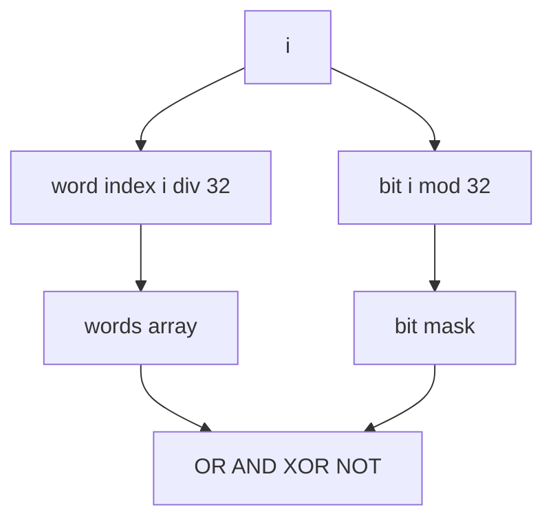
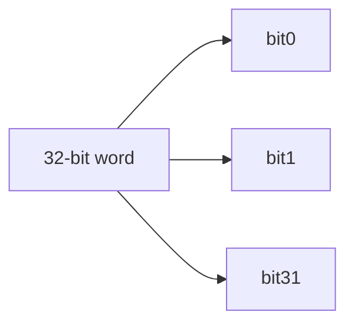
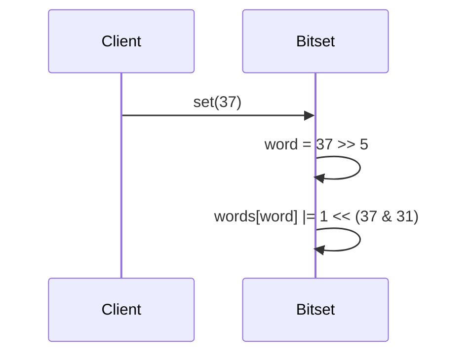

# Bitsets and Compact Boolean Arrays

## Overview

A **bitset** (bit vector) packs Boolean flags into machine words, using **1 bit per flag** instead of 1 byte (or 1 object) per flag in naive `boolean[]`. Word-level **bitwise operations** (`AND`, `OR`, `XOR`, `NOT`) implement set algebra on entire batches in O(n / word_size) time.

Bitsets appear in allocators (free lists), graph algorithms (visited sets), permission masks, Bloom filter internals, and database null bitmaps.

## Learning Objectives

- Map logical index `i` to `(wordIndex, bitMask)`
- Implement get/set/clear/toggle with O(1) word operations
- Analyze space savings vs `boolean[]` and object overhead in dynamic languages
- Apply word-parallel batch operations (union/intersection)
- Choose bitset vs hash set for dense vs sparse membership

## Prerequisites

- [[04-Data-Structures/01-Contiguous-Sequences/Fixed-Capacity Arrays|Fixed-Capacity Arrays]]
- [[01-Computer-Science/01-Information-and-Representation/Bits Bytes and Information|Bits Bytes and Information]]

## Difficulty

`intermediate`

## Estimated Time

- Reading: 1.5 hours
- Exercises: 2 hours
- Mini project: 3 hours

## History

Bitmaps tracked disk block allocation in early file systems. **BSD buddy allocators** and **Linux page flags** use word bitmaps. `std::bitset` and Java `BitSet` standardized API patterns. Vectorized bitset operations underpin columnar databases and search indexes.

## Problem It Solves

| Scenario | Naive bool array | Bitset |
| --- | --- | --- |
| 1M feature flags | ~1 MB (byte each) or worse with objects | ~125 KB (8 bits/byte) |
| Set union of two domains | O(n) per element branch | O(n/w) word OR |
| Universe `{0..n-1}` dense | Wastes little if byte | Optimal packing |

Sparse arbitrary keys still prefer hash sets—see [[04-Data-Structures/04-Hash-Tables-and-Sets/Sets Multisets and Map vs Set|Sets]].

## Internal Implementation

Storage: `Uint32Array` or `bigint[]` words.

For index `i`:

- `word = i >> 5` (divide by 32)
- `mask = 1 << (i & 31)`



## Mermaid Diagrams

### Structure: bit packing in one word



### Sequence: set bit



## Examples

### Minimal Example

TypeScript:

```typescript
export class Bitset {
  private readonly words: Uint32Array;

  constructor(public readonly size: number) {
    this.words = new Uint32Array(Math.ceil(size / 32));
  }

  set(i: number): void {
    this.check(i);
    this.words[i >> 5]! |= 1 << (i & 31);
  }

  get(i: number): boolean {
    this.check(i);
    return (this.words[i >> 5]! & (1 << (i & 31))) !== 0;
  }

  private check(i: number): void {
    if (i < 0 || i >= this.size) throw new RangeError();
  }
}
```

Python:

```python
class Bitset:
    def __init__(self, size: int) -> None:
        if size <= 0:
            raise ValueError
        self.size = size
        self._words = bytearray((size + 7) // 8)

    def set(self, i: int) -> None:
        self._check(i)
        self._words[i >> 3] |= 1 << (i & 7)

    def get(self, i: int) -> bool:
        self._check(i)
        return bool(self._words[i >> 3] & (1 << (i & 7)))

    def _check(self, i: int) -> None:
        if not 0 <= i < self.size:
            raise IndexError
```

### Production-Shaped Example

Permission mask with bulk grant:

```typescript
export class PermissionMask {
  private words = new Uint32Array(4); // 128 bits

  grant(roleBit: number): void {
    const w = roleBit >> 5;
    this.words[w]! |= 1 << (roleBit & 31);
  }

  can(userMask: Uint32Array): boolean {
    for (let i = 0; i < this.words.length; i++) {
      if ((userMask[i]! & this.words[i]!) !== this.words[i]!) return false;
    }
    return true;
  }
}
```

Cross-link: [[04-Data-Structures/10-Probabilistic-Structures/Bloom Filters|Bloom Filters]] (later module).

## Operation Complexity

| Operation | Time | Space |
| --- | --- | --- |
| get/set/clear bit i | O(1) | O(n / w) words |
| popcount (count set bits) | O(n / w) | O(1) |
| union/intersect two bitsets | O(n / w) | O(1) extra |
| iterate set bits | O(n / w + k) | k = set count |

## Invariants

1. `0 <= size`; only bits `[0, size)` are logically meaningful
2. Bits beyond `size` in last word must be zero (or masked on read)
3. Word array length = `ceil(size / word_bits)`
4. After `clearAll`, all logical bits false

## Trade-offs

| Dimension | Upside | Downside | When it matters |
| --- | --- | --- | --- |
| vs bool[] | 8× (or more) space savings | Bit arithmetic | Large flag vectors |
| vs hash set | O(1) bit ops, cache friendly | Universe must be dense | IDs in range n |
| Fixed size | Simple | Resize requires copy | Known universe |
| Word ops | SIMD potential | Endian/word-size care | Bulk analytics |

### When to Use

- Dense universe `{0..n-1}`, visited arrays, feature flags
- Set algebra on fixed universes (role masks)
- Allocator / page tracking

### When Not to Use

- Sparse arbitrary string keys
- Need associated payload per key (use map)

## Exercises

1. Implement `clear`, `toggle`, and `countSetBits` (popcount per word).
2. Benchmark bitset vs `boolean[]` for 10M flags in TS/Python.
3. Bitwise derive union and intersection of two bitsets.
4. Find first set bit in word (ffs) for iterator.
5. Size bitset for 1-based IDs `1..n` without wasting bit 0.

## Mini Project

Dual-language bitset passing shared vectors for set/get/union; compare RSS.

## Portfolio Project

Bitset lab module in [[04-Data-Structures/projects/Structures Workbench/README|Structures Workbench]] with popcount benchmark chart.

## Interview Questions

1. How map index i to word and mask?
2. Space for n flags in bitset vs byte array?
3. When bitset vs hash set?
4. O(?) time to intersect two length-n bitsets?
5. Role of popcount in databases/search?

### Stretch / Staff-Level

1. SIMD popcount across words.
2. Roaring bitmap concept (compressed bitsets) — handoff to databases track.

## Common Mistakes

- Forgetting to mask garbage bits in last word on size query
- Using bitset for sparse UUID sets
- Off-by-one in 1-based ID systems
- Not bounds-checking index before shift

## Best Practices

- Mask last word on construction/resize
- Expose `size` and `count()` for observability
- Use typed arrays for word storage in JS
- Document universe bounds in API

## Summary

Bitsets compress Boolean membership into word arrays, enabling constant-time single-bit updates and word-parallel set operations. They excel when the universe is dense and bounded; sparse or labeled membership needs other structures. Implementation hinges on correct index-to-word mapping and masking trailing bits in the final word.

## Further Reading

- [[01-Computer-Science/01-Information-and-Representation/Bits Bytes and Information|Bits Bytes and Information]]
- Warren — *Hacker's Delight* (bit tricks)
- [[04-Data-Structures/10-Probabilistic-Structures/Bloom Filters|Bloom Filters]]

## Related Notes

- [[04-Data-Structures/01-Contiguous-Sequences/Fixed-Capacity Arrays|Fixed-Capacity Arrays]]
- [[04-Data-Structures/04-Hash-Tables-and-Sets/Sets Multisets and Map vs Set|Sets Multisets and Map vs Set]]
- [[04-Data-Structures/08-Graphs-as-Representation/Adjacency Matrices and Edge Lists|Adjacency Matrices and Edge Lists]]

## Progress Checklist

- [ ] Explained from first principles
- [ ] Drew at least one Mermaid diagram
- [ ] Implemented a minimal version
- [ ] Documented trade-offs and non-goals
- [ ] Completed exercises
- [ ] Practiced interview questions aloud
- [ ] Linked prerequisites and dependents
