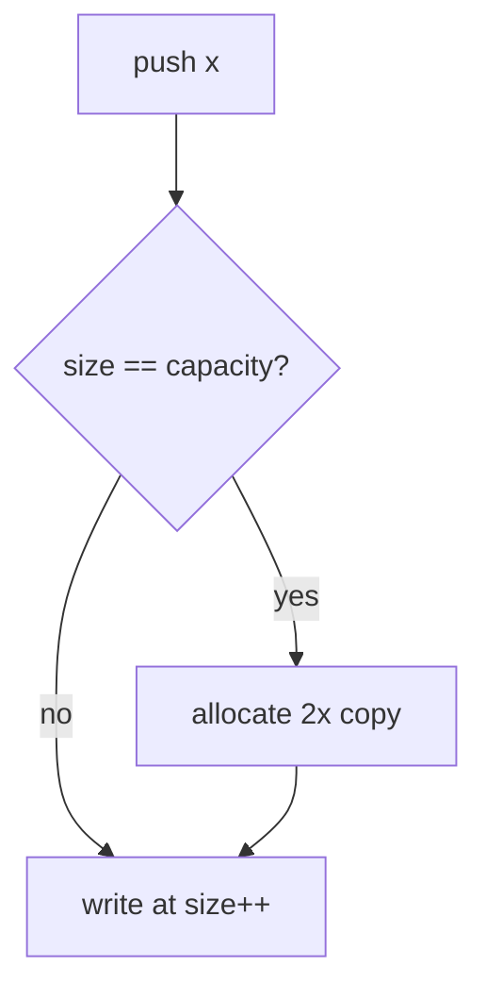
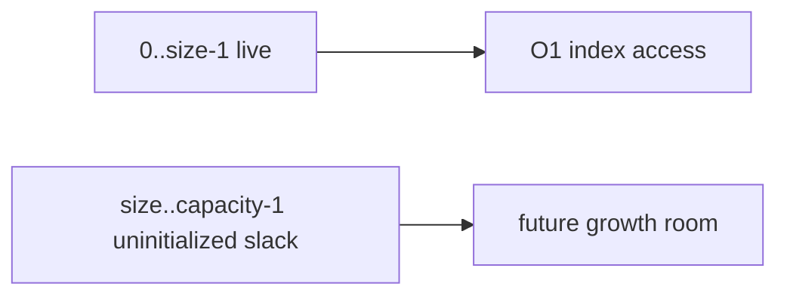
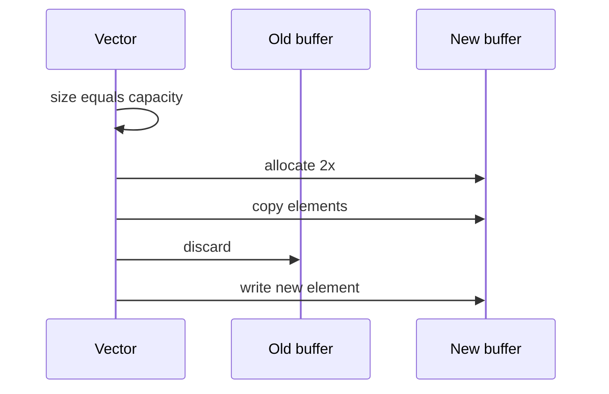

# Dynamic Arrays and Amortized Growth

## Overview

A **dynamic array** (vector) is a contiguous sequence that **grows** (and sometimes shrinks) by reallocating backing storage while presenting O(1) amortized append-at-end to callers. It combines [[04-Data-Structures/01-Contiguous-Sequences/Fixed-Capacity Arrays|fixed-array]] indexing with automatic capacity management via **growth policies** (typically multiply by ~1.5–2).

JavaScript `Array`, Python `list`, C++ `std::vector`, Rust `Vec`, and Java `ArrayList` are dynamic arrays under heterogeneous APIs.

## Learning Objectives

- Implement push/pop with geometric growth and size/capacity tracking
- Prove O(1) amortized append via aggregate or potential method
- Compare growth factors for memory slack vs copy frequency
- Handle insert/delete at index with O(n) shift cost
- Relate to production concerns: iterator invalidation, reserve(), shrink

## Prerequisites

- [[04-Data-Structures/01-Contiguous-Sequences/Fixed-Capacity Arrays|Fixed-Capacity Arrays]]
- [[04-Data-Structures/00-Orientation-and-Contracts/Complexity Tables Amortization and Practical Constants|Complexity Tables Amortization and Practical Constants]]

## Difficulty

`intermediate`

## Estimated Time

- Reading: 2 hours
- Exercises: 3 hours
- Mini project: 4 hours

## History

Dynamic tables date to early Lisp and Simula implementations. **Amortized analysis** (Tarjan) explained why doubling is cheap in aggregate. STL `vector` codified `capacity()` vs `size()` distinction for performance-aware callers.

## Problem It Solves

Programs need:

- Unknown final size with mostly append workloads
- O(1) random access after build
- Better cache behavior than linked structures for scans

Without dynamic arrays, developers manually reallocate and copy—error-prone and duplicated across codebases.

## Internal Implementation

Fields:

- `data: T[]` storage with `capacity >= size`
- `size`: logical length
- On `push` when `size == capacity`: allocate new block, copy, free old (GC handles in managed langs)

Growth: newCap = max(1, oldCap * 2) or similar.



See [[04-Data-Structures/projects/Dynamic Array and Arena Lab/README|Dynamic Array and Arena Lab]].

## Mermaid Diagrams

### Structure: size vs capacity slack



### Sequence: resize on push



## Examples

### Minimal Example

TypeScript:

```typescript
class Vec<T> {
  private data: T[] = [];
  private sz = 0;

  get size(): number {
    return this.sz;
  }

  push(value: T): void {
    if (this.sz === this.data.length) {
      const next = this.data.length === 0 ? 4 : this.data.length * 2;
      const grown = new Array<T>(next);
      for (let i = 0; i < this.sz; i++) grown[i] = this.data[i];
      this.data = grown;
    }
    this.data[this.sz++] = value;
  }

  get(i: number): T {
    if (i < 0 || i >= this.sz) throw new RangeError();
    return this.data[i];
  }
}
```

Python (pedagogical; production uses `list`):

```python
class Vec:
    def __init__(self) -> None:
        self._data: list[object | None] = []
        self._size = 0

    def push(self, value: object) -> None:
        if self._size == len(self._data):
            new_cap = 4 if not self._data else len(self._data) * 2
            self._data.extend([None] * (new_cap - len(self._data)))
        self._data[self._size] = value
        self._size += 1

    def get(self, i: int) -> object:
        if i < 0 or i >= self._size:
            raise IndexError
        return self._data[i]
```

### Production-Shaped Example

Pre-reserve capacity when batch size known; expose metrics:

```typescript
export class BatchVec<T> {
  private buf: T[] = [];
  constructor(expected: number) {
    this.buf.length = expected; // preallocate slack in JS engines
    this.buf.length = 0;
  }

  push(value: T): void {
    this.buf.push(value); // engine-managed growth
  }
}
```

Cross-link: [[04-Data-Structures/00-Orientation-and-Contracts/Complexity Tables Amortization and Practical Constants|Complexity Tables]].

## Operation Complexity

| Operation | Worst | Amortized | Space |
| --- | --- | --- | --- |
| push back | O(n) copy | O(1) | O(n) |
| pop back | O(1) | O(1) | O(n) optional shrink |
| get/set at i | O(1) | O(1) | O(1) |
| insert at i | O(n) | O(n) | O(n) |
| delete at i | O(n) | O(n) | O(n) |
| reserve(cap) | O(n) if grow | — | O(capacity) |

## Invariants

1. `0 <= size <= capacity`
2. Elements `[0, size)` valid; do not read `[size, capacity)` as live
3. After resize, content order preserved
4. Iterators/indexes invalid after reallocation if exposed raw pointer

## Trade-offs

| Dimension | Upside | Downside | When it matters |
| --- | --- | --- | --- |
| vs linked list | Cache scan, O(1) index | O(n) middle insert | Analytics buffers |
| Growth 2x | Fewer resizes | Up to ~50% slack memory | Large vectors |
| Growth 1.5x | Less slack | More copies | Memory caps |
| shrink-to-fit | Lower RSS | O(n) compact cost | Long-lived processes |

### When to Use

- Default sequential container for unknown size
- Stack/heap backing when LIFO on same end
- Building adjacency lists with variable degree

### When Not to Use

- Heavy front insert/delete (use deque or linked structure)
- Hard realtime forbidding rare O(n) spikes without reserve

## Exercises

1. Prove aggregate O(n) copy work for n pushes starting empty with doubling.
2. Implement `insert(i, x)` and analyze worst case.
3. Compare growth factor 1.1 vs 2 with total copies for n=10_000.
4. Implement `reserve` and benchmark batch load with/without it.
5. Document iterator invalidation rules for your language's dynamic array.

## Mini Project

Dual-language dynamic array lab matching [[04-Data-Structures/projects/Dynamic Array and Arena Lab/README|Dynamic Array and Arena Lab]] shared JSON vectors.

## Portfolio Project

Integrate instrumented vector (resize metrics) into [[04-Data-Structures/projects/Structures Workbench/README|Structures Workbench]].

## Interview Questions

1. Why is push amortized O(1) but worst case O(n)?
2. capacity vs size?
3. Cost of inserting at front of vector?
4. How does `ArrayList` growth differ from linked list prepend?
5. When call `reserve`?

### Stretch / Staff-Level

1. Analyze growth policy under adversarial append/pop patterns.
2. Small-vector optimization (SSO) — when inline storage beats heap?

## Common Mistakes

- Using vector as queue with pop front (O(n) shift)
- Not pre-reserving known batch sizes
- Holding references to internal array across resize
- Confusing amortized with worst-case SLO

## Best Practices

- Call reserve when upper bound known
- Prefer push_back over repeated insert at front
- Expose shrink only when memory pressure measured
- Document resize spikes in latency-sensitive APIs

## Summary

Dynamic arrays extend fixed contiguous storage with geometric growth, yielding amortized constant append at the back and constant indexing. Middle mutations remain linear due to shifting. Growth policy trades memory slack against copy frequency; production code reserves capacity and avoids front deletion patterns that defeat the layout's strengths.

## Further Reading

- [[04-Data-Structures/00-Orientation-and-Contracts/Complexity Tables Amortization and Practical Constants|Complexity Tables Amortization and Practical Constants]]
- CLRS — dynamic table expansion
- [[04-Data-Structures/01-Contiguous-Sequences/Fixed-Capacity Arrays|Fixed-Capacity Arrays]]

## Related Notes

- [[04-Data-Structures/03-Stacks-Queues-and-Deques/Stacks|Stacks]]
- [[04-Data-Structures/02-Linked-Structures/Linked vs Contiguous Trade-offs|Linked vs Contiguous Trade-offs]]
- [[04-Data-Structures/08-Graphs-as-Representation/Adjacency Lists|Adjacency Lists]]

## Progress Checklist

- [ ] Explained from first principles
- [ ] Drew at least one Mermaid diagram
- [ ] Implemented a minimal version
- [ ] Documented trade-offs and non-goals
- [ ] Completed exercises
- [ ] Practiced interview questions aloud
- [ ] Linked prerequisites and dependents
