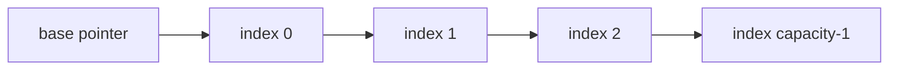
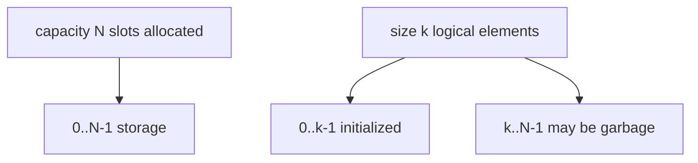
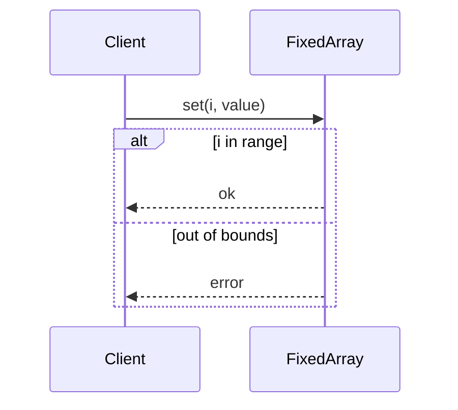

# Fixed-Capacity Arrays

## Overview

A **fixed-capacity array** stores a bounded sequence of elements in a **contiguous** memory block indexed from `0` to `capacity - 1`. Size may be tracked separately when the logical count is less than capacity (partial fill) or capacity may equal size for fully packed buffers.

Fixed arrays are the atomic contiguous sequence: O(1) random access, predictable memory footprint, and no reallocation on insert when bounds are respected. They underpin ring buffers, heaps, hash table buckets, and GPU kernels.

## Learning Objectives

- Implement fixed arrays with explicit capacity and bounds-checked access
- Separate **capacity** (allocated slots) from **size** (live elements)
- Analyze cache-friendly sequential access vs bounds check cost
- Map to TypedArray/stack buffers in TypeScript and `array`/`memoryview` in Python
- Connect overflow handling to [[04-Data-Structures/00-Orientation-and-Contracts/Interface Design Capacity Errors and Iteration|Interface Design]]

## Prerequisites

- [[04-Data-Structures/00-Orientation-and-Contracts/Memory Layout Locality and Allocation Patterns|Memory Layout Locality and Allocation Patterns]]
- [[01-Computer-Science/01-Information-and-Representation/Bits Bytes and Information|Bits Bytes and Information]]

## Difficulty

`beginner`

## Estimated Time

- Reading: 1.5 hours
- Exercises: 2 hours
- Mini project: 3 hours

## History

Fortran (1957) standardized static arrays. C inherited raw pointers + length discipline. Modern languages add bounds-checked abstractions (`std::array`, Rust `[T; N]`, JS `TypedArray`) while systems code still uses fixed buffers for **stack allocation** and **real-time guarantees** (no hidden realloc).

## Problem It Solves

Dynamic growth is unnecessary when:

- Maximum batch size is known (network MTU multiples, fixed worker pool)
- Embedded or kernel constraints forbid heap growth
- Real-time tasks require **worst-case O(1)** without amortized spikes
- Building blocks for [[04-Data-Structures/01-Contiguous-Sequences/Ring Buffers as Contiguous Queues|ring buffers]] and [[04-Data-Structures/06-Heaps-and-Priority-Queues/Binary Heaps and Array Layout|binary heaps]]

## Internal Implementation

Representation:

- `storage: T[capacity]` contiguous
- optional `size: int` for fill level
- index formula: address of `storage[i]` = base + i × stride



Bounds checking: compare index against capacity before access; on violation throw or return error per API contract.

## Mermaid Diagrams

### Structure: capacity vs size



### Sequence: bounds-checked set



## Examples

### Minimal Example

TypeScript:

```typescript
class FixedArray<T> {
  private readonly buf: (T | undefined)[];
  private len = 0;

  constructor(public readonly capacity: number) {
    if (capacity <= 0) throw new Error("capacity must be positive");
    this.buf = new Array(capacity);
  }

  get(i: number): T {
    if (i < 0 || i >= this.len) throw new RangeError("index out of range");
    return this.buf[i] as T;
  }

  append(value: T): void {
    if (this.len >= this.capacity) throw new Error("overflow");
    this.buf[this.len++] = value;
  }
}
```

Python:

```python
class FixedArray:
    def __init__(self, capacity: int) -> None:
        if capacity <= 0:
            raise ValueError("capacity must be positive")
        self.capacity = capacity
        self._buf: list[object | None] = [None] * capacity
        self._len = 0

    def get(self, i: int) -> object:
        if i < 0 or i >= self._len:
            raise IndexError("index out of range")
        return self._buf[i]

    def append(self, value: object) -> None:
        if self._len >= self.capacity:
            raise OverflowError("fixed array full")
        self._buf[self._len] = value
        self._len += 1
```

### Production-Shaped Example

Stack-allocated style buffer for batch RPC parsing with explicit overflow metric:

```typescript
export class ParseBatch {
  private readonly ids = new Int32Array(4096);
  private count = 0;
  readonly overflow = { count: 0 };

  addId(id: number): boolean {
    if (this.count >= this.ids.length) {
      this.overflow.count++;
      return false;
    }
    this.ids[this.count++] = id;
    return true;
  }

  view(): Int32Array {
    return this.ids.subarray(0, this.count);
  }
}
```

Cross-link: [[01-Computer-Science/01-Information-and-Representation/Data Serialization Fundamentals|Data Serialization Fundamentals]].

## Operation Complexity

| Operation | Time | Space |
| --- | --- | --- |
| access `get(i)` / `set(i)` | O(1) | O(1) |
| append (if size < cap) | O(1) | O(1) |
| append when full | O(1) fail | — |
| scan all live elements | O(n) | O(1) extra |
| Storage | — | O(capacity × element size) |

## Invariants

1. `0 <= size <= capacity`
2. Indices `[0, size)` contain initialized live elements (if using separate size)
3. No access outside `[0, capacity)` without explicit error
4. `capacity` is constant after construction (fixed-capacity contract)

## Trade-offs

| Dimension | Upside | Downside | When it matters |
| --- | --- | --- | --- |
| Fixed cap | No realloc spikes | Overflow handling required | Real-time |
| Contiguous | Cache-friendly scans | Wasted slack slots | Memory caps |
| vs dynamic array | Predictable RSS | Manual capacity planning | Edge devices |
| Typed arrays | Compact numeric storage | No generic objects | Telemetry |

### When to Use

- Known upper bounds, heaps, ring buffer backing store
- Hot numeric buffers (metrics, audio samples)
- Building blocks in embedded parsers

### When Not to Use

- Unbounded user-generated collections (use [[04-Data-Structures/01-Contiguous-Sequences/Dynamic Arrays and Amortized Growth|dynamic array]])
- Frequent insert/delete in middle (O(n) shifts)

## Exercises

1. Implement `FixedArray` with `tryAppend` returning boolean instead of throw.
2. Compare memory of `FixedArray<number>` vs linked list of n integers (estimate pointers).
3. Write invariant `check()` validating size and capacity.
4. Implement bounds-checked `set(i, v)` when array is fully sized without separate length.
5. Map C `int buf[64]` to Rust `[i32; 64]` semantics.

## Mini Project

Implement fixed-capacity `IntBuffer` in TS (TypedArray) and Python (`array('i')`); share test vectors for append/overflow/get.

## Portfolio Project

Use fixed arrays as backing stores in [[04-Data-Structures/projects/Structures Workbench/README|Structures Workbench]] ring buffer and heap labs.

## Interview Questions

1. Difference between capacity and size in a partial-fill array?
2. Why are fixed arrays used inside binary heaps?
3. What happens on out-of-bounds access in C vs Java?
4. When is a fixed array better than dynamic array despite overflow risk?
5. How does stride relate to indexing?

### Stretch / Staff-Level

1. Stack allocation limits and stack overflow in fixed buffer designs.
2. SIMD alignment requirements for fixed buffers.

## Common Mistakes

- Confusing uninitialized slack slots with live elements
- Omitting overflow policy in public APIs
- Using fixed array when max size is unknown and unbounded growth is required
- Off-by-one at index `capacity - 1`

## Best Practices

- Expose `capacity`, `size`, `full`, `tryAppend`
- Use typed arrays for homogeneous numeric data
- Document uninitialized slot policy
- Pair with [[04-Data-Structures/00-Orientation-and-Contracts/Invariants Representation and Debug Assertions|debug checks]]

## Summary

Fixed-capacity arrays are contiguous, index-addressable stores with constant-time random access and no implicit growth. They trade flexibility for predictable memory and latency, requiring explicit overflow handling at the interface. Most other contiguous structures in this track compose fixed arrays with metadata (size, head/tail, heap indices).

## Further Reading

- [[04-Data-Structures/01-Contiguous-Sequences/Dynamic Arrays and Amortized Growth|Dynamic Arrays and Amortized Growth]]
- [[04-Data-Structures/01-Contiguous-Sequences/Multidimensional Arrays and Strides|Multidimensional Arrays and Strides]]
- MDN — TypedArray

## Related Notes

- [[04-Data-Structures/01-Contiguous-Sequences/Ring Buffers as Contiguous Queues|Ring Buffers as Contiguous Queues]]
- [[04-Data-Structures/06-Heaps-and-Priority-Queues/Binary Heaps and Array Layout|Binary Heaps and Array Layout]]
- [[04-Data-Structures/00-Orientation-and-Contracts/Memory Layout Locality and Allocation Patterns|Memory Layout Locality and Allocation Patterns]]

## Progress Checklist

- [ ] Explained from first principles
- [ ] Drew at least one Mermaid diagram
- [ ] Implemented a minimal version
- [ ] Documented trade-offs and non-goals
- [ ] Completed exercises
- [ ] Practiced interview questions aloud
- [ ] Linked prerequisites and dependents
