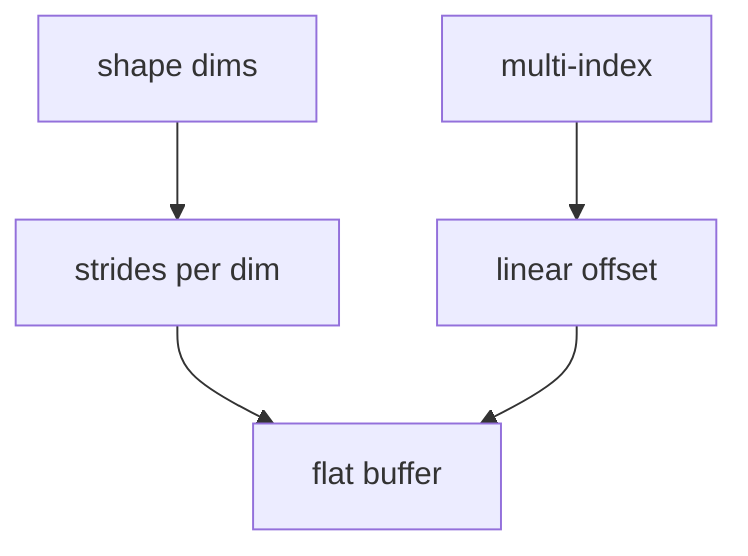
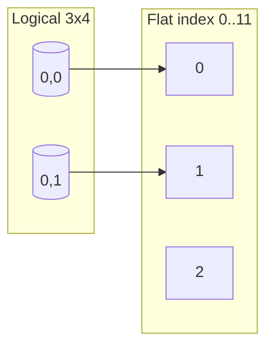
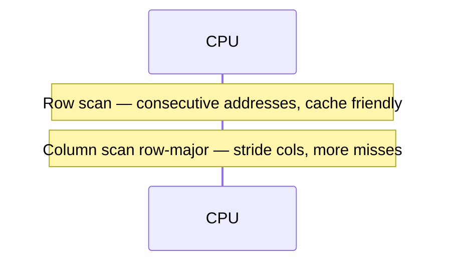

# Multidimensional Arrays and Strides

## Overview

A **multidimensional array** maps multi-index tuples `(i, j, …)` to a single contiguous (or strided) address space. **Strides** specify byte/element offset per dimension increment; **row-major** (C, NumPy default) vs **column-major** (Fortran, MATLAB) determines which index is fastest-varying in memory.

Production tensors, image buffers, and game grids are not "arrays of arrays" logically—they are flat storage plus shape/stride metadata for O(1) element access and slice views without copy.

## Learning Objectives

- Compute linear index from multi-index using strides
- Explain row-major vs column-major traversal locality
- Implement 2D matrix on 1D buffer with bounds checks
- Describe non-contiguous views (subarrays with step > 1)
- Connect to NumPy/strided buffers and WASM memory

## Prerequisites

- [[04-Data-Structures/01-Contiguous-Sequences/Fixed-Capacity Arrays|Fixed-Capacity Arrays]]
- [[04-Data-Structures/00-Orientation-and-Contracts/Memory Layout Locality and Allocation Patterns|Memory Layout Locality and Allocation Patterns]]

## Difficulty

`intermediate`

## Estimated Time

- Reading: 2 hours
- Exercises: 3 hours
- Mini project: 4 hours

## History

Fortran column-major layout influenced BLAS/LAPACK. C treats `T a[R][C]` as row-major contiguous blocks. NumPy (2006) generalized **strided universal function interface** enabling views, broadcasting, and zero-copy slices—central to ML stacks.

## Problem It Solves

| Naive approach | Problem | Strided flat buffer |
| --- | --- | --- |
| `T[][]` jagged rows | Non-contiguous rows, pointer overhead | One allocation |
| Repeated row malloc | Cache misses, allocator churn | Single slab |
| Transpose by copy | O(n²) memory traffic | Swap strides O(1) view |

## Internal Implementation

Row-major 2D with shape `(rows, cols)`:

- stride_row = cols
- stride_col = 1
- index `(r, c)` → `r * cols + c`

General: `offset = sum_k index_k * stride_k`



## Mermaid Diagrams

### Structure: row-major 3×4



### Sequence: row scan vs column scan



## Examples

### Minimal Example

TypeScript:

```typescript
class Matrix2D {
  constructor(
    private readonly rows: number,
    private readonly cols: number,
    private readonly data: Float64Array,
  ) {
    if (data.length !== rows * cols) throw new Error("size mismatch");
  }

  static zeros(rows: number, cols: number): Matrix2D {
    return new Matrix2D(rows, cols, new Float64Array(rows * cols));
  }

  get(r: number, c: number): number {
    if (r < 0 || r >= this.rows || c < 0 || c >= this.cols) throw new RangeError();
    return this.data[r * this.cols + c]!;
  }

  set(r: number, c: number, v: number): void {
    if (r < 0 || r >= this.rows || c < 0 || c >= this.cols) throw new RangeError();
    this.data[r * this.cols + c] = v;
  }
}
```

Python:

```python
class Matrix2D:
    def __init__(self, rows: int, cols: int) -> None:
        self.rows = rows
        self.cols = cols
        self._data = [0.0] * (rows * cols)

    def _index(self, r: int, c: int) -> int:
        if not (0 <= r < self.rows and 0 <= c < self.cols):
            raise IndexError
        return r * self.cols + c

    def get(self, r: int, c: int) -> float:
        return self._data[self._index(r, c)]

    def set(self, r: int, c: int, v: float) -> None:
        self._data[self._index(r, c)] = v
```

### Production-Shaped Example

Strided view without copy (read-only slice):

```typescript
export class StridedView {
  constructor(
    private readonly base: Float64Array,
    readonly offset: number,
    readonly length: number,
    readonly stride: number,
  ) {}

  get(i: number): number {
    if (i < 0 || i >= this.length) throw new RangeError();
    return this.base[this.offset + i * this.stride]!;
  }
}

// Every other column: stride = 2
```

Cross-link: [[01-Computer-Science/01-Information-and-Representation/Bits Bytes and Information|Bits Bytes and Information]].

## Operation Complexity

| Operation | Time | Notes |
| --- | --- | --- |
| get/set element | O(1) | With precomputed strides |
| Row scan (row-major) | O(cols) per row, cache friendly | |
| Column scan (row-major) | O(rows) per col, poor locality | |
| Transpose view | O(1) | Swap shape/strides |
| Copy submatrix | O(k) | k = submatrix elements |

## Invariants

1. `product(shape) <= base.length` (with stride rules for views)
2. Strides non-negative for contiguous layouts; negative strides possible for flipped views in advanced APIs
3. Bounds check every public access unless unsafe API documented
4. View does not outlive base buffer if base can reallocate—views must pin or copy

## Trade-offs

| Dimension | Upside | Downside | When it matters |
| --- | --- | --- | --- |
| Row-major | C interop, row scans | Column scans slow | ML batches (often row samples) |
| Column-major | BLAS Fortran | C row scans slow | Legacy numerics |
| Strided views | Zero-copy slice | Non-unit stride SIMD pain | Image processing |
| Jagged 2D | Ragged rows | Pointer chasing | CSV ragged data |

### When to Use

- Matrices, tensors, grids, image planes
- Numerical code with BLAS alignment requirements
- Shared memory IPC with flat layout

### When Not to Use

- Highly ragged rows with vastly different lengths (consider list of arrays)
- Frequent insert row/col in middle (sparse structures elsewhere)

## Exercises

1. Derive stride vector for shape `(4, 3, 2)` row-major.
2. Benchmark row vs column sum on 4096×4096 matrix.
3. Implement O(1) transpose view by swapping shape/strides.
4. Explain broadcasting at stride level (NumPy mental model).
5. Compute padding for 3×3 matrix aligned to 4-wide SIMD.

## Mini Project

Implement `Matrix2D` + `transposeView()` with tests; compare copy transpose vs view for 2048².

## Portfolio Project

Add tensor view explorer to [[04-Data-Structures/projects/Structures Workbench/README|Structures Workbench]] showing linear index under cursor.

## Interview Questions

1. Row-major vs column-major — which index is fastest varying?
2. Formula for element `(r,c)` in rows×cols row-major flat array?
3. Why avoid `vector<vector<int>>` for dense numeric work?
4. What is stride?
5. Cost of transposing by view vs by copy?

### Stretch / Staff-Level

1. Layout for cache-oblivious matrix multiply (tiling preview).
2. WASM linear memory and manual stride calculation.

## Common Mistakes

- Assuming `m[i][j]` in dynamic languages is contiguous 2D
- Column-major loops on row-major storage without awareness
- Views referencing reallocated base buffer
- Integer overflow in index arithmetic on huge tensors

## Best Practices

- Store shape + strides + base pointer as one struct
- Loop inner dimension over fastest-varying index
- Use typed arrays / contiguous alloc for SIMD paths
- Document layout in serialization formats

## Summary

Multidimensional arrays are flat buffers plus shape and stride metadata mapping multi-indices to O(1) offsets. Layout choice (row vs column major) determines which traversal patterns are cache-friendly. Strided views enable zero-copy slicing and transposes at the cost of non-unit-step access patterns—critical for numerical and ML pipelines built on contiguous memory discipline.

## Further Reading

- NumPy ndarray strides documentation
- [[04-Data-Structures/00-Orientation-and-Contracts/Memory Layout Locality and Allocation Patterns|Memory Layout Locality and Allocation Patterns]]
- BLAS/LAPACK storage conventions

## Related Notes

- [[04-Data-Structures/01-Contiguous-Sequences/Fixed-Capacity Arrays|Fixed-Capacity Arrays]]
- [[04-Data-Structures/08-Graphs-as-Representation/Adjacency Matrices and Edge Lists|Adjacency Matrices and Edge Lists]]
- [[01-Computer-Science/02-Machine-Model/Cache Hierarchy and Locality|Cache Hierarchy and Locality]]

## Progress Checklist

- [ ] Explained from first principles
- [ ] Drew at least one Mermaid diagram
- [ ] Implemented a minimal version
- [ ] Documented trade-offs and non-goals
- [ ] Completed exercises
- [ ] Practiced interview questions aloud
- [ ] Linked prerequisites and dependents
