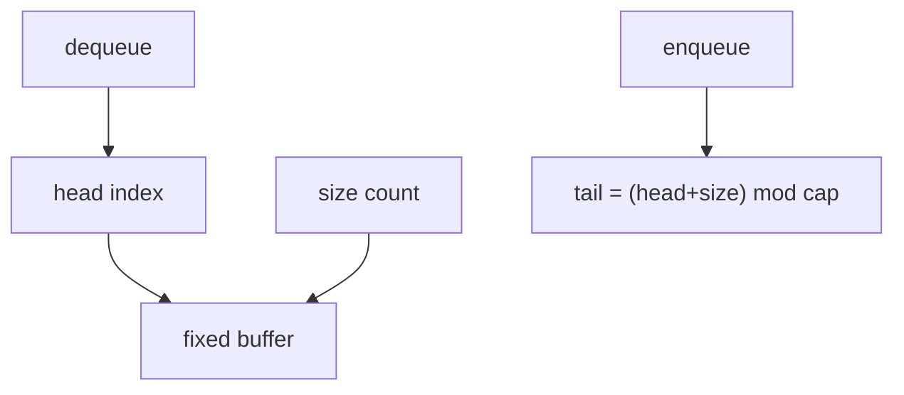
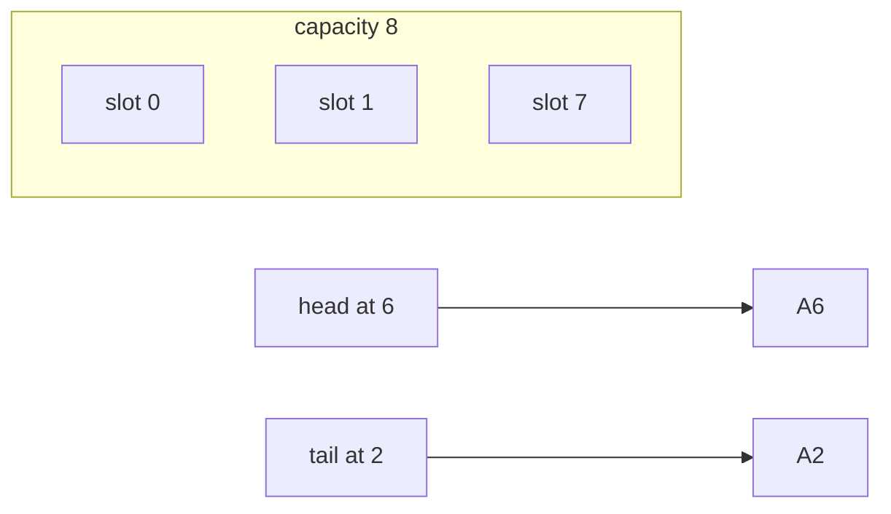
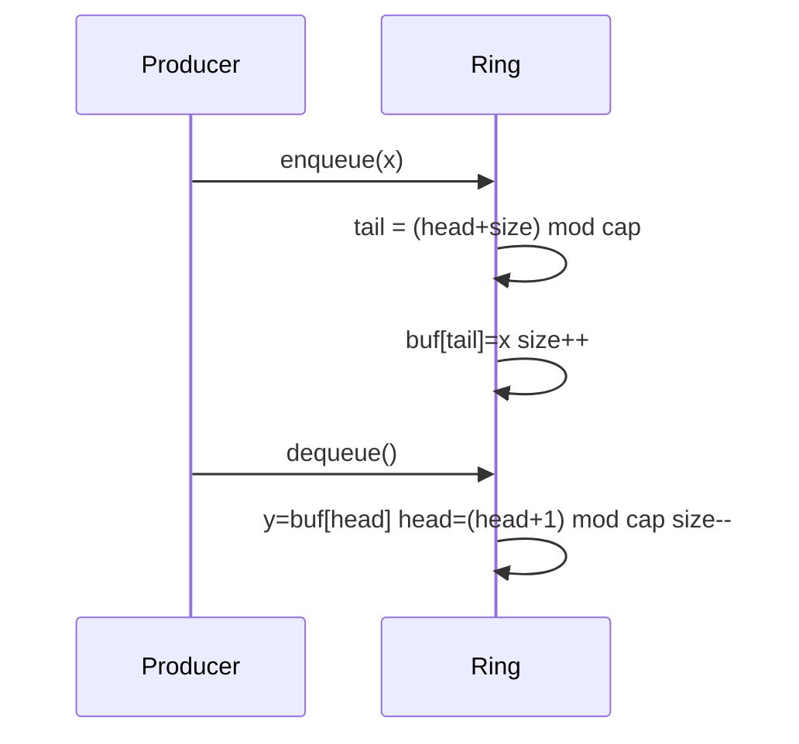

# Ring Buffers as Contiguous Queues

## Overview

A **ring buffer** implements a FIFO **queue** in a **fixed-capacity** contiguous array by advancing **head** and **tail** indices with **modulo wraparound**. Enqueue and dequeue are O(1) without shifting elements—unlike using a dynamic array as a queue with pop-front.

Ring buffers power audio pipelines, network NIC queues, logging buffers, and bounded producer-consumer channels with predictable memory.

## Learning Objectives

- Implement ring buffer with explicit size counter (avoid head==tail ambiguity)
- Handle full/empty conditions with try/enqueue metrics
- Compare ring buffer vs linked queue vs dynamic array queue
- Apply power-of-two capacity optimization `(i & mask)` instead of `%`
- Connect to [[04-Data-Structures/03-Stacks-Queues-and-Deques/Bounded Buffers and Producer-Consumer Interfaces|producer-consumer interfaces]]

## Prerequisites

- [[04-Data-Structures/01-Contiguous-Sequences/Fixed-Capacity Arrays|Fixed-Capacity Arrays]]
- [[04-Data-Structures/00-Orientation-and-Contracts/Interface Design Capacity Errors and Iteration|Interface Design Capacity Errors and Iteration]]

## Difficulty

`intermediate`

## Estimated Time

- Reading: 2 hours
- Exercises: 3 hours
- Mini project: 4 hours

## History

Circular buffers appear in telephony and DSP (1960s+). Kernel **kfifo**, Disruptor pattern (LMAX), and game **triple buffering** standardized ring semantics for high-throughput low-latition paths.

## Problem It Solves

| Queue impl | dequeue cost | memory |
| --- | --- | --- |
| Dynamic array shift front | O(n) | contiguous |
| Linked queue | O(1) | pointer + alloc per node |
| Ring buffer | O(1) | fixed contiguous |

Bounded capacity forces **backpressure**—a feature for stability, not a bug.

## Internal Implementation

Fields:

- `buf: T[capacity]`
- `head`: index of front
- `size`: element count (preferred over wasting one slot)

Enqueue tail index: `(head + size) % capacity`  
Dequeue: read `buf[head]`, `head = (head + 1) % capacity`, `size--`

Power-of-two capacity: `index & (capacity - 1)` when capacity is `2^k`.



## Mermaid Diagrams

### Structure: wrapped queue in linear array



### Sequence: enqueue when wrapped



## Examples

### Minimal Example

TypeScript:

```typescript
export class RingBuffer<T> {
  private readonly buf: (T | undefined)[];
  private head = 0;
  private size = 0;

  constructor(public readonly capacity: number) {
    if (capacity <= 0) throw new Error("capacity must be positive");
    this.buf = new Array(capacity);
  }

  tryEnqueue(item: T): boolean {
    if (this.size >= this.capacity) return false;
    const tail = (this.head + this.size) % this.capacity;
    this.buf[tail] = item;
    this.size++;
    return true;
  }

  tryDequeue(): T | undefined {
    if (this.size === 0) return undefined;
    const item = this.buf[this.head] as T;
    this.buf[this.head] = undefined;
    this.head = (this.head + 1) % this.capacity;
    this.size--;
    return item;
  }
}
```

Python:

```python
class RingBuffer:
    def __init__(self, capacity: int) -> None:
        if capacity <= 0:
            raise ValueError
        self.capacity = capacity
        self._buf: list[object | None] = [None] * capacity
        self._head = 0
        self._size = 0

    def try_enqueue(self, item: object) -> bool:
        if self._size >= self.capacity:
            return False
        tail = (self._head + self._size) % self.capacity
        self._buf[tail] = item
        self._size += 1
        return True

    def try_dequeue(self) -> object | None:
        if self._size == 0:
            return None
        item = self._buf[self._head]
        self._buf[self._head] = None
        self._head = (self._head + 1) % self.capacity
        self._size -= 1
        return item
```

### Production-Shaped Example

Power-of-two mask + metrics:

```typescript
export class Pow2Ring<T> {
  private readonly mask: number;
  private buf: T[];
  private head = 0;
  private size = 0;
  readonly metrics = { dropped: 0 };

  constructor(capacityPow2: number) {
    if ((capacityPow2 & (capacityPow2 - 1)) !== 0) throw new Error("power of two");
    this.mask = capacityPow2 - 1;
    this.buf = new Array(capacityPow2);
  }

  tryEnqueue(item: T): boolean {
    if (this.size > this.mask) return false;
    const tail = (this.head + this.size) & this.mask;
    this.buf[tail] = item;
    this.size++;
    return true;
  }
}
```

Cross-link: [[04-Data-Structures/03-Stacks-Queues-and-Deques/Queues|Queues]].

## Operation Complexity

| Operation | Time | Space |
| --- | --- | --- |
| enqueue | O(1) | O(1) |
| dequeue | O(1) | O(1) |
| peek front | O(1) | O(1) |
| size/empty/full | O(1) | O(capacity) storage |

## Invariants

1. `0 <= size <= capacity`
2. `0 <= head < capacity`
3. Logical elements occupy exactly `size` slots starting from `head` with wrap
4. Empty: `size == 0`; full: `size == capacity` (when using size field)

## Trade-offs

| Dimension | Upside | Downside | When it matters |
| --- | --- | --- | --- |
| vs linked queue | Locality, no per-node alloc | Fixed cap | Streaming |
| vs deque | Simple array | No arbitrary middle ops | NIC/audio |
| Size field vs sacrifice slot | Clear full/empty | Extra int | Always prefer size field |
| Pow2 capacity | Fast bitmask | Rounded capacity waste | Hot loops |

### When to Use

- Bounded FIFO with known max lag
- Single-producer single-consumer when synchronized externally
- Logging and metrics batching

### When Not to Use

- Unbounded queues without drop policy
- Need priority ordering (use heap module)
- Frequent resize of capacity (dynamic deque)

## Exercises

1. Reproduce full/empty bug using only head/tail without size; fix with size counter.
2. Implement power-of-two ring with bitmask indexing.
3. Benchmark ring vs `collections.deque` for 1M enqueue/dequeue pairs.
4. Write `check()` invariant validator walking logical order.
5. Design overwrite-on-full (drop oldest) policy for metrics buffer.

## Mini Project

SPSC ring buffer with optional blocking wrapper; document thread-safety boundaries (link [[01-Computer-Science/05-Concurrency-Fundamentals/Race Conditions|Race Conditions]]).

## Portfolio Project

Ring buffer stage in [[04-Data-Structures/projects/Structures Workbench/README|Structures Workbench]] with overflow metrics dashboard.

## Interview Questions

1. Why keep a size field instead of head==tail for empty?
2. O(1) enqueue/dequeue — why no shift?
3. Power-of-two capacity benefit?
4. Ring vs linked queue memory/latency?
5. How express backpressure when full?

### Stretch / Staff-Level

1. Disruptor sequence barriers vs simple ring.
2. Cache line padding between head/tail for MPMC (preview module 13).

## Common Mistakes

- head==tail meaning both empty and full
- Modulo with non-positive capacity
- Not clearing slots on dequeue (GC retention in JS/Python)
- Assuming thread-safe without synchronization

## Best Practices

- Separate `tryEnqueue` and metrics on drop
- Prefer explicit `size` field
- Use pow2 + mask in hot paths
- Snapshot iterate without mutating during walk

## Summary

Ring buffers implement FIFO queues in fixed contiguous storage with head index and size counter, achieving O(1) enqueue/dequeue via wraparound without element shifting. They trade unbounded growth for predictable memory and excellent locality—ideal for bounded streaming when paired with explicit overflow/backpressure policies at the interface.

## Further Reading

- [[04-Data-Structures/03-Stacks-Queues-and-Deques/Queues|Queues]]
- [[04-Data-Structures/03-Stacks-Queues-and-Deques/Bounded Buffers and Producer-Consumer Interfaces|Bounded Buffers and Producer-Consumer Interfaces]]
- LMAX Disruptor technical paper

## Related Notes

- [[04-Data-Structures/01-Contiguous-Sequences/Fixed-Capacity Arrays|Fixed-Capacity Arrays]]
- [[04-Data-Structures/00-Orientation-and-Contracts/Invariants Representation and Debug Assertions|Invariants Representation and Debug Assertions]]
- [[04-Data-Structures/02-Linked-Structures/Linked vs Contiguous Trade-offs|Linked vs Contiguous Trade-offs]]

## Progress Checklist

- [ ] Explained from first principles
- [ ] Drew at least one Mermaid diagram
- [ ] Implemented a minimal version
- [ ] Documented trade-offs and non-goals
- [ ] Completed exercises
- [ ] Practiced interview questions aloud
- [ ] Linked prerequisites and dependents
